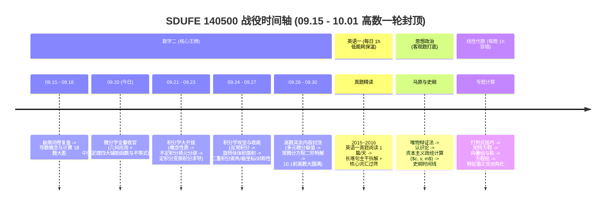

# SDUFE 140500 智能科学与技术 全局周度作战蓝图 (2026-09-15 ~ 2026-09-22)

> **制定时间**: 2026-09-15 (2026-09-17 战略重大升级调整)  
> **核心战略转折**: **正式锁定【山东财经大学 140500 智能科学与技术 (学硕)】！** 卸下 408 统考硬件与协议冗余包袱，全面聚焦【数学二极限攻坚 + 英语一长难句精读 + 政治马原客观题启动 + 数据结构经典算法手撕】。  
> **时间约束**: **周五下午 ~ 周六下午全面放空**（学校上课 + 每周固定放假充电，零学习负罪感）。

---

## 一、科目战役目标与推进路线

### 1. 302 数学二（高数冲刺 + 线代滚动）
- **高数攻坚线**:
  - 【09.20 今日完成】**Chap05 几何应用**（切线极值凹凸渐近线）+ **Chap06 中值定理与不等式证明**（微分学全部结束）；
  - 【09.21 ~ 09.27 下周拿下】**积分学全量收官**：
    * 不定积分第一第二换元、分部积分表格法；
    * 定积分变限积分求导、反常积分 $p$ 判别法；
    * 几何应用（平面面积、绕 $x/y$ 轴旋转体体积）；
    * 二重积分直角与极坐标、奇偶对称性与轮换对称性；
  - 【09.28 ~ 09.30 赴京前封顶】**高数其余内容全部结束**：
    * 多元微分学（偏导、全微分、无条件极值 $AC-B^2$、条件极值拉氏乘数法）；
    * 常微分方程（一阶公式法、二阶常系数齐次/非齐次特定解、微分方程应用）；
  - **精选强化**：每章核心难点挑选《李林880》对应章节 3~5 道题巩固。
- **线代线**:
  - 每晚固定 1h 穿插：行列式 $\to$ 矩阵 $\to$ 向量组 $\to$ 方程组 $\to$ 特征值对角化。

### 2. 201 英语一（战术放缓，每日 1h 保温）
- 每天固定 1.0h：
  - 2015~2016 英语一真题阅读 1 篇/天；
  - 重点拆解划线长难句主干，积累真题核心高频词与熟词生义；
  - 睡前 20 分钟 App 过筛 50 个高频词。

### 3. 101 思想政治（客观题选择题启动）
- 每天 1.0h（下午或晚间）：
  - 重点理解马原哲学三大规律、认识论、政经剩余价值计算；
  - 配合肖秀荣 1000 题单选多选，扫除易混淆概念。

---

## 二、时间表概览（周五六假期友好型）

| 日期 | 星期 | 可支配时长 | 核心攻坚任务 | 状态与说明 |
| :--- :---: | :---: | :---: | :--- | :--- |
| **09-15** | 二 | 8.5h | 高数极限复盘 + 导数概念前半 | 已完成 |
| **09-16** | 三 | 9.5h | 高数 Chap03 1000a 基础篇全量手写闭环 | 已完成 |
| **09-17** | 四 | 9.0h | 高数 Chap04 微分计算 18 题大胜闭环 + 锁定 140500 新纪元 | 已完成 |
| **09-18** | 五 | 4.0h | 高数 Chap05 几何应用(极值/凹凸/渐近线) + 英语一 2015 Text 1 | 上午学习，下午/晚上上课休息 |
| **09-19** | 六 | 0.0h | 全天上课 + 彻底放空充电回血，零负罪感！ | 放松蓄力 |
| **09-20** | 日 | 9.5h | **【微分学全量收官】** Chap05 几何应用 + Chap06 中值定理与不等式证明 + 英语保温 | 今日攻坚 |
| **09-21** | 一 | 9.0h | **【积分开拔】** Chap08 积分学概念性质与反常积分 + 英语一 Text 2 + 线代行列式 | 正常全天 |
| **09-22** | 二 | 9.0h | **【积分计算】** Chap09 不定积分换元法与分部积分表格法 + 政治政经计算 | 正常全天 |
| **09-23** | 三 | 9.0h | **【定积分大题】** Chap09 变限积分求导大题 + 英语一 Text 3 + 线代矩阵运算 | 正常全天 |
| **09-24** | 四 | 9.0h | **【定积分几何】** Chap10 面积/体积(圆盘与圆柱壳) + 政治史纲开启 | 正常全天 |
| **09-25** | 五 | 9.0h | **【积分证明与物理】** Chap11&12 积分不等式与物理应用 + 线代向量组 | 正常全天 |
| **09-26** | 六 | 4.0h | **【二重积分前锋】** Chap14 直角坐标与极坐标计算 (上午攻坚，下午送站) | 调节休息 |
| **09-27** | 日 | 5.5h | **【积分学大收官】** Chap14 二重积分对称性强化，**至此积分学全部结束！** | 下午回归 |
| **09-28** | 一 | 9.0h | **【高数其余】** Chap13 多元函数微分学与极值最值 (链式/隐函数/拉氏乘数法) | 正常全天 |
| **09-29** | 二 | 9.0h | **【高数其余】** Chap15 常微分方程一阶/二阶特解与物理应用 | 正常全天 |
| **09-30** | 三 | 9.0h | **【高数一轮大圆满封顶】** 全书知识网大排查 + 整理行装，奔赴北京！ | 正常全天 |
