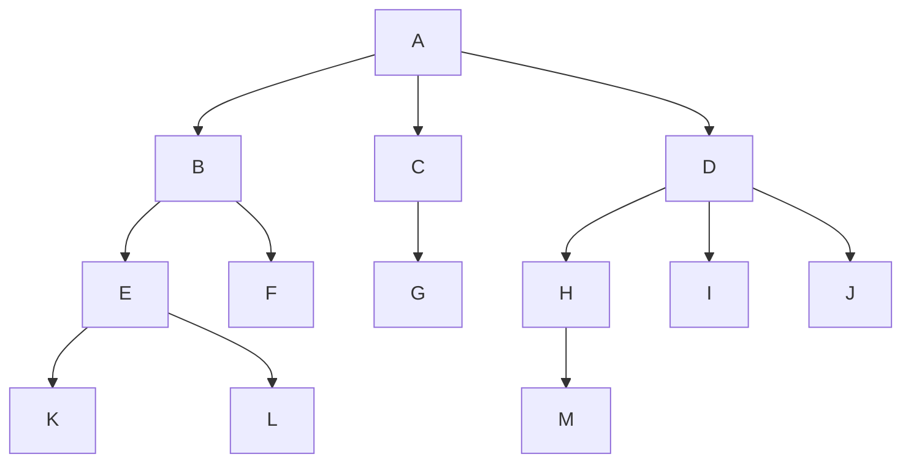

# Chap 5.1 树的基本概念

## 1.树的定义

树是n($n\geq 0 $)个结点的有限集(当n=0时,称为空树)任意一棵非空树$n>0$存在以下结论:

>   (1)有且仅有一个特定的节点称为根节点
>
>   (2)除了根节点以外的其余结点可以分为m个互不相交的有限集$T_1,T_2,\cdots,T_m\rightarrow$每一个集合本身又是一棵树

**树是一种典型的递归数据(在定义中引用本身)**

**树是一种逻辑结构,也是一种分层结构,存在以下两个特征**

>(1)根节点没有前驱,除根节点以外的每个结点有且仅有一个前驱
>
>(2)所有结点可以拥有0个或者多个前驱

## 2.基本术语

(共4层)   A(B(E(KL)F)C(G)D(H(M)IJ))



###### **(1)人称关系**

祖先:从根节点A到结点K唯一路径上经过的所有**除K的结点**,叫做K的祖先      (比如K的祖先是:ABE)

子孙:**以某节点为根的子树中的任一结点**(该结点以下的所有层结点)	  (比如B的子孙是:EFKL)

双亲:**结点的直接前驱**(该结点上方最近的(直接连接)的结点)(其中根节点A没有双亲)	   (比如H的双亲是:D)

孩子:**结点的直接后继**(该节点下方最近的(直接连接)的结点)(其中当前叶子结点没有孩子)      (比如D的孩子是:HIJ)

兄弟:双亲完全相同的两个结点					(比如K的兄弟是L,它们都有一个双亲E)

堂兄弟:双亲在同一层且双亲不同的两个结点			     (比如G与EFHIJ互为堂兄弟)

==**双亲在同一层,则这两个结点必然在同一层**==

###### **(2)层次深度**

**<font color=red>结点的层次:从根开始定义:根为第1层</font>->结点的深度就是结点的层次,结点的高度概念不同**

**结点的深度:<font color=deeppink>从根结点(深度为1)向下数,看的是"来时的路"</font>**

>   **树的高度:指树中结点的最大层数**	   

**结点的高度:<font color=deeppink>从叶子结点(高度为1)向上数,看的是"未来的路"</font>**(王道:指以该结点为根的子树的高度)

>   **树的高度=树的深度,但是结点的高度不一定等于深度**

###### **(3)度(degree)**

**结点的度:结点的孩子个数称为结点的度**	

**树的度:树中所有结点的度的最大值为树的度**    -> max(degree)

###### **(4)分支结点和叶结点(生育能力)**

分支结点(非终端结点):度大于0(有孩子)	->分支的支数=该节点的度

叶子结点(即终端结点):度等于0(无孩子)	->分支的支数=0

**<font color=red>注:树只有一个根(地位),它也同时为树的叶子结点(生育能力)</font>**

###### **(5)有序树和无序树**

有序树:若树中各结点的子树从左往右具有固定次序,不可互换	->交换某结点的子结点位置,则得到不同的树

无序树:若树中各结点的子树从左往右没有固定次序,可以互换	->交换某结点的子结点位置,则得到相同的树

###### **(6)路径和路径长度**

路径:树中两个结点之间的路径是从一个结点到另一个结点所经过的**结点序列**

>   **<font color=red>只能由祖先向子孙单向存在。如果两个结点互不为祖先和子孙（比如兄弟结点、堂兄弟结点），则它们之间绝对不存在路径!!</font>**

路径长度:该路径上边的数目

**树的路径长度:树根到每个结点路径长度的综合**

###### **(7)森林**

森林:m棵互不相交的树的集合	

->树的根节点移除后,其各个子树构成一个森林

->m棵独立的树添加一个新结点作为共同根,则转化为一棵树

## 3.树的性质

**<font color=red>性质:需要通过贪心算法转换为等比数列求和问题->满树(最胖的树)/长条树(最瘦的树)</font>**

**1.树的结点数n等于所有结点的度数之和+1**

>   理解:从下往上统计所有的边数,最后+1表示根节点

**2.度为m的树中,第i层上至多有$m^{i-1}$个结点($i\geq1$)**	**<font color=red>(满树,等比数列)</font>**

>   第1层(根节点):($m^0$)	1个结点
>
>   第2层(满层):  ($m^1$)	m个结点
>
>   第i层(满层):  ($m^{i-1}$)      m个结点

**3.高度为h的m叉树至多有$(m^h-1)/(m-1)$个结点**	**<font color=red>(满树,等比数列求和)</font>**

>(本质:把满树的所有结点求和,首项为1,公比为m,一共有h项)
>
>```math
>n \leq\bigg( 1+m+m^2+\cdots + m^{h-1} = \frac{1\cdot(1-m^h)}{1-m}\bigg)=\frac{m^h-1}{m-1}
>```

**4.度为m,具有n个结点的树的最小高度为$$\lceil log_m(n(m-1)+1) \rceil$$**  **<font color=red>(满树,等比数列不等式)</font>**

>(本质:逆向解(3)不等式)
>
>```math
>\because n\leq\frac{m^h-1}{m-1}\therefore m^h\geq n(m-1)+1\qquad\Rightarrow h\geq log_m(n(m-1)+1)
>\\ \\
>\therefore h_{min}=\lceil log_m(n(m-1)+1)\rceil
>```

**4.度为m,具有n个结点的树的最大高度为$n-m+1$**	**<font color=red>(瘦树,前提条件)</font>**

>   (本质:满足度为m的前提以后,拉一条直线)
>
>   (1)拿出一个根节点,以及m个结点做它的孩子
>
>   (2)剩下的n-(m+1)就组成了剩下的高度

**<font color=Deeppink>Q:对于整树而言:树的高度$h$=树的层次$i$,但是为什么还是用高度描述?</font>**

>   答案:还是描述的问题:描述一个点/面,使用层次i;描述立体容器的时候,使用高度h
>
>   (文字游戏,层次为i的树->还以为是只看第i层)

## 4.结点SOP

**<font color=red>无论结点如何移动,边的关系以及根节点的数量是不变的</font>**

**1.(横向分类,节点数)总结点数 = 所有度数的结点数之和**

```math
N = N_0 + N_1+\cdots + N_m
```

**2.(纵向极性,边数)除了头节点,每个结点有且仅有一条边**

```math
E= N-1 =  (N_0 + N_1+\cdots + N_m)-1
```

**3.(纵向极性,边数,森林推广)除了k棵树的头节点,每个结点有且仅有一条边**

```math
E= N-k =  (N_0 + N_1+\cdots + N_m)-k
```

**3.(加权总和,节点-边标准方程)总边数E等于所有结点伸向下方孩子的边数总和**

```math
E = 0\cdot N+1\cdot N_1+2\cdot N_2+ \cdots + m\cdot N_m
```

**4.叶子结点公式**

```math
N_0 = 1+0\cdot N_1+1\cdot N_2+\cdots+ (m-1)N_m
```

## 4.本章习题

DAAAA CD**<font color=red>DBC</font>**

DAAAA CDDBC

额外注意n个结点,度为4的树,树的高度至多是n-3,废了3个结点和最后一层的一个组成n=4

**(8)设一棵m叉树种有$N_1$个度为1的结点,$N_2$个度为2的结点...$N_m$个度为m的结点,则该树中共有()个叶结点?**

```math
\begin{align}
\because E &= N-1 
\\ \\
 (N_0+N_1+N_2+\cdots+N_m)-1
&\Leftrightarrow  (0\cdot N+1\cdot N_1+2\cdot N_2+ \cdots + m\cdot N_m)
\\ \\
\therefore N_0 & = 1+0\cdot N_1+1\cdot N_2+2\cdot N_3 \cdots+ (m-1)N_m
\\ \\
&=1+\sum^{m}_{i=2}(i-1)N_i
\end{align}
```

**(9,真题)在一颗度为4的树T中,若有20个度为4的结点,10个度为3的结点,1个度为2的结点,10个度为1的结点,则树T的叶节点数是?**

```math
N_0 = 1+N_2 + 2N_3+3N_4 = 1=1+20+60 = 82
```

**(10,真题)森林F有15条边,25个节点,则F包含树的个数是?**

```math
E = N-K\cdot1 \Rightarrow k = N-E = 25-15=10
```

