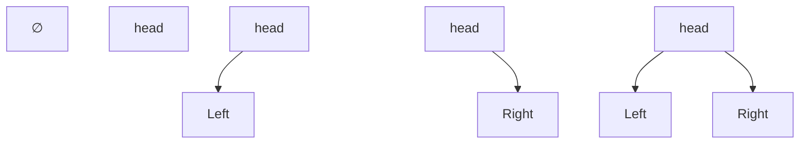
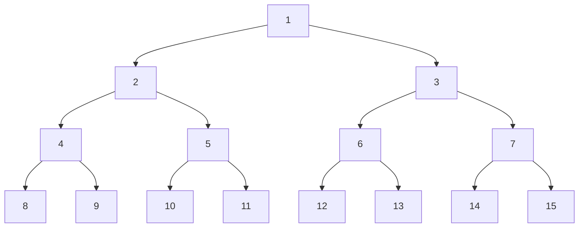
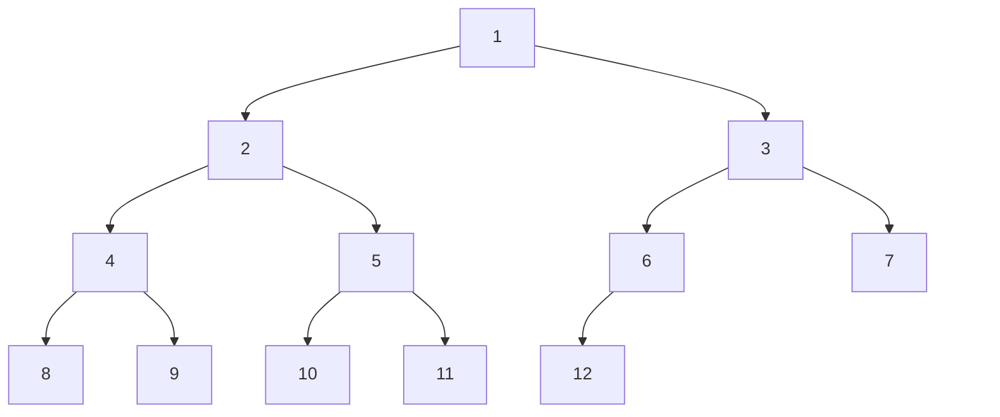

# Chap5.2 二叉树的概念

## 1.二叉树的定义及其主要特性

###### **1.二叉树的定义**

二叉树是一种特殊的树形结构,核心特征在于**每个结点最多拥有两个子树(不存在大于2的结点),有左右之分(有序树)**

**二叉树是包含n($n\geq 0 $)个结点的有限集合**

>   二叉树的递归定义(1):或者为空二叉树,n=0
>
>   二叉树的递归定义(2):或者由 一个根节点 以及 两颗互不相交的左子树和右子树构成
>
>   二叉树的递归定义(3):左子树和右子树本身也为二叉树

**二叉树是一种有序树,即使仅有一棵子树,也需要区分左右子树**



**<font color=red>注意:二叉树 不等于 度为2的有序树</font>**

(1)从结点数量看:度为2的树至少包含3个结点;而二叉树可以为空

(2)从左右次序看:度为2的树只有一个孩子无需区分左右;而二叉树只有一个孩子也要区分左右

###### **2.特殊的二叉树**

**<font color=deeppink>(1)满二叉树(全满)</font>**

满二叉树:高度为h且包含==$2^h-1$==个结点的二叉树称为满二叉树(每一层包含该层能容纳的最大结点数)

>**满二叉树特点(1):(度的特点)除了叶结点以外,其余每个结点的度都为2**
>
>**满二叉树特点(2):(次序特点)根节点编号为1,自上而下,自左向右**
>
>>   若存在双亲:双亲编号为$\lfloor i/2\rfloor$(<font color=red>如果能整除,一定是左孩子</font>)
>>
>>   若存在孩子:左孩子编号为$2i$,右孩子编号为$2i+1$



**<font color=deeppink>(2)完全二叉树(编号对应)</font>**

完全二叉树:高度为h且包含==n==个结点的二叉树,每个结点与高度为h的满二叉树的结点编号==逐个对应==



**<font color=deeppink>(3)二叉排序树</font>**

二叉排序树特点(1):其左子树上所有结点的关键字均小于根节点的关键字

二叉排序树特点(2):其右子树上所有节点的关键字均大于根节点的关键字

二叉排序树特点(3):左子树和右子树本身各是一颗二叉排序树

**<font color=deeppink>(4)平衡二叉树:任意结点的左子树和右子树的高度之差绝对值不超过1</font>**

**<font color=deeppink>(5)正则二叉树:树中每个分支结点均有2个孩子,所以仅有度为0和度为2的结点</font>**

###### **3.二叉树的性质**

**1.非空二叉树叶节点的数量等于度为2的结点数+1:$n_0=n_2+1$**(二叉树包含$n_0,n_1,n_2$)

>   ```math
>   \begin{align}
>   N &= 1 + E = 1+n_1+2n_2 = n_0+n_1+n_2
>   \\ \\
>   \therefore n_0 &= n_2+1
>   \end{align}
>   ```

**2.非空二叉树的第k层最多有$2^{k-1}$个结点(首项为1,公比为2,$a_n = 1\cdot 2^{n-1}$)**

**3.高度为h的二叉树至多有$2^h-1$个结点(首项为1,公比为2,$S_n = \frac{1-2^h}{1-2} =2^h-1$)**

**4.<font color=red>对完全二叉树</font>:按照从上到下,从左到右的顺序编号**

>   4a:最后一个分支结点的编号为$\lfloor n/2 \rfloor$:小于等于$\lfloor n/2 \rfloor$的都是分支结点,大于$\lfloor n/2 \rfloor$都是叶子结点	
>
>   4b:叶子结点只能出现在最后两层
>
>   4c:若存在度为1的结点,最多就一个(最后一个分支节点只有左孩子[这里包括一共两个结点:头结点+其左孩子])
>
>   4d:只看当下,如果某个i结点为叶结点or仅有左孩子,大于i的全部是叶子结点
>
>   4e1:如果总数n为奇数(除了头节点都是偶数),那么每个分支结点都有两个子结点
>
>   4e2:如果总数n为偶数(除了头节点都是奇数),那么最后一个分支结点$\lfloor n/2 \rfloor$仅有左孩子
>
>   4f:<font color=red>i>1时</font>结点i的双亲结点编号为$\lfloor i/2 \rfloor$
>
>   4g:若结点i有左右孩子,则左孩子编号为2i,右孩子编号为2i+1
>
>   4h:结点i所在层次为$\lfloor log_2i \rfloor+1$

**5.具有n个(n>0)结点的完全二叉树高度为$\lfloor log_2n \rfloor+1$**(反解Sn不等式,$2^{h-1}-1<n\leq 2^h-1$)

## 2.二叉树的存储结构

###### **(1)顺序存储结构**

二叉树的顺序存储是指使用一组连续的存储单元,按照自上而下,自左向右的层序,依次存储完全二叉树的结点元素

```C++
#define MAXSIZE 100
typedef struct SqBiTree{
    ElemType data[MAX_SIZE + 1];
    bool isEmpty[MAX_SIZE + 1];
}SqBiTree;
// 调用的时候:struct SqBiTree T;
```

>   **<font color=red>注:只有将根节点强行存放在下标1的位置,下标0不使用,才能满足双亲孩子公式</font>**`ElemType tree[MaxSize + 1]`
>
>   (根节点放在下标1)$\rightarrow$左孩子:$2i$,右孩子:$2i+1$$\rightarrow $双亲:$\lfloor i/2 \rfloor$
>
>   (根节点放在下标0)$\rightarrow$左孩子:$2i+1$,右孩子:$2i+2$$\rightarrow $双亲:$\lfloor(i-1)/2\rfloor$

>   **注:完全二叉树和满二叉树特别适合采用顺序存储**,一般的二叉树如果想顺序存储会带来很多空位置
>
>   (一个高度为h且仅有h个结点的单支树:需要占用$2^h-1$个存储单元)

###### **(2)链式存储结构**

```C++
typedef struct BiTNode{
    ElemType data;
    struct SqBiTree *lchild,*rchild;
}BiTNode,*BiTree;
```

**<font color=red>重要结论:n个结点的二叉链表中,有n+1个空链域</font>****

>   解释:n个结点(每个结点包含`lchild`和`rchild`)包含2n个指针域,从下往上n-1个结点需要n-1个指针域:$2n-(n-1)=n+1$

实际运用中根据需要拓展结点结构,比如增加指向父节点的指针域成为三叉链表的存储结构

```C++
// 三叉链表
typedef struct TriNode {
    ElemType data;
    struct TriNode *lchild, *rchild;
    struct TriNode *parent;
}TriNode,*TriTree;
```

```C++
// 孩子兄弟表示法
typedef struct CSNode {
    ElemType data;
    struct CSNode *firstChild;
    struct CSNode *nextsiblling;
};
```

## 3.本章习题

BCDBC CDBCC DAABC DCCDB CC

CCABB DCCCC CAADC BCBAA CC


log_2(50)+1

1 2 4 8 16 32 64 128 256 512 1024

