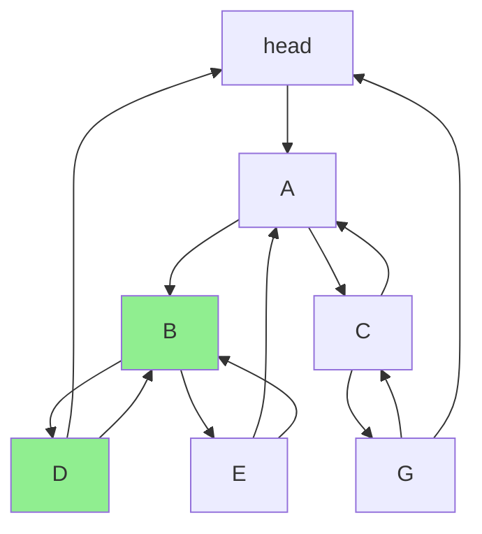
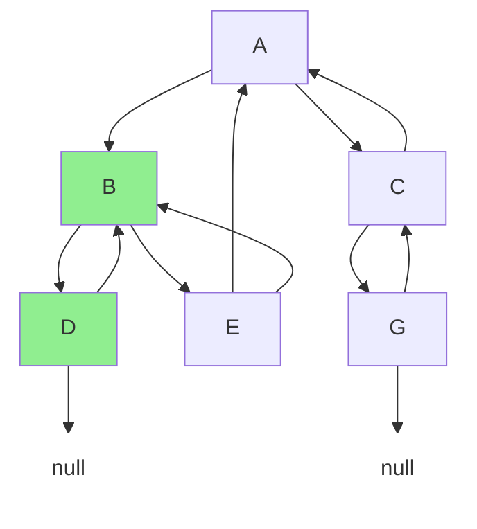

# Chap5.3 二叉树的遍历和线索二叉树

## 1.二叉树的遍历

**二叉树的遍历:指按照某种搜索路径访问树中的每个结点,使得每个结点均被访问依次且仅被访问一次**

>   根(N,Node)左子树(L,lchild)右子树(R,rchild)
>
>   ```mermaid
>   graph TD
>   1-->2
>   1-->3
>   2-->null1[ ]
>   2-->4
>   3-->null2[ ]
>   3-->5
>   4-->6
>   4-->null3[ ]
>   style null1 fill:none,stroke:none
>   style null2 fill:none,stroke:none
>   style null3 fill:none,stroke:none
>   ```
>
>   **拓展:DFS中,每一个结点都会物理上经过它三次(NLR+LNR+LRN),单个枝条入栈是先序遍历,单个纸条出栈是后序遍历,打印中缀表达式则是中序遍历**

首先定义树:

```c++
struct TreeNode {
    int val;
    TreeNode* left;
    TreeNode* right;
    // 构造函数:首先它是函数,其次函数名相同,直接调用本身
    TreeNode(int x) : val(x), left(nullptr), right(nullptr) {}
};
```

**<font color=red>以下三种遍历算法,每个结点都能被访问且只有一次</font>**

>   时间复杂度均为$O(n)$,空间复杂度$O(n)$(系统工作调用栈)
>
>   ```c++
>   // 核心是递归调用,不需要现式while循环
>   void Order(BiTree T){
>   	if(T!=NULL){
>       	visit(T);			// N
>           Order(T->lchild);	// L
>           Order(T->rchild);	// R
>       }
>   }
>   ```

###### **1.先序遍历(NLR)**

```c++
int* preorderTraversal(struct TreeNode* root, int* returnSize) {
    int* res = (int*)malloc(sizeof(int) * 501);
    *returnSize = 0;
    preorder(root, res, returnSize);
    return res;
}
void preorder(struct TreeNode* root, int* res, int* resSize) {
    if (!root) {
        return;
    }
    res[(*resSize)++] = root->val;
    preorder(root->left, res, resSize);
    preorder(root->right, res, resSize);
}
// 删树只能最后删根,不然UB
void destroyTree(TreeNode* root) {
    if (root == nullptr) return;
    destroyTree(root->left);  // 先杀左子树
    destroyTree(root->right); // 再杀右子树
    delete root;              // 最后杀根节点（后序遍历的应用）
}
```

###### **2.中序遍历(LNR)**

```c++
int* inorderTraversal(struct TreeNode* root, int* returnSize) {
    int* res = (int*)malloc(sizeof(int) * 501);
    *returnSize = 0;
    inorder(root, res, returnSize);
    return res;
}
void inorder(struct TreeNode* root, int* res, int* resSize) {
    if (!root) {return;}
    inorder(root->left, res, resSize);		// L
    res[(*resSize)++] = root->val;			// N
    inorder(root->right, res, resSize);		// R
}
void destroyTree(TreeNode* root) {
    if (root == nullptr) return;
    destroyTree(root->left);  // 先杀左子树
    destroyTree(root->right); // 再杀右子树
    delete root;              // 最后杀根节点（后序遍历的应用）
}
```

###### **3.后序遍历(LRN)**

```c++
int* postorderTraversal(struct TreeNode* root, int* returnSize) {
    int* res = (int*)malloc(sizeof(int) * 501);
    *returnSize = 0;
    postorder(root, res, returnSize);
    return res;
}
void postorder(struct TreeNode* root, int* res, int* resSize) {
    if (!root) {
        return;
    }
    postorder(root->left, res, resSize);
    postorder(root->right, res, resSize);
    res[(*resSize)++] = root->val;
}
// 删树只能最后删根,不然UB
void destroyTree(TreeNode* root) {
    if (root == nullptr) return;
    destroyTree(root->left);  // 先杀左子树
    destroyTree(root->right); // 再杀右子树
    delete root;              // 最后杀根节点（后序遍历的应用）
}
```

**4.层次遍历(在栈和队列出现过)**

>   取出队首元素访问其左右孩子,将孩子入队(将下一层元素加入待处理队列)

```c++
           'a'
		 /     \
	   'b'      'c'				则:a|bc|def
	  /  \     /  
	'd'  'e'  'f'   
// 唯一需要while循环的
while(!IsEmpty(Q)){
    DeQueue(Q,p);	// 队头结点出队
    visit(p);		// 访问出队结点
    if(p->lchild != NULL)
        EnQueue(Q,p->lchild);
    if(p->rchild != NULL)
        EnQueue(Q,p->rchild);
}
```

```c++
// 注意C语言要求:(1)type(2)函数位置,放个原型(3)类内都是完整声明不需要模板
int* levelOrder(struct TreeNode* root, int* returnSize) {
    int* res = (int*)malloc(sizeof(int) * 501);
    *returnSize = 0;
    if (!root) {return res;} // 空树直接返回空数组
    struct TreeNode* queue[501]; 
    int head = 0; // 队头游标（出队）
    int tail = 0; // 队尾游标（入队）
    // 根结点率先入队，占据首发位置
    queue[tail++] = root;
    while (head < tail) {
        // 队头元素出队（游标后移）
        struct TreeNode* curr = queue[head++];
        // 访问！打上时间戳
        res[(*returnSize)++] = curr->val;
        // 如果有左孩子，左孩子入队排队
        if (curr->left) {queue[tail++] = curr->left;}
        // (如果有右孩子，右孩子入队排队
        if (curr->right) {queue[tail++] = curr->right;}
    }
    // 此时队头追上队尾 (head == tail)，队列榨干，遍历结束
    return res;
}
```

## 2.由遍历序列构造二叉树

**对于<font color=red>给定的一颗二叉树,其先序/中序/后序/层序都是唯一的</font>**

(已知中序遍历+其它三种遍历序列的任意一种,可以唯一重构该二叉树)

必死前提(1):节点值互不相同,如果存在相同值也可能有不同树(==中序{1,1,1}==)

必死前提(2):所有的遍历序列都要来自同一个树,只给两个序列(没说同一颗树)写不出来
必死前提(3):左右子树的规模是否确定(没有中序,子结点左右不分)

**构树O(n)一定要用哈希表**

>```c++
>vector<int> preorder = {1, 2, 4, 3, 5}; // 先序
>vector<int> inorder = {4, 2, 1, 5, 3};  // 中序
>vector<int> postorder = {4, 2, 5, 3, 1};// 后序
>vector<int> levelrorder = {1, 2, 3, 4, 5}// ceng'ci
>// ====================================================
>(中)4	2	1	5	3	// 中序正写,正序正写
>1			 1						       1
>2		2		 \				->        / \
>4	4			   \					 2   3
>3				  	 3				    /    /
>5				5					   4    5
>// ====================================================
>(中)4	2	1	5	3	// 中序正写,后序反写
>1			 1						       1
>3			/		 3			->        / \
>5		  /		 5  					 2   3
>2		 2		  	 				    /    /
>4	4								   4    5
>// ====================================================
>(中)4	2	1	5	3	// 中序正写,层次正写
>1			 1						       1
>2		 2		\			    ->        / \
>3	  /			  	3				 	 2   3	
>4	4			 /						/    /
>5				5					   4    5
>// ====================================================  
>中	2	1	4	3
>1		 1
>2	2
>3				 3
>4			4
>```

特殊情况:前序和后序构成的树数量

>   **!!!特殊:前序(pre) + 后序(post) +<font color=red>满二叉树:可以确定唯一二叉树</font>**

```C++
// 前序 + 后序唯一确定的特例是“满二叉树” -> 不成立的是单亲家族
// 进一步的:单亲孩子在左侧/右侧产生2种树 -> k个单亲家族产生2^k个情况
vector<int> preorder = {1, 2, 4, 3, 5};
// 先序:一个结点后面必跟它的大(左)儿子
vector<int> postorder = {4, 2, 5, 3, 1};
// 后序:一个结点前面必跟它的小(右)儿子
{1,2}{3,1} -> // 1是双亲
{2,4}{4,2} -> // 2是单亲 +1
{3,5}{5,3} -> // 3是单亲 +1		// 2^2 =4
{4,3}{null,4} -> // 叶子节点
{5,null}{2,5} -> // 叶子结点
// ==================================================== 
// 层次:相邻结点只能是父子/兄弟	-> 不成立的是单亲家族
vector<int> levelrorder = {1, 2, 3, 4, 5}
// 先序:一个结点后面必跟它的大(左)儿子
vector<int> preorder =    {1, 2, 4, 3, 5};
// 没法,尝试构建然后找单亲结点
	1
   /  \
  2    3						 // 2^2 =4
 /      \ 
4        5
```

## 3.线索二叉树

###### **1.线索二叉树的定义**

遍历二叉树:通过特定规则将树中结点排列成线性序列

>   该序列中,除了首尾结点,每个结点都有唯一的直接前驱和直接后继

**问题(1):传统的二叉链表(lchild和rchild)只能看父子关系,每次想得到前驱和后继都必须从根节点重新跑一个`O(n)`**
**问题(2):还有n个结点的二叉树中,共有n+1个空指针域,可以利用充分利用它们指向前驱或者后继**(==注:这种指向前驱和后继的指针,就叫做线索==)
->**中继:好的,那就使用空指针域,但是如何区分这个lchild存的是前驱or左孩子**->使用标志位`ltag`和`rtag`

```C++
// 带有线索的二叉链表:线索链表
// 带有线索的二叉树:线索二叉树
typedef struct ThreadNode {
    ElemType data;
    struct ThreadNode *lchild, *rchild;
    int ltag, rtag;		
    // ltag==rtag==0,指向孩子
    // ltag==1,指向前驱;rtag==1,指向后继
} ThreadNode, *ThreadTree;
```

###### **2.中序线索二叉树的构建**

二叉树的线索化:将空指针域替换为指向前驱或后继的线索,需要额外遍历一次二叉树

构建很简单:pre指向刚刚访问过的结点,p指向当前节点

>(处理左-根-右)
>
>Step1:建立前驱:检查p的左指针(有无左孩子),空则指向结点pre(左前驱)
>
>Step2:建立后继:检查pre的右指针(有无右孩子),空则指向结点p(右后继)
>
>Step3:建立完毕后:pre=p;

```C++
void InThread(ThreadTree &p,ThreadTree &pre){}
void CreateInThread(ThreadTree T){
    ThreadTree pre = NULL;
    if(T!=NULL){
        InThread(T,pre);
        pre->rchild=NULL;
        pre->rtag=1;
    }
}
void InThread(ThreadTree &p,ThreadTree &pre){
    if(p!=NULL){
        InThread(p->lchild,pre);
        if(p->lchild==NULL){				// 建立前驱
            p->lchild=pre;
            p->ltag=1;
        }
        // pre==NULL
        if(pre!=NULL && pre->rchild==NULL){ // 建立后继
            pre->rchild=p;
            pre->rtag=1;
        }
        pre=p;
        InThread(p->rchild,pre);
    }
}
```

>   注意(1):左根右本身就不是根开始的,而是左下的结点(`pre==NULL`)







```c++
				执行操作					 		指针变化
(1)初始化:		 				  			  		p指向的是T,pre则是指向NULL(无头节点)指向head(有头节点)
// (...InThread(p->lchild, pre))				
(2)(D)InThread(p->lchild, pre):		  		  	  p=D,pre==NULL/head
(3)(D.lchild)								 	  p=D.lchild==NULL,pre==NULL/head
(4*)(D)p->lchild==NULL : pre=p		    		  p=D,pre=D
(5)(D)InThread(p->rchild, pre)				  	  p=D,pre=D
(6)(D.rchild)								  	  p=D.rchild==NULL,pre==D
// (B)InThread(p->lchild, pre)					  Finished		
// (D Finished,stack to B)						  p=B,pre==D
    (7)(B)pre!=NULL&&pre->rchild==NULL:pre->rchild=p  p=B,pre==D
    (8)(B)pre=p										  p=B,pre==B
    (8)(B)InThread(p->rchild, pre)					  p=E,pre==B
        (9)(E)InThread(p->lchild, pre):		  		  	  p=E,pre==B
        (10)(E.lchild)									  p=E.lchild==NULL,pre==B
        (11)(E)pre!=NULL&&pre->rchild==NULL:pre->rchild=p p=E,pre==B
        (12)(E)pre=p									  p=E,pre=E
// (B)InThread(p->rchild, pre)					  Finished		
// (E Finished,stack to B)						  p=E,pre==E                         
// (A)InThread(p->lchild, pre)					  Finished	
//...
// DBEACG                   
(i)(G)InThread(p->rchild, pre)					 p=G,pre=G
// (C)InThread(p->lchild, pre)					 Finished
// (A)InThread(p->rchild, pre)					 Finished
// 最后额外的:pre->rchild=NULL;pre->rtag=1;		 (G.rchild没有值,给一个空指针)
// 最后额外的:pre->rchild=head;head->rchild=pre
```

>   pre=p是在左右前驱确定后

###### **3.中序线索二叉树的遍历**

**遍历:存在前驱后继,直接找到中序序列的第一个结点,然后查找每个结点的后继(直至后继为空)**

**若结点的rtag为1,则rchild直接指向其后继;若结点的rtag为0.则后继为右子树中最左下结点**

(1)求中序序列中的第一个结点:

```C++
#include <iostream>
// ADT定义：线索二叉树节点 (ThreadNode)
typedef struct ThreadNode {
    int data;
    struct ThreadNode *lchild, *rchild;
    int ltag, rtag; // 标志位：0代表指向孩子，1代表指向线索(前驱/后继)
} ThreadNode, *ThreadTree;
// 一直向左走，直到遇到尽头（最左下角的节点）
ThreadNode* FirstNode(ThreadNode* p) {
    if (p == nullptr) return nullptr;
    // 只要 ltag == 0，说明有真正的左子树，继续深入
    while (p->ltag == 0) { 
        p = p->lchild;
    }
    return p;
}
```

(2)求结点p在中序序列中的后继(看右指针)

```c++
ThreadNode* NextNode(ThreadNode* p) {
    if (p == nullptr) return nullptr;
    // 规则A：若 rtag == 1，右指针就是现成的传送门，直接去后继
    if (p->rtag == 1) {
        return p->rchild;
    } 
    // 规则B：若rtag == 0说明有真正的右子树。
    // 而第一个被遍历的是右子树的最左下角节点
    else {
        return FirstNode(p->rchild);
    }
}

```

```C++
// 中序遍历整个线索二叉树 (像遍历链表一样)
void InOrder(ThreadTree T) {
    for (ThreadNode* p = FirstNode(T); p != nullptr; p = NextNode(p)) {
        cout << p->data << " "; 
    }
}
```

###### **4.先序线索二叉树和后序线索二叉树**

建立方式和中序建立类似,只不过更换了先后执行次序(直接通过遍历序列前后连)

**先序线索二叉树（根左右 钻地法）**

如果有左孩子，则左孩子就是其后继	左边实心土，钻左孩子(后继)

如果无左孩子有右孩子，则右孩子是后继    左边虚空，右边右孩子，钻右孩子（后继）

如果是叶结点，则右链域直接指示结点的后继 左右虚空，右指针是后继

**后序线索二叉树（左右根 潜水上浮法）**

(1)若结点x是二叉树的根，则其后继为空    已经到海面了，不需要找后继了

(2)若结点x是其双亲的右孩子 或是 其双亲的左孩子且双亲没有右子树，则后继即双亲 		左右根里面的左右都探完了，该回根了(后继是双亲)

(3)若结点x是其双亲的左孩子 且 其双亲有右孩子，则其后继为双亲的右子树上按后序遍历列出的第一个结点	左右根里面的左探完了，该右边了
**<font color=red>考点:后序线索二叉树其实根本找不到后继，因为它不知道是他自己和双亲的关系(没有指向双亲的指针)</font>**

**中序线索二叉树:找两个方向的前驱后继都能找到**

**先序线索二叉树：找不到前驱，可以找到后继(没有双亲指针)**

**后序线索二叉树：找不到后继，可以找到前驱(没有双亲指针)**
