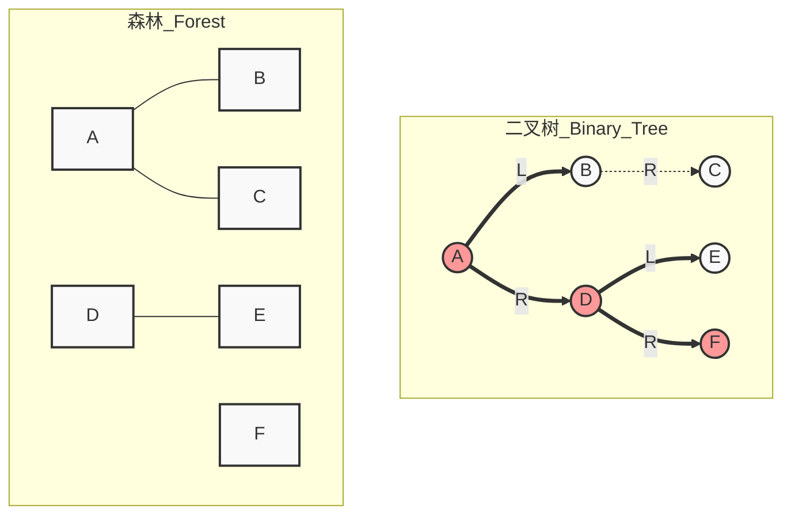
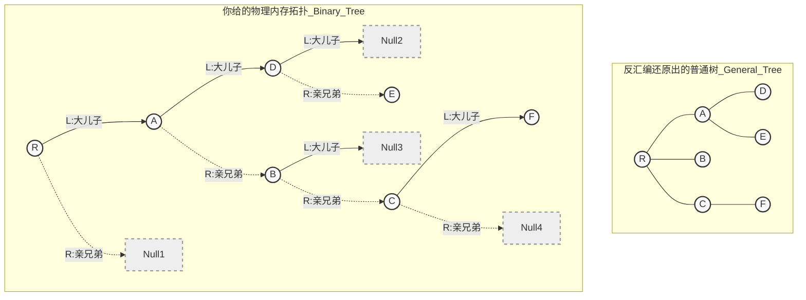
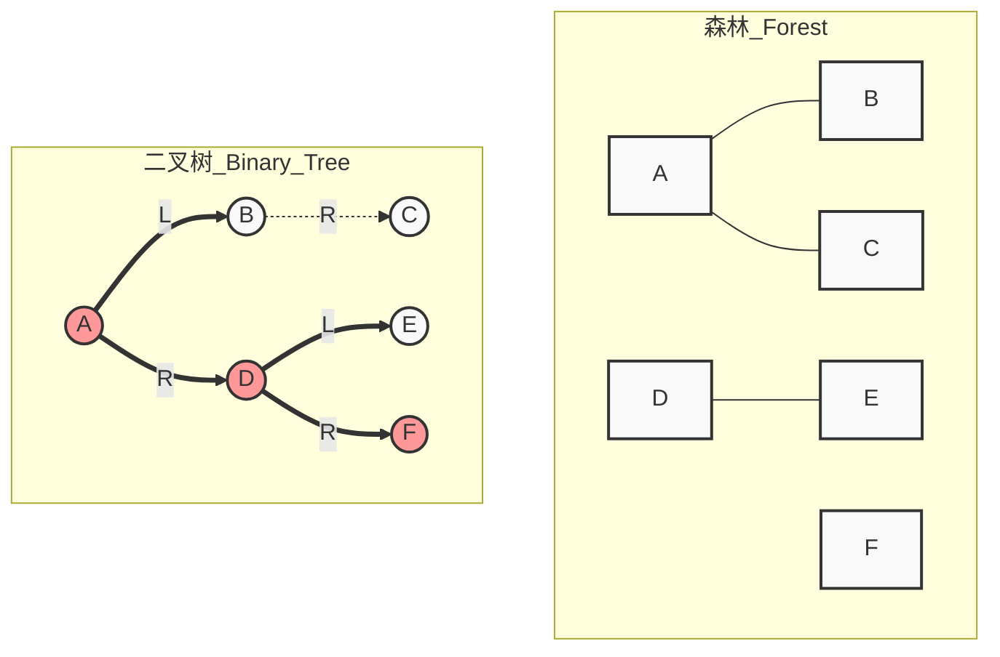
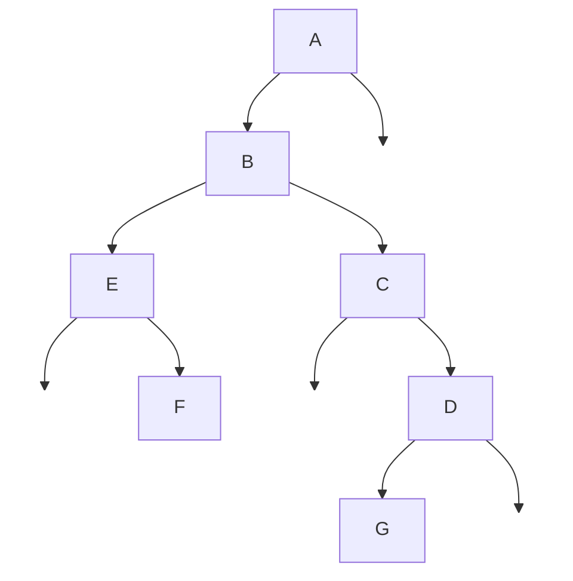
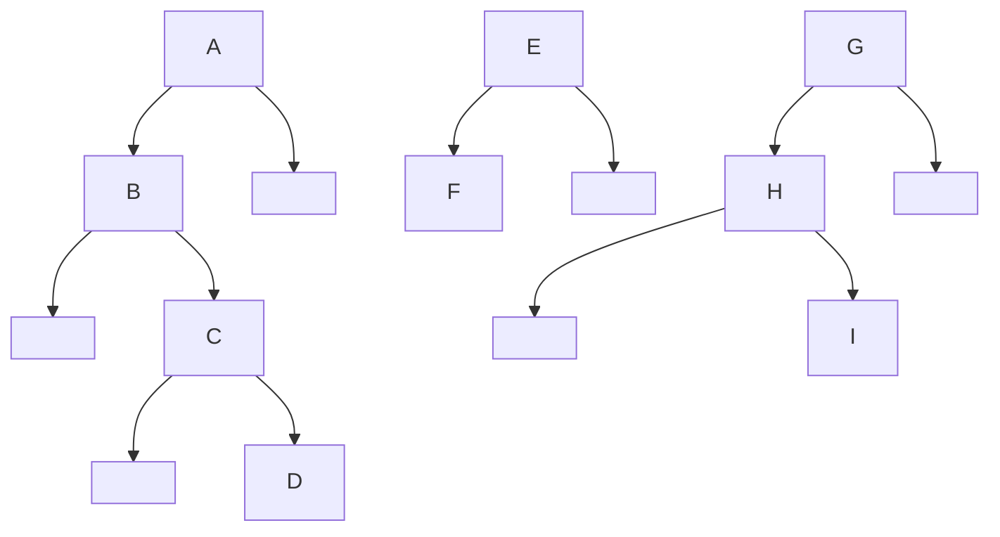

# 5.4 树和森林

## 1.树的存储结构

树的存储方式:顺序存储结构和链式存储结构

>   但是总之都要唯一反映树种各个结点之间的逻辑关系
>
>   ```MERMAID
>   graph TD
>   R-->A
>   A-->D
>   A-->E
>   R-->B
>   R-->C
>   C-->F
>   F-->G
>   F-->H
>   F-->K
>   ```
>
>   

###### **1.双亲表示法(顺序表)**

通过一组连续的空间存储每个结点,同时在每个结点种增设一个伪指针表示其双亲结点在数组种的位置(根节点下标伪0,伪指针域为-1)

表示出来就是孩子指向双亲

```c++
   data   parent
0|	R	|	-1	|
1|	A	|	0	|
2|	B	|	0	|
3|	C	|	0	|
4|	D	|	1	|
5|	E	|	1	|
6|	F	|	3	|
7|	G	|	6	|
8|	H	|	6	|
9|	K	|	6	|
```

>   优点:可以很快得到每个结点的双亲结点
>
>   确定:求结点的孩子时则需要遍历整个结构

注意:区别树的顺序存储结构与二叉树的顺序存储结构

>   树的顺序存储结构:数组下标是结点的编号,指示了结点之间的关系
>
>   二叉树的顺序存储结构:数组下标是结点的编号,指示了结点之间的关系,也指示了二叉树中各个结点之间的关系
>
>   双亲和孩子之间的序号关系是完全二叉树独有的

###### **2.孩子表示法(顺序表+链表)**

孩子表示法是将每个结点的孩子结点视为一个线性表,且以单链表作为存储结构,则n个结点就有n个孩子链表(叶结点的孩子链表为空).n个头指针又组成一个线性表

```C++
   data   LinkList
0|	R	-->1[-->2[-->3[^
1|	A	-->4[-->5[^
2|	B	-->^
3|	C	-->6[^
4|	D	-->^
5|	E	-->^
6|	F	-->7[-->8[-->9[^
7|	G	-->^
8|	H	-->^
9|	K	-->^
```

>优点:可以很快得到每个结点的孩子结点
>
>确定:求结点的双亲时则需要遍历整个结构

###### **3.孩子兄弟表示法(链表)**

也叫做**二叉树表示法**,使用二叉链表作为树的存储结构

(斜着看,右孩子是兄弟,左孩子都是下一层的)

>   结点值,指向结点第一个孩子结点的指针,指向下一个兄弟结点的指针
>
>   ```c++
>   typeef struct CSNode{
>   	ElemType data;
>   	struct CSNode *firstchild,*nextsibling;
>   }CSNode,*CSTree;
>   ```
>
>   ```mermaid
>   graph TD
>   R-->A
>   R-->Null1[ ]
>   A-->D
>   D-->Null2[ ]
>   A-->B
>   B-->Null3[ ]
>   B-->C
>   D-->E
>   C-->F
>   C-->Null4[ ]
>   style Null1 fill:none,stroke:none
>   style Null2 fill:none,stroke:none
>   style Null3 fill:none,stroke:none
>   style Null4 fill:none,stroke:none
>   ```
>
>   

## 2.树森林和二叉树的转换

###### **1.树转换为二叉树**

树转换为二叉树的规则:每个结点的左指针指向其第一个孩子;右指针指向其再原树的下一个右兄弟(见左孩子-右兄弟原则)

###### **2.森林转换为二叉树**

森林是若干棵树的集合,其转换基于单棵树的转换方法,首先将森林中的每棵树分别转换为对应的二叉树;转换后的每棵二叉树根节点均没有右子树,可将这些根节点视为兄弟;将第二棵二叉树作为第一棵二叉树根的右子树

>   **<font color=red>由于树是有序树,在森林里面的站位只能决定出一颗二叉树</font>**
>
>   人话:按照站位确定根,把右边一侧写好(定性),根据左孩子右兄弟继续写(定量)





###### **3.二叉树转换为森林**

给定的二叉树非空,转换为森林的规则:二叉树的根及其左子树对应的第一棵树的二叉树白哦是;将根的右指针断开,其右子树即代表剩余森林转换后的二叉树;对右子树递归应用相同规则,不断分离出下一棵树,直至右子树为空:最后将每棵分离出的二叉树还原为普通树,得到原始森林**<font color=red>二叉树转换为树或森林的结果是唯一的</font>**

**人话:仍然是孩子右兄弟(注意根节点往右的每一个点都是单独的树)**

**推论(1):如果根节点没有右孩子那么它一定是单树**

**推论(2):如果其余结点它向右走的次数大于1,它肯定不是二叉树**

人话:二叉树断右孩子,断一次一颗树(定性)每棵树再左孩子右兄弟(定型)



## 3.树和森林的遍历

**<font color=red>没有中序遍历的原因:<br>即使它是正常的"二叉树",题干说了是森林,那它就具有"孩子兄弟表示"的拓扑结构<br>斜着看的所以现在的根没有任何意义</font>**

###### **1.树的遍历(仅有先根遍历和后根遍历,层次遍历)**

先根遍历:根-子树:(ABEFCDG)-(斜着看)A-BEF-C-DG

后根遍历:子树-根:(EFBCGDA)-(斜着看)EFB-C-GD-A

层次遍历:层次遍历:(ABCDEFG)-(斜着看)A-BCD-EFG



###### **2.森林的遍历(仅有先根遍历和后根遍历,层次遍历)**

相对于树而言,森林的遍历只要按照树根的相对位置写即可

先根遍历:根-子树(ABCDEFGHI)-(斜着看)A-BCD,E-F,G-HI

后根遍历:子树-根(BCDAFEHIG)-(斜着看)BCD-A,F-E,HI-G

层次遍历:**<font color=red>从根开始层次遍历</font>**(AEGBCDFHI)-(根+斜着看)AEG-BCD-F-HI



