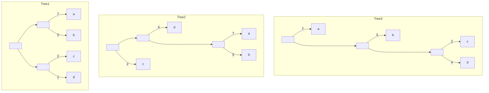
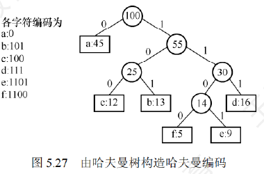
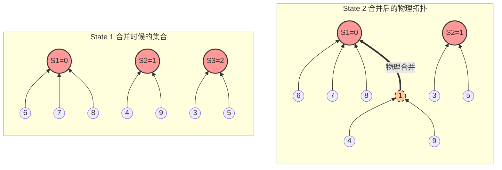
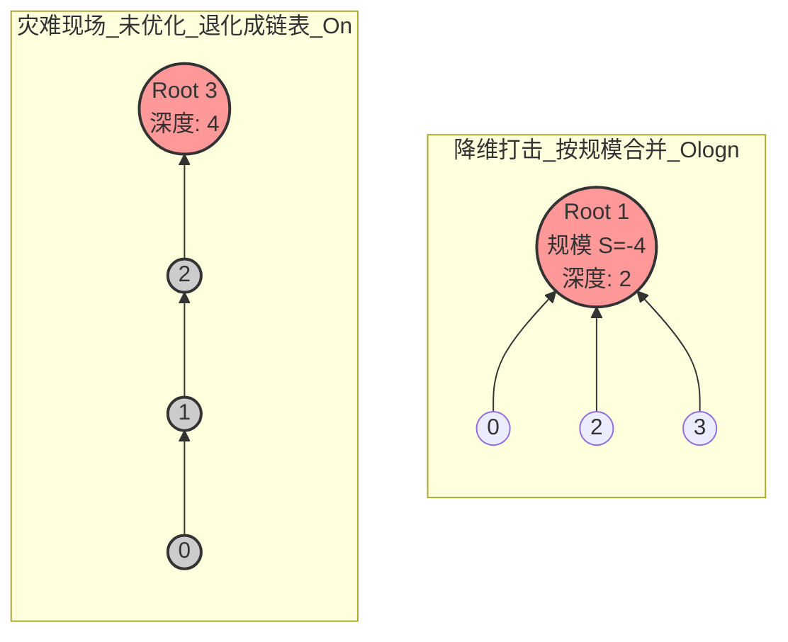

# 5.树和二叉树的应用(哈夫曼树)

## 1.哈夫曼树和哈夫曼编码

###### **1.哈夫曼树的概念**

权：树种结点常常被赋予一个表示某种意义的数值，叫做结点的权

结点的带权路径长度：**从树的根到一个结点的路径长度 与 该结点上权重的乘积**

整树的带权路径长度：**所有叶结点的带权路径长度之和**$WPl = \sum^{n}_{i=1}w_il_i$

>   其中$w_i$是第i个叶结点所带的权重
>
>   其中$l_i$是该叶结点到根结点的路径长度

哈夫曼树:在n个带权叶结点的二叉树种,带权路径长度(WPL)最小的二叉树



>   WPL Tree1:$7\times 2 +5\times 2+2\times 2+4\times 2=36$
>
>   WPL Tree2:$1\times 2+2\times 4+3\times(5+7) = 46$
>
>   WPL Tree3:$1\times 7+2\times 5+3\times(2+4) = 35$(哈夫曼树&最优树)

###### **2.哈夫曼树的构造**

(1)构造一个新结点,从森林里面选**两个结点权值最小的树**组合为新树新权重

(2)删除旧的两棵树,新生成的树加入森林F

(3)重复(1)(2)

###### **3.哈夫曼树的性质**

(1)每个初始结点最后都成了叶子结点,权值越小离根越远

(2)构建过程中新建了n-1个结点(双分支),总结点数应该是2n-1

>   n个原结点,n-1个记录结点(最后是两个叶子结点)

(3)每次合并选取两棵树,所以不存在度为1的结点(严格二叉树)

(4)有序树(左右不同树不同)但是实际上没有左右要求:普通二叉树/哈夫曼树

**<font color=red>坑:二叉树是有序树,但哈夫曼树WPL算出来一样就行,所以可有多个哈夫曼树</font>**

>   ==有左小右大限制的:二叉排序树(但是和WPL又无关了)==

###### **4.哈夫曼编码**

固定长度编码:每个字符使用相同长度的二进制位表示

可变长度编码:不同字符使用不同长度的二进制表示

>   哈夫曼编码是一种可变长度编码
>
>   特点:对出现频率高的字符赋予较短编码,对出现频率低的字符赋予较长编码
>
>   目的:**降低字符的平均编码长度**

前缀编码:一个编码集合中,没有任何一个编码是另一个编码的前缀

>   特点:0,10,110|a,b,c->解码过程没有歧义
>
>   但如果不是前缀编码:中间存在歧义,可能是ab可能只是c
>
>   **二叉树设计的可变长度编码+<font color=red>需要编码的有效字符只在叶子结点上</font>=必然前缀编码**

哈夫曼编码:由哈夫曼树生成哈夫曼编码



WPL:$1\times 45+3\times(12+13+16)+4\times(5+9)=224$

>   **意义:WPL表示对100个字符编码后的二进制总长度**

如果使用3位编码(即a:000/b:001...则WPL是300),这里$224/300\approx 75\%$,省了25%

## 2.并查集

###### **1.并查集的概念**

并查集是一种处理不相交集合的合并与查询的树状数据结构(孩子指向父亲)

```
Initial(S)				将集合S中的每个元素都初始化为一个独立的单元素子集合
Union(S,Root1,Root2)	将集合S中的子集合Root2并入子集合Root1
						(要求Root1和Root2属于不同的子集合,否则不合并)
Find(S,x)				在集合S中查找单元素x所属子集合,并返回该子集合的根节点
```

###### **2.并查集的数据结构**

并查集通常采用**双亲表示法(顺序表)**

>   每个子集合用一棵树表示,所有子集合对应的树共同构成一个森林,并存储在一个数组中
>
>   在该数组中,数组下标代表集合中的元素编号,每个元素所存的值是**双亲结点的下标**
>
>   对于根结点,其双亲域设为负数(取当前所在子集合元素数量的相反数)

Eg:

```
S:	0	1	2	3	4	5	6	7	8	9
	-1	-1	-1	-1	-1	-1	-1	-1	-1	-1
```

操作(1):单个元素的合并:$S_1 = \{0,6,7,8\},S_2=\{1,4,9\},S_3=\{2,3,5\}$

>   修改存储的值为父结点的下标,修改集合元素的相反数
>
>   ```
>   S:	0	1	2	3	4	5	6	7	8	9
>   	[-4	-3	-3]	2	1	2	0	0	0	1
>   	(当前S1(0)一共有4个元素:0,6,7,8)
>   	(当前S2(1)一共有3个元素:1,4,9)
>   	(当前S3(2)一共有3个元素:2,3,5)
>   ```

操作(2):子集合的合并:$S_1\bigcup S_2$:仅需修改合并结点,修改集合元素的相反数

>```
>S:	0	1	2	3	4	5	6	7	8	9
>	[-7	(0)	-3]	2	1	2	0	0	0	1
>	(当前S1(0)一共有7个元素:0,6,7,8,1,4,5)
>	(当前S2(1)一共有3个元素:1,4,9)
>	(当前S3(2)被合并,指向父节点(S1=0))
>```



###### **3.并查集的基本实现**

```C++
#define SIZE 100
int UFSETS[SIZE];
// (1)并查集的初始化操作
void Initial(int S[]){
    for(int i=0;i<SIZE;i++)
        S[i]=-1;
}
// (2)并查集的Find操作
//	  目的:找到包含元素x的根(元素x就是数组下标)
//    注意:直接锁定孩子找父亲(根)
int Find(int S[],int x){
    while(S[x]>=0)
        x=S[x];
    return x;
}
// (3)并查集的Union操作
//	  目的:只需要找到子集合的根,修改其值即可(少了更新上层集合)
void Union(int S[],int Root1,int Root2){
    if(Root1==Root2)return;
    S[Root2]=Root1;
}
```

###### **4.并查集实现的优化**

最坏情况O(n)退化成链表,深度为n

改进:执行Union的时候比较两个子集合的规模,较小规模的树挂在大规模的树下

>   **即规模小的树 的根,直接挂在规模大的树 的根(横向拓展)**
>
>   性质:小树的每个结点的深度+1(规模不同),最多不超过$\lfloor log_2n\rfloor+1$(树的规模相同)

```C++
// 改进后的Union操作
void UnionBySize(int S[], int Root1, int Root2) {
    if (Root1 == Root2) return; // 同一个家族，直接返回
	// 谁的负数更小,谁的规模更大
    if (S[Root1] < S[Root2]) { 
        S[Root1] += S[Root2]; // Root1 吞并 Root2 的人口（例如 -5 + (-2) = -7）
        S[Root2] = Root1;     // Root2 的指针指向 Root1
    } else {
        S[Root2] += S[Root1]; // Root2 吞并 Root1 的人口
        S[Root1] = Root2;     // Root1 的指针指向 Root2
    }
}
```



**改进后的Find操作**

目的:直接把结点全部指向老祖,所有的访问都是O(1)

>   摊时间复杂度会达到恐怖的 $O(\alpha(n))$（阿克曼函数的反函数）
>   在全宇宙任何一台计算机上，这个值都不会超过 4。

```C++
// 直接锁定孩子找父亲(根)
int Find(int S[], int x) {
    if (S[x] < 0) {
        return x; // 找到老祖宗了
    } else {
        // 核心爆破：递归寻找老祖宗，并且在回溯的时候，
        // 把当前节点 x 的双亲，直接改成最高层的老祖宗！
        x=S[x];		//	等价于:p=p->parent
        S[x] = Find(S, S[x]); 
        return S[x];
    }
}
```


