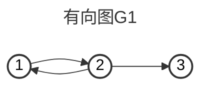
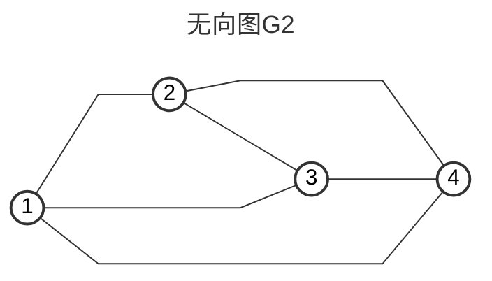
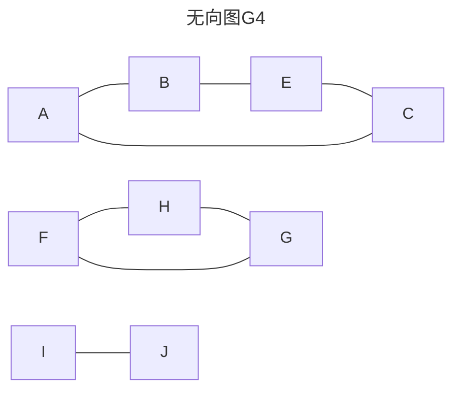

# Chap6.1 图的基本概念

## 1.图的定义

图G由顶点集V和边集E组成,记为G=(V,E)

>   其中V(G)表示图G中顶点的有限非空集;E(G)表示图G中顶点之间的关系集合
>
>   $$V=\{v_1,v_2,\cdots,v_n\}$$	用|V|表示图G中顶点的数量
>
>   $E=\{(u,v)|u\in V,v\in V \}$   用|E|表示图G中边的数量

**<font color=red>线性表可以是空表,树可以是空树,但是图不可用是空图(图不能一个顶点都没有)</font>** 

###### **1.有向图**

若E是有向边(弧)的有限集合,则图G称为有向图

弧是顶点的有序对:<v,w>其中v为弧尾,w为弧头(表示从v到w的有向边,v邻接到w)



>   $G_1=(V_1,E_1),V_1=\{1,2,3\},E_1=\{<1,2>,<2,1>,<2,3>\}$

###### **2.无向图**

若E是无向边(边)的有限集合,则图G称为有向图

边是顶点的无序对:(v,w)或(w,v),w和v互为邻接点,或称边(v,w)和v,w相关联



>   $G_2=(V_2,E_2),V_2=\{1,2,3,4\},E_2=\{(1,2),(1,3),(1,4),(2,3),(2,4),(3,4)\}$

###### **3.简单图,多重图**

满足以下条件,则为简单图:

>   (1):不存在重复边
>
>   (2):不存在顶点到自身的边

满足以下条件,则为多重图:

>   两个顶点之间的边数超过1条,并且允许顶点与自身关联

###### **4.顶点的度[无向图],入度和出度[有向图],握手定理**

[无向图]度:依附于顶点v的边的数量:记作TD(v)

>   **<font color=red>无向图全部顶点的度 = 边数的2倍</font>**
>
>   Eg:G2每个结点度为3,4个结点度为12,边数为6

[有向图]入度和出度:

>入度:以顶点v为终点的有向边数量,ID(v)
>
>出度:以顶点v为起点的有向边数量,OD(v)
>
>**<font color=red>有向图[单个点]的入度=出度	TD(v)=ID(v)+OD(v)</font>**
>
>**<font color=red>有向图[全部点]的入度=出度=边数</font>**

###### **5.路径/路径长度/回路**

顶点$v_p$和$v_q$之间(注意开ADT视角:`std::List<Vertex>`)

>   路径:指一条顶点序列$v_p,v_{i1},v_{i2},\cdots,v_{im},v_q$
>
>   >从起点到终点:`push_back()`经过的结点
>
>   路径长度:路径所包含边的数量
>
>   >   路径长度 = 边的数量 = 结点数-1 = `Vertex.Length()-1`
>
>   回路/环:**第一个顶点**和**最后一个顶点**相同的路径
>
>   >   注意:只有`front() == back()`,如果头尾不同,中间嵌套小环都不算环
>
>   **<font color=red>若一个图有n个顶点,且有大于n-1条边,此图内必然有环<br>但形成的路径不一定是环(头尾结点不同)</font>**

###### **6.简单路径,简单回路**

简单路径:路径序列中顶点不重复出现的路径

>`[v1, v2, v3, v4]` $\rightarrow$没重复,是简单路径。
>
>`[v1, v2, v3, v2, v4]` $\rightarrow$ 有重复,V2,死了

简单回路(环):首先是环(首尾相同)中途绝对不允许走回头路或画8字形

>`[v1, v2, v3, v1]` $\rightarrow$ 完美！首尾是 $v_1$，中间干干净净
>
>`[v1, v2, v3, v2, v1]` $\rightarrow$ 死了！首尾是 $v_1$，中间$v_2$重复了

###### **7.距离**

从顶点u到v的**最短路径长度**称为u到v的距离;若不存在路径,则距离为无穷大

###### **8.子图**

有两个图$G=(V,E)$和$G'=(V',E')$

>   子图:	V是V'的子集,E是E'的子集 $\rightarrow$ 则G'是G的子图
>
>   生成子图:    若图G本身产生的子图(V(G')=V(G)),则称其为G的生成子图

###### **9.[无向图]连通,连通图,连通分量**

连通:在**无向图**中,若从顶点v到w存在路径,则v和w连通

连通图:若**无向图G**中任意两点都是连通的,则图G为连通图,否则非连通图

连通分量:**无向图**中的极大连通子图,称为连通分量



>以上三个子图都是无向图G4的连通分量

**<font color=red>在一个有n个顶点的非连通图中，最多可能有(n-1)(n-2)/2条线</font>**

>   解释:取一个点出来,然后剩下n-1个点完全连通
>
>   >   n个点全连每个点需要n-1条边,n-1个点全连每个点需要n-2条边
>   >
>   >   然后握手定理:其实是去重a<-->b,除以2

###### **10.[有向图]强连通图,强连通分量**

强连通:**有向图**中,若顶点v和w,从v到w和从w到v之间都有路径,则两个顶点强连通

强连通图:**有向图G**中任意两点都是强连通的,则图G为强连通图

强连通分量:**有向图**中的极大强连通子图

**<font color=red>在一个有n个顶点的有向图，且该图是强连通的,则最少需要n条边</font>**

>   解释:n个结点成环,无论如何都能找到前驱后继

###### **11.[无向图]生成树,生成森林**

连通图[无向图]的生成树:是一个包含所有顶点的极小连通子图

若图中有n个顶点,其生成树恰好包括n-1条边(减去形成环的边)

>   对生成树而言:若移除任意一条边,都会变成非连通图
>
>   对生成树而言:若添加任意一条边,都会形成一个回路

非连通图[无向图]的生成森林:每个连通分量的生成树共同构成生成森林

>   即使无向图只有结点没有边:也是5个生成森林

**<font color=red>无向图必然是生成树或生成森林的一种</font>**

###### **12.边的权,网,带权路径长度**

边的权:每条边可以被赋予一个某种意义的数值

带权图(网):每条边上带上权值的图叫做带权图,也叫做网

带权路径长度:路径上所有边的权值之和

###### **13.完全图(简单完全图)**

对于无向图,其边的数量达到最大值n(n-1)/2时,则称之为完全图

>   无向图的边数为n(n-1)/2:表示任意两个结点之间都有一条边
>
>   无向图的边的范围是:0~n(n-1)/2

对于有向图,其边的数量达到最大值n(n-1)时,则称之为有向完全图

>无向图的边数为n(n-1):表示任意两个结点之间都有一对边

###### **14.稠密图,稀疏图**

**==一个不绝对的概念,基于相对性==**但是一般视为边数$|E|<|V|log_2|V|$为稀疏图

###### **15.有向树**

一个顶点的入度为0,其余顶点的入度为1的有向图,称为有向图

>   一个顶点指向其余所有顶点,顶点之间没有联接
>
>   ```mermaid
>   graph TD
>   1 -->2
>   1 -->3
>   1 -->4
>   ```


###### **16.Index**

| **图的类型** | **物理状态目标**         | **拓扑极限模型**                           | **边数**                   |
| ------------ | ------------------------ | ------------------------------------------ | -------------------------- |
| **无向图**   | **最少**边保证**连通**   | 生成树 (一笔画到底，绝不短路)              | **$n-1$**                  |
| **无向图**   | **最多**边且**不连通**   | 绝对孤岛 + 超级帝国 (上一个回合你刚秒杀的) | **$\frac{(n-1)(n-2)}{2}$** |
| **有向图**   | **最少**边保证**强连通** | 单向环 (所有人都在一个数据流转圈里)        | **$n$**                    |
| **有向图**   | **最多**边保证**强连通** | 完全有向图 (两两之间都有双向专线直达)      | **$n(n-1)$**               |