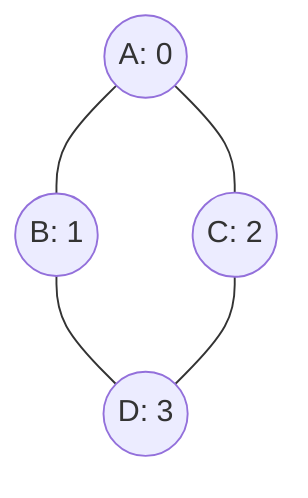
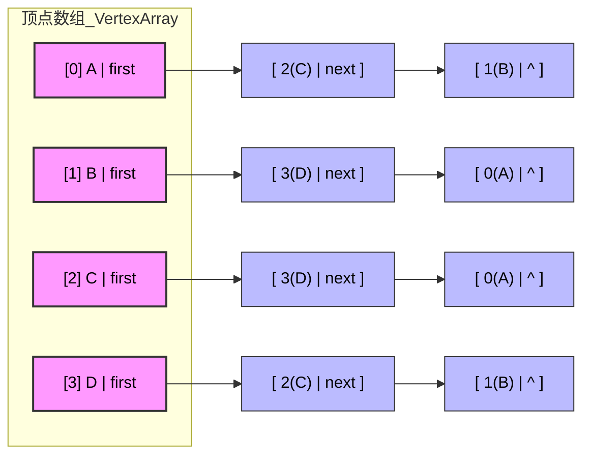
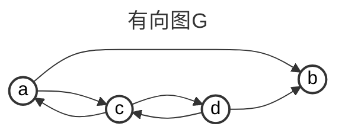

# Chap6.2 图的存储方式

## 1.邻接矩阵法(1D-2D-Array)

**主要思想:通过一个一维数组存储图中结点的信息+一个二维数组存储边的信息**

>   其中存储边信息的二维矩阵:也叫邻接矩阵
>
>   ```C++
>   #define MAX_VERTEX_NUM 100
>   typedef char VertexType;
>   typedef int  EdgeType;	    // 有权
>   // typedef bool EdgeType;	// 无权
>   typedef struct {
>       char vex[MAX_VERTEX_NUM];                  // 顶点表(存名字)
>       int edge[MAX_VERTEX_NUM][MAX_VERTEX_NUM];  // 邻接矩阵 
>       int vexnum, arcnum;                        // 当前顶点数和边数
>   } MGraph;
>   ```
>
>   查询的时间复杂度:`edge[A][B]`,时间复杂度为`O(1)`
>
>   建立的空间复杂度:$$O(|V|^2)$$(并且极度稀疏)
>
>   ```math
>   A[i][j](无权) = \begin{cases}
>   1,&(v_i,v_j)或<v_i,v_j>是E(G)中的边
>   \\ \\ 
>   0,&(v_i,v_j)或<v_i,v_j>不是E(G)中的边
>   \end{cases}
>   \\ \\
>   A[i][j](有权) = \begin{cases}
>   w_{ij},&(v_i,v_j)或<v_i,v_j>是E(G)中的边
>   \\ \\ 
>   \infty,&(v_i,v_j)或<v_i,v_j>不是E(G)中的边
>   \end{cases}
>   ```

**特点(1):无向图的邻接矩阵一定是对称矩阵,只需要保存三角就行**

**特点(2):无向图的邻接矩阵第i行/列非零元素数量正好是顶点i的度TD(i)**

**特点(3):对于有向图,第i行非零元素是出度;第i列非零元素是入度**

**特点(4):优点是判断两个顶点是否相连,缺点是确定图中一共多少边很慢**

**特点(5):本身很稀疏,建议存稠密图增加有效命中**

==**优点:便于存储两个顶点之间是否有边/便于计算各个顶点的度/适用稠密图**==

==**缺点:不便增加和删除结点/不便统计边的数目/空间复杂度高稀疏图无法用**==

**离散:图G的邻接矩阵A,A^n的元素`A[i][j]`代表顶点i到顶点j长度为n的路径数量**

>   状态转移方程： $A^n = A^{n-1} \times A$。
>
>   它的物理意义极其优雅：想走$n$步到$j$那就是先走$n-1$步到一个中转站 $k$，然后再跨最后1步到$j$。这在本质上就是一个高维的动态规划！

## 2.邻接表法(Array+Node)

**目的:解决邻接矩阵浪费内存的痛点:只存真实存在的边**

**主要思想:对图G中每个结点$v_i$建立一个单链表**

>   边表:第i个"单链表结点"表示依附于顶点$v_i$的边(有向图中这些边是$v_i$为尾的弧)
>
>   >   边表结点:邻接点域`adjvex`:存放与$v_i$邻接的顶点在表头数组的位置
>   >
>   >   边表结点:指针域`nextarc`:指向下一条边或弧
>
>   顶点表:边表的头指针与顶点的数据信息采用顺序存储
>
>   >顶点表:顶点域`data`:
>   >
>   >顶点表:边表头指针域`firstarc`:

```C++
// 边表结点 (挂在后面的糖葫芦)
typedef struct ArcNode {
    int adjvex;              // 该边所指向的顶点的位置下标
    struct ArcNode *next;    // 指向下一条边的指针
    // InfoType info;        // 网的边权值
} ArcNode;
// 顶点表结点 (数组里的头)
typedef struct VNode {
    VertexType data;         // 顶点信息
    ArcNode *first;          // 指向第一条依附该顶点的边的指针
} VNode, AdjList[MAX_VERTEX_NUM];
typedef struct { 
    AdjList vertices; 		// 顶点数组 
    int vexnum, arcnum; 	// 图的当前顶点数和弧(边)数
    GraphKind kind;			// 图的种类 
} ALGraph; 
```



```
(0)main程序
    vex[0].data = 'A';
    vex[1].data = 'B';
    vex[2].data = 'C';
    vex[3].data = 'D';
(1)初始化
    开辟一个大小为4的数组,所有的first指针全NULL,用^表示
    [0] A | first -> ^
    [1] B | first -> ^
    [2] C | first -> ^
    [3] D | first -> ^
(2)注入第一条边(A, B)->即(0,1)
	new:0(A),1(B),前插法
	[0] A | first -> [ 1 | ^ ] // A指向B
	[1] B | first -> [ 0 | ^ ] // B指向A
(3)注入第一条边(A, C)->即(0,2)
	new:0(A),2(C),前插法
	[0] A | first -> [ 2 | next ] -> [ 1 | ^ ]  // A指向B,A指向C
	[1] B | first -> [ 0 | ^ ] 					// B指向A
	[2] C | first -> [ 0 | ^ ]					// C指向A
```



**<font color=red>邻接表法和逆邻接表法</font>**

```
Graph:A-->B,A-->C,C-->D,D-->A
邻接表法:找出度易,找入度难(头插法,后继在先)
[0] A | first -> [ 2 | next ] -> [ 1 | ^ ]  
[1] B | ^ 					
[2] C | first -> [ 3 | ^ ]					
[3] D | first -> [ 0 | ^ ]					
逆邻接表法:找入度易,找出度难(尾插法,前驱在先)
[0] A | first -> [ 3 | ^ ] 
[1] B | first -> [ 0 | ^ ] 					
[2] C | first -> [ 0 | ^ ]					
[3] D | first -> [ 2 | ^ ]	
```

**特点(1):G是无向图,需要存储`O(|V|+2|E|)`;G是有向图,需要存储`O(|V|+2|E|)`**

**特点(2):对于稀疏图可以有效节省存储空间**

**特点(3):相对于邻接矩阵的优势:查找指定顶点的所有邻接点**

>   邻接矩阵:需要扫描整行 	邻接表:遍历对应的边表

**特点(4a):无向图邻接表:顶点的度等于邻接表中边表结点的个数**

**特点(4b):有向图邻接表:顶点的出度等于邻接表中边表结点的个数-><font color=red>入度需要遍历</font>**

**<font color=red>特点(5):邻接表的表示不唯一,因为先进哪一条?顺时针逆时针?都不确定</font>**

>   ==进一步导致DFS/BFS打印到控制台的输出不唯一==
>
>   但是邻接表是DFS/BFS的最爱`O(|V|+|E|)`;邻接矩阵则是`O(|V|^2)`

**<font color=red>优点:便于增加删除结点/便于统计边的数目/空间效率高适用于稀疏图</font>**

**<font color=red>缺点:不便于判断顶点之间是否有边/不便于计算有向图各个顶点的度(遍历)</font>**

## 3.十字链表(仅有向图)

**主要思想:邻接表和逆邻接表放在一起**

>   (用一个2指针域作为入口,用一共4指针域检查前驱后继)
>
>   **不同于线索化,这里没有利用空指针域,而是新开**

```c++
// 1. 物理边结点（十字扣件）:实体
// ArcNode表示边->找我和哪些边相连(第3层)
typedef struct ArcNode {
    int tailvex;           // 弧尾下标 (起点)
    int headvex;           // 弧头下标 (终点)  
    struct ArcNode *tlink; // Tail Link: 串起"起点"相同的下一条边 
    struct ArcNode *hlink; // Head Link: 串起"终点"相同的下一条边
    // InfoType info;      // 权值等附加信息
} ArcNode;
/* [tailvex | headvex | *hlink | *tlink ]*/
```

```c++
// 2. 路由器实体（数组头结点）:索引层
// VNode表示顶点->找我有哪些边
typedef struct VNode {	
    VertexType data;       // 顶点名字 (如 'A')
    // 声明两个指向ArNode的指针:随机地址,需要NULL初始化
    ArcNode *firstin;      // 指针:入边链表入口 (只管谁射向了我)
    ArcNode *firstout;     // 指针:出边链表入口 (只管我射向了谁)
} VNode;
/*
struct VNode A{
	VertexType data;
	*firstin -> ArcNode(E→A) [tailvex:E | headvex:A | *hlink | *tlink ]
				 -> tlink -> ArcNode (E→B) 同起点的
				 -> hlink -> ArcNode (D→A) 同终点的
	*firstout-> ArcNode(A→B) [tailvex:A | headvex:B | *hlink | *tlink ]
			  	 -> tlink -> ArcNode (A→C) 同起点的
				 -> hlink -> ArcNode (D→B) 同终点的
}VNode;
*/
```

>firstout：相当于原来的邻接表，能查到结点发出的所有箭头
>
>firstin：相当于逆邻接表，能查到所有扎向结点的箭头

```C++
// 3. 全局内存池
typedef struct {
    VNode xlist[MAX_VERTEX_NUM]; // 所有的路由器都存在这个数组里
    int vexnum, arcnum;
} OLGraph;
/*
struct OLGraph{
	xlist[
        xlist[0]:struct VNode{
            VertexType data;
            *firstin -->ArcNode[tailvex | headvex | *hlink | *tlink ]
            		-> tlink -> NULL
				 	-> hlink -> NULL	
            *firstout-->ArcNode[tailvex | headvex | *hlink | *tlink ]
            		-> tlink -> NULL
				 	-> hlink -> NULL	
        }VNode;,
        xlist[1]:struct VNode{
            VertexType data;
            *firstin  [tailvex | headvex | *hlink | *tlink ]
            		-> tlink -> NULL
				 	-> hlink -> NULL
            *firstout [tailvex | headvex | *hlink | *tlink ]
            		-> tlink -> NULL
				 	-> hlink -> NULL
        }VNode;,
        ...
        ],
    int vexnum;
    int arcnum;
}OLGraph;
*/
```



```
(1)初始化:G:xlist[...],vexnum,arcnum		  
	序号		  		初始化Node				编号  边		
    a = 0		G.xlist[0].data = 'a';  	e1	a → b   
    b = 1		G.xlist[1].data = 'b';		e2	a → c
    c = 2		G.xlist[2].data = 'c';		e3	c → d
    d = 3		G.xlist[3].data = 'd';		e4	d → b
											e5	c → a		
											e6	d → c
	OLGraph（初始化完成，但还没有边）
	xlist[0] (a):firstin = NULL,firstout = NULL
	xlist[1] (b):firstin = NULL,firstout = NULL
	xlist[2] (c):firstin = NULL,firstout = NULL
	xlist[3] (d):firstin = NULL,firstout = NULL
									
(2)标准做法:新建1个ArcNode->直接入图:
// ArcNode[tailvex | headvex | *hlink | *tlink ]
=====================================================================
① malloc ArcNode
② 填 tailvex / headvex
③ 插firstout(同起点):新节点记录原先firstout,然后替换
	e->tlink = G.xlist[i].firstout;		G.xlist[i].firstout = e;    
④ 插firstin(同终点):新节点记录原先firstin,然后替换
	e->hlink = G.xlist[j].firstin;		G.xlist[j].firstin = e;
					a.firstin 	b.firstin 	c.firstin 	d.firstin 
同终点有占位:改hlink(一个索引)和firstin(一个链表)--hin
同起点有占位:改tlink(一个索引)和firstout(一个链表)--tout
=====================================================================
    e1: (0 → 1)		ArcNode[tailvex(0)|headvex(1)|*hlink ^|*tlink ^]
    xlist[0] (a):firstin = NULL,firstout = e1
	xlist[1] (b):firstin = e1,firstout = NULL
	xlist[2] (c):firstin = NULL,firstout = NULL
	xlist[3] (d):firstin = NULL,firstout = NULL
    
    e2: (0 → 2)		ArcNode[tailvex(0)|headvex(2)|*hlink ^|*tlink e1]
    xlist[0] (a):firstin = NULL,firstout = e2->e1
	xlist[1] (b):firstin = e1,firstout = NULL
	xlist[2] (c):firstin = e2,firstout = NULL
	xlist[3] (d):firstin = NULL,firstout = NULL
	
    e3: (2 → 3)		ArcNode[tailvex(2)|headvex(3)|*hlink ^|*tlink ^]
    xlist[0] (a):firstin = NULL,firstout = e2->e1
	xlist[1] (b):firstin = e1,firstout = NULL
	xlist[2] (c):firstin = e2,firstout = e3
	xlist[3] (d):firstin = e3,firstout = NULL
	
    e4: (3 → 1)		ArcNode[tailvex(3)|headvex(1)|*hlink e1|*tlink ^]
	xlist[0] (a):firstin = NULL,firstout = e2->e1
	xlist[1] (b):firstin = e4->e1,firstout = NULL
	xlist[2] (c):firstin = e2,firstout = e3
	xlist[3] (d):firstin = e3,firstout = e4
	
    e5: (2 → 0)		ArcNode[tailvex(2)|headvex(0)|*hlink ^|*tlink e3]
    xlist[0] (a):firstin = e5,firstout = e2->e1
	xlist[1] (b):firstin = e4->e1,firstout = NULL
	xlist[2] (c):firstin = e2,firstout = e5->e3
	xlist[3] (d):firstin = e3,firstout = e4
	
    e6: (3 → 2)		ArcNode[tailvex(3)|headvex(2)|*hlink e2|*tlink e4]
    xlist[0] (a):firstin = e5,firstout = e2->e1
	xlist[1] (b):firstin = e4->e1,firstout = NULL
	xlist[2] (c):firstin = e6->e2,firstout = e5->e3
	xlist[3] (d):firstin = e3,firstout = e6->e4
	=====================================================================
(3)遍历:特长(既能快速找“我发出的边”,也能快速找“指向我的边”)
xlist[0] (a):firstin = e5,firstout = e2->e1
xlist[1] (b):firstin = e4->e1,firstout = NULL
xlist[2] (c):firstin = e6->e2,firstout = e5->e3
xlist[3] (d):firstin = e3,firstout = e6->e4
(1)"从a点出发的所有点"(tlink+firstout)
ArcNode *p = G.xlist[0].firstout; // 先指向firstout,然后输出所有边
while (p) {
	print(p->tailvex, p->headvex);p = p->tlink;
	// 0→2 0→1
}
(1)"终点为a的所有点"(hlink+firstin)
ArcNode *p = G.xlist[2].firstin; // 先指向firstin,然后输出所有边
while (p) {
    printf(p->tailvex, p->headvex);p = p->hlink;
    // 3→2 0→2
}
(4):删除边(状态机不再推导)-> O(n)
	1.从tlink中删掉(需要遍历) 
	2.从tlink中删掉(需要遍历) 
	3.free,G.arcnum--;//更新边数
```

优点:容易求得顶点和边的信息(尤其是作为起点/终点)

缺点:删除很麻烦(需要遍历`tlink`和`hlink`),<font color=red>只能也仅能用于存储有向图</font>

空间复杂度：虽然结构极其复杂但一条边只占用一个物理结点。

>   总空间复杂度依然是极致的 $O(|V| + |E|)$。

时间复杂度:看`tlink`和`hlink`多长(一个for循环O(n))

## 4.邻接多重表(仅无向图)

背景:邻接表中对于无向图的边(A,B)会记录两次[A|next],[B|next]

```C++
// [ mark | ivex | jvex | *ilink | *jlink | info ]
typedef struct ENode {
    int mark;           // 标志域：0代表未访问，1代表已访问/已删除
    int ivex;           // 这条边连着的一个顶点 i 
    int jvex;           // 这条边连着的另一个顶点 j
    struct ENode *ilink;// 顺着这根线，全都是连着顶点 i 的其他边
    struct ENode *jlink;// 顺着这根线，全都是连着顶点 j 的其他边
    // InfoType info;   // 边的权值
} ENode;

typedef struct VNode {
    VertexType data;    // 顶点名字
    ENode *firstedge;   // 指向第一条依附该顶点的边
} VNode;
```

==**这个实现较为简单,务必全部掌握**==

```
(1)初始化    初始化图
e1: a—b     xlist[0] (a): firstedge = NULL
e2: a—c		xlist[1] (b): firstedge = NULL
e3: c—d		xlist[2] (c): firstedge = NULL
e4: d—b		xlist[3] (d): firstedge = NULL
(2)插入i-j
// 挂到 i (ilink记录,然后替换[i].firstedge)
	// 如果firstedge有
e->ilink = G.xlist[i].firstedge;G.xlist[i].firstedge = e;
// 挂到 j (jlink记录,然后替换[j].firstedge)
e->jlink = G.xlist[j].firstedge;G.xlist[j].firstedge = e;
=====================================================================
	e1: [ mark | ivex(0) | jvex(1) | *ilink = NULL | *jlink = NULL ]
    xlist[0] (a): firstedge
    			  -> e1(ilink = NULL|jlink = NULL)
    xlist[1] (b): firstedge
    			  -> e1(ilink = NULL|jlink = NULL)
    xlist[2] (c): firstedge = NULL
    xlist[3] (d): firstedge = NULL
=====================================================================
	e2: [ mark | ivex(0) | jvex(2) | *ilink = e1 | *jlink = NULL ]
	xlist[0] (a): firstedge
    			  -> e2(ilink = e1|jlink = NULL) 
    			     -> ilink = e1(ilink = NULL|jlink = NULL)
	xlist[1] (b): firstedge
    			  -> e1(ilink = NULL|jlink = NULL)
    xlist[2] (c): firstedge
    			  -> e2(ilink = NULL|jlink = NULL) 
    xlist[3] (d): firstedge = NULL
=====================================================================
	e3: [ mark | ivex(2) | jvex(3) | *ilink = e2 | *jlink = NULL]
	xlist[0] (a): firstedge
    			  -> e2(ilink = e1|jlink = NULL) 
    			     -> e1(ilink = NULL|jlink = NULL)
	xlist[1] (b): firstedge
    			  -> e1(ilink = NULL|jlink = NULL)
    xlist[2] (c): firstedge
    			 -> e3(ilink = e2|jlink = NULL) 
    			  	-> e2(ilink = NULL|jlink = NULL) 
    xlist[3] (d): firstedge
    			 -> e3(ilink = NULL)|jlink = NULL) 
=====================================================================
	e4: [ mark | ivex(3) | jvex(1) | *ilink = e3 | *jlink = e1]
	xlist[0] (a): firstedge
    			  -> e2(ilink = e1|jlink = NULL) 
    			     -> e1(ilink = NULL|jlink = NULL)
	xlist[1] (b): firstedge
				  -> e4(ilink = NULL|jlink = e1) 
    			  	-> e1(ilink = NULL|jlink = NULL)
    xlist[2] (c): firstedge
    			 -> e3(ilink = e2|jlink = NULL) 
    			  	-> e2(ilink = NULL|jlink = NULL) 
    xlist[3] (d): firstedge
    			 -> e4(ilink = e3|jlink = NULL) 
    			 	-> e3(ilink = NULL)|jlink = NULL) 
```

```
(3)遍历:如果v是起点ivex则走ilink;如果v是终点jvex则走jlink
=====================================================================
ENode *p = G.xlist[v].firstedge;// 第一个结点
//!!!!!重点,会挖空!!!!!
while (p) {
    if (p->ivex == v):p = p->ilink;
    else:			  p = p->jlink;
}
=====================================================================
//  访问a(0):ilink
	xlist[0] (a): firstedge
    			  -> e2(ilink = e1|jlink = NULL) 
    			     -> e1(ilink = NULL|jlink = NULL)
    Step1:p = e2(ivex=0, jvex=2):
       (p->ivex == 0) p = p->ilink → e1
    Step2:p = e1: (ivex=0, jvex=1)
       (p->ivex == 0) p = p->ilink → NULL
=====================================================================
// 访问b(1):jlink
	xlist[1] (b): firstedge
				  -> e4(ilink = NULL|jlink = e1) 
    			  	-> e1(ilink = NULL|jlink = NULL)
	Step1:p = e4: (ivex=3, jvex=1)
	   (p->jvex == 1) p = p->jlink → e1
	Step2:p = e1: (ivex=0, jvex=1)
       (p->jvex == 1) p = p->jlink → NULL
===================================================================== 
// 访问c(2):ilink-jlink
    xlist[2] (c): firstedge
    			 -> e3(ilink = e2|jlink = NULL) 
    			  	-> e2(ilink = NULL|jlink = NULL) 
    Step1:p = e3: (ivex=2, jvex=3)
	   (p->ivex == 2) p = p->ilink → e2
	Step2:p = e2: (ivex=0, jvex=2)
       (p->jvex == 2) p = p->jlink → NULL
```

## 图的基本操作

```
Adjacent(G,x,y):		判断图G中是否存在边<x,y>或(x,y)。
Neighbors(G,x):			列出图G中与顶点x邻接的所有边。
InsertVertex(G,x):		在图G中插入顶点x。
DeleteVertex(G,x):		从图G中删除顶点x及其相关的所有边。
AddEdge(G,x,y):			若无向边(x,y)或有向边<x,y>不存在，则将其添加到图G中。
RemoveEdge(G,x,y):		若无向边(x,y)或有向边<x,y>存在，则从图G中删除该边FirstNeighbor(G,x): 	查找图G中顶点x的第一个邻接点。若存在则返回顶点号;若x没有邻接点或图中不存在x，则返回-1
NextNeighbor(G,x,y):	假设顶点y是顶点x的一个邻接点，返回除y外顶点x的下一个邻接点的顶点号。若y是x的最后一个邻接点，则返回-1
Get_edge_value(G,x,y):	获取图G中边(x,y)或<x,y>对应的权值Set_edge_value(G,x,y,v):设置图G中边(x,y)或<x,y>对应的权值为v.此外，还有图的遍历算法:按照某种顺序访问图中的每个顶点且仅访问一次。常见的图遍历算法包括深度优先遍历(DFS)和广度优先遍历(BFS)，具体内容将在下一节详细讨论。
```

