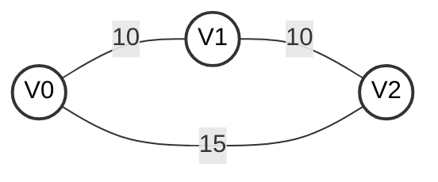
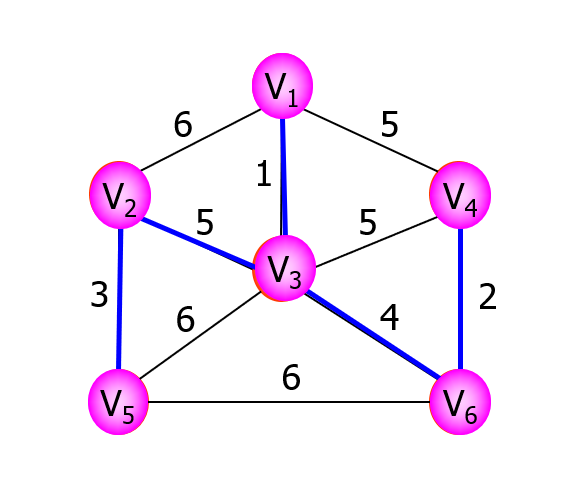
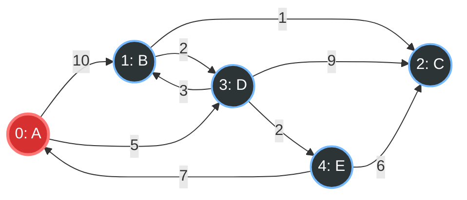
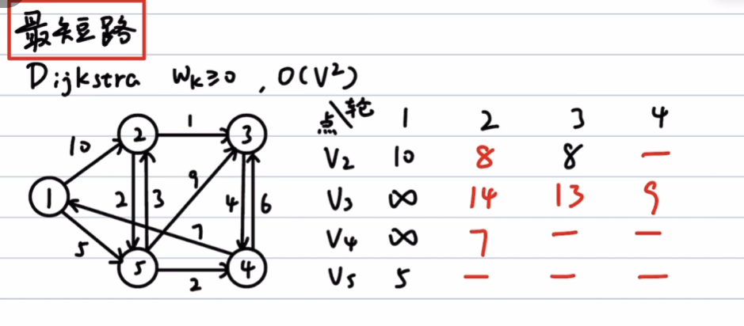
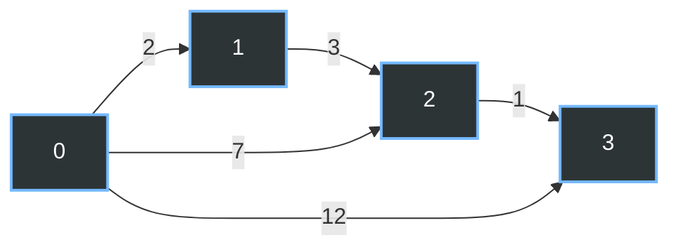
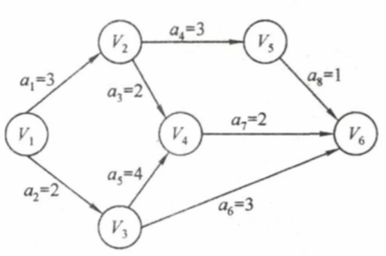

# Chap6.4 图的应用

## 1.最小生成树(MST)

**生成树:目标是删除重复边,n个结点留下n-1条边**

**最小生成树:<font color=red>带权连通无向图G</font>中不同生成树总权重可能不同,最小权重的就是MST**

**MST特性(1):若图G中含有权值相同的边,则最小生成树可能不唯一/唯一(值相同,点不同)**

>   但是总权值是一样的,都是最小值

**MST特性(2):若图G中含有权值不同的边,则最小生成树唯一(最小值)**

**MST特性(3):如果无向连通图本身就只有n-1条边了,它就是MST了(删不了边了)**

>   MST的边数等于n-1

<font color=red>MST的目标是总权值最小,但是并非任意两个顶点之间的路径都是最短路径)</font>

MST的基本思想设N=(V,E)是一个连通网，U是顶点集V的一个非空子集。
若边(u,v)是一条具有最小权值的边，其中 u∈U，v∈V-U，
则必存在一棵包含边(u,v)的最小生成树。



>   [最小生成路径]	MST:V0->V1,V1->V2 (总共权值为20)
>
>   [最短路径]	   PTH:从V0->V2直达才是最优,但是MST多绕了一圈

###### **1.PRIM**

Prim算法的核心思想:通过经过的结点->选择其中权重最小的边

初始的时候:从图中任取一个顶点加入树T,**选择一个当前T中顶点集合距离最近的点**,将临近点集合中"权值最小的边"加入树.




```
遍历点		比较边								最终选择
V1		V1-V2(6),V1-V3(1),V1-V4(5)		 	 V1-V3
V3		V1-V2(6),V1-V4(5)
		V3-V2(5),V3-V4(5),V3-V5(6),V3-V6(4)	 V3-V6
V6      V1-V2(6),V1-V4(5)					 V6-V4
		V3-V2(5),V3-V4(5),V3-V5(6)
		V6-V5(6),V6-V4(2)			
V4      V1-V2(6)		 					 V3-V2
		V3-V2(5),V3-V5(6)
V2      V2-V5(3)							 V2-V5
```

在Prim算法中,每一步都从已构建的树向外拓展一条最短边->但是遍历的点是一样的

>   即时间复杂度和顶点的个数相关:$O(|V|)$

最优适用场景:稠密图,就按点算

**Prim算法的资格检查**

(设已选顶点集为U，未选顶点集为V-U)

(1):形成环:一条边的两个端点u,v都在已选顶点集U内-没有必要加入

(2):不接壤:一条边的两个端点u,v都在未选顶点集内V-U内-无法加入

(3):非最优:一条边的两个端点u,v正常($u \in U, v \in V-U$),但是权值不是最小的

###### **2.Kruskal算法**

Kruskal算法的核心思想:按照边的权值递增的次序选择合适的边构造最小生成树

初始的时候,图`T={V,{}}`包含所有结点,每个结点都是一个连通分量

直接全局边的权值从小到大排序考察各条边


```
集合{V1,V2,V3,V4,V5,V6}
比较边										
V1-V2(6),V1-V3(1),V1-V4(5)				  
V2-V3(5),V2-V5(3)
V3-V4(5),V3-V5(6),V3-V6(4)
V4-V6(2),V5-V6(6)
```

在kruskal算法中,每当选择一条连接不同树的边时,这两颗树将通过这条边合并为一颗更大的树,最坏情况是对所有边进行遍历$$(O(|E|))$$+==边是堆存储的,所以查找算法是$o(log_2 |E|)$==,所以总的时间复杂度是$O(|E|log_2|E|)$

最优适用场景:稀疏图,就按边算

**kruskal算法的资格检查**

(设已选顶点集为U，未选顶点集为V-U)

(1):形成环:一条边的两个端点u,v都处于同一个连通分量中

(2):不便宜:选择了更贵的边

## 2.最短路径算法

**注:前面提到的BFS适用于==无权图的最短路径==**

**带权路径长度:从一个顶点$v_0$到图中任意一个顶点$v_i$的路径上所有边的权值之和**

**问题性质:最短路径问题基于==最优子结构性质==:每一段路径肯定也是最短的**

###### **1.Dijkstra算法**

使用一个集合S记录已确定最短路径的顶点

初始的时候,将源点放入S,每当将一个新顶点i加入S以后,需要更新"源点到所有尚未确定的最短路径的顶点(集合V-S中的顶点)的当前最短路径长度"

>final[]:标记各顶点是否已找到最短路径
>
>dist[]:记录从源点到各顶点的当前最短路径长度
>
>path[]:path[i]存储了从源点到顶点i的最短路径;算法结束后,可以通过path[]数组回溯,重构出完整路径

算法(1)贪心:在所有final==F的城市里，挑一个dist最小的，直接设为T！(dist都不看了)

算法(2)松弛:以这个新锁定的城市为中转站，看看和原来的代价比起来是不是更少(小就更新)



```
(0)锁定	final(A,B,C,D,E)	dist(A,  B ,  C  , D ,E)	 		path (A,B,C,D,E)
	A(起点)     T,F,F,F,F         [0], 10, ∞, 5, ∞        			  -,A,-,A,-     
	D(5)		T,F,F,T,F		  [0],(5+3),(5+9),[5],(5+2)             -,D,D,A,D 
	E(7)		T,F,F,T,T		  [0],  8 , (7+6),[5],[7]				-,D,E,A,D
    B(8)		T,T,F,T,T		  [0], [8],(10+1),[5],[7]			    -,D,B,A,D
    C(9)		T,T,T,T,T         [0], [8],(9),[5],[7]					-,D,B,A,D
```

>   如果想要得到最短路径:A->C(反着来)
>
>   path[C] = B,path[B] = D,path[D] = A
>
>   算出来的得到结果:A->D->B->C = 5+3+1 =9

**<font color=red>Dijkstra算法和Prim算法的区别:</font>**

>   1.目的不同:Prim算法:构建最小生成树 Dijkstra算法:构建单源点的最短路径树 
>
>   2.思想不同:Prim算法:从一个点开始,每次选择权值最小的边,连接到已构成的生成树上
>
>   ​	  Dijkstra算法:距离最近的未归入集合的点->从该点更新源点到其它所有顶点的距离
>
>   3.适用不同:Prim算法:只能带权无向图
>
>   ​	  Dijkstra算法:用于带权有向图和带权无向图

**Dijkstra算法的复杂度**

使用邻接矩阵,使用线性扫描dist[]查找最小值,Dijkstra算法的时间复杂度为$O(|V|^2)$

使用带权邻接表,仍然需要查找最小dist[]的值,总时间复杂度为$O(|V|^2)$

==**注意:Dijkstra算法不适用于存在负权边的图(会为了负权绕一圈)**==

==**注意:Dijkstra算法本质是BFS(prior_queue)**==

**Dijkstra快速做法(避免状态机):**



```
(类似prim算法):
初始化做题矩阵,行是轮数,列是点
当前选择图		 	当前出边				选择出边					做法
G1:V1			V1-V2(10),V1-5(5)	 	  	 V1-5(5)			 第一列:V1(0)-V2(10)/V3(无)...
																 V5=0+5=5,V5行(第四行)--
G2:V1-V5		V1-V2(10),					 V5-V4(2)			 第二列:V1V5(5)-V2(3)/V3(9)/V4(2)
				V5-V2(3),V5-V3(9),V5-V4(2)	  					 V4=5+2=7,V4行(第三行)--
G3:V1-V5-V4     V1-V2(10),					 V5-V2(3)			 第三列:V1V5V4(7)-V2(5+3=8)V3(6)
				V5-V2(3),V5-V3(9),								 V2=8,V2行(第一行)--
				V4-V3(6)										 
G4:V1-V5-V4-V2  V2-V3(1)V4-V3(6)			 V2-V3(1)			 第四列:V1V5V4V2(8),V3=9
```

###### **2.Floyd算法**

给定带权有向图,对于任意不同顶点,求解从$v_i$和$v_j$的最短路径以及长度

**1.离散数学图乘法引入**

```math
\begin{align}
(A^2)[i][j] &= \sum_kA[i][k]\cdot A[k][j] 
\\ \\
(A^3)[i][j] &= \sum_k\sum_l A[i][k]\cdot A[k][l] \cdot A[l][j] 
\\ \\
(A^n)[i][j] &= \sum_k\sum_l\cdots\sum_z A[i][k]\cdot A[k][l] \cdots A[z][j] 
\end{align}
```

>   表示从i到j,长度为n<font color=red>(边的数量)</font>的所有路径数量

假设有4个点,$(A^2)[i][j] = \sum_kA[i][k]\cdot A[k][j] $

>   ```
>   (原式表示以k为中转点)
>   假设图有 4 个点：1, 2, 3, 4:找A^2
>   1 → 1 → 4
>   1 → 2 → 4
>   1 → 3 → 4
>   1 → 4 → 4
>   ```

**2.Floyd算法**

基本思路:

d矩阵的乘法的次数等于到

```C++
// 核心状态机：三重 for 循环
for (int k = 0; k < n; ++k) {           // k 必须在最外层！(中转站)
    for (int i = 0; i < n; ++i) {       // i 是起点
        for (int j = 0; j < n; ++j) {   // j 是终点
            // 状态转移方程 (核心松弛动作)
            if (A[i][j] > A[i][k] + A[k][j]) {
                A[i][j] = A[i][k] + A[k][j]; 
                path[i][j] = k; // 如果需要记录路径，把中转站 k 存下来
            }
        }
    }
}
```



>   **(1)初始化矩阵**
>
>   **(2)确定比较路径集合:{tail点集合}-中转点-{head点集合}**
>
>   **(3)计算比较:当前矩阵\[tail\]\[中转点\]+图中的新出边\[中转点\]\[head\]**
>
>   **(4)修正P记录:当前矩阵\[tail\]\[中转点\]受到了中转点k的影响,因此更新P\[tail\]\[中转点\]=k**
>
>   (一直更新全局的边矩阵)
>
>   ==因此不能存在点A-点B有多条边的情况==

```math
(看入边[0-0],出边[0-1][0-2][0-3]因此考虑比较当前[0-1][0-2][0-3])\\
D^{(初始化距离)} = 
\begin{bmatrix}
&[0]&[1]&[2]&[3]\\
[0]&0 & 2 & 7 & 12 \\
[1]&\infty & 0 & 3 & \infty \\
[2]&\infty & \infty & 0 & 1 \\
[3]&\infty & \infty & \infty & 0
\end{bmatrix}
,P^{(初始)} = \begin{bmatrix} -1 & -1 & -1 & -1 \\ -1 & -1 & -1 & -1 \\ -1 & -1 & -1 & -1 \\ -1 & -1 & -1 & -1 \end{bmatrix}

\\
\\(看入边[0-1],出边[1-2],因此考虑比较当前[0-2])
\\(D[0][1] + D[1][2] = 2+3 =5<7,受到了1的影响)
\\D^{(以[1]为中转)} = 
\begin{bmatrix}
&[0]&[1]&[2]&[3]\\
[0]&0 & 2 & 5 & 12 \\
[1]&\infty & 0 & 3 & \infty \\
[2]&\infty & \infty & 0 & 1 \\
[3]&\infty & \infty & \infty & 0
\end{bmatrix}
,P^{(以[1]为中转)} = \begin{bmatrix} -1 & -1 & \mathbf{1} & -1 \\ -1 & -1 & -1 & -1 \\ -1 & -1 & -1 & -1 \\ -1 & -1 & -1 & -1 \end{bmatrix}
\\
\\(看入边[1-2][0-2],出边[2-3]因此考虑比较当前[1-3][0-3])
\\(D[1][2]+D[2][3] = 3+1=4 < \infty,受到了2的影响)
\\(D[0][2]+D[2][3] = 5+1=6 < \infty,受到了2的影响)
\\D^{(以[2]为中转)} = 
\begin{bmatrix}
&[0]&[1]&[2]&[3]\\
[0]&0 & 2 & 5 & 6 \\
[1]&\infty & 0 & 3 & 4 \\
[2]&\infty & \infty & 0 & 1 \\
[3]&\infty & \infty & \infty & 0
\end{bmatrix}
,P^{(以[2]为中转)} = \begin{bmatrix} -1 & -1 & \mathbf{1} & \mathbf{2} \\ -1 & -1 & -1 & \mathbf{2} \\ -1 & -1 & -1 & -1 \\ -1 & -1 & -1 & -1 \end{bmatrix}
\\ \\
D^{(以[3]为中转)} = D^{(以[2]为中转)}(不变)
```

**Floyd读取最短路径**

>```math
>P^{(final)} = \begin{bmatrix} -1 & -1 & \mathbf{1} & \mathbf{2} \\ -1 & -1 & -1 & \mathbf{2} \\ -1 & -1 & -1 & -1 \\ -1 & -1 & -1 & -1 \end{bmatrix}
>```
>
>输入查询序列:(0,3)
>
>->查询(0,3)=2	     ->拆分(0,2)(2,3)
>
>->查询(0,2)=1,(2,3)=-1    ->拆分(0,1)(1,2)(2,3)	
>
>->查询(0,1)(1,2)(2,3)     ->全部都是-1,完成

**Floyd算法的时间复杂度和特点**

->Floyd算法的时间复杂度是$O(|V|^3)$,无需复杂数据结构

->Floyd算法允许负权边(因为全局最优),但是不能出现负权环(刷圈数了)

->Floyd算法允许带权无向图:如上面的有向图,只使用了上三角矩阵

->Floyd算法也可以使用|V|(每个结点都做)次Dijkstra算法,$O(|V|^3)$

###### **3.Dijkstra和Floyd算法总结**

|                | BFS                       | Dijkstra     | Floyd                |
| -------------- | ------------------------- | ------------ | -------------------- |
| 用途           | 单源最短路径              | 单源最短路径 | 各个顶点之间最短路径 |
| 无权图         | 适用                      | 适用         | 适用                 |
| 带权图         | 不适用                    | 适用         | 适用                 |
| 带负权值图     | 不适用                    | 不适用       | 适用                 |
| 带负权回路的图 | 不适用                    | 不适用       | 不适用               |
| 时间复杂度     | O(\|V\|^2^)O(\|V\|+\|E\|) | O(\|V\|^2^)  | O(\|V\|^3^)          |

为了避免带负权回路的图刷钱,所以通过Bellman-Ford算法,把合法路径压成V-1条

## 3.有向无环图描述表达式

有向无环图(DAG)图是指不含任何有向环路的**有向图**

**DAG核心思想:在内存里,长得一模一样的子模块,绝对只存在一份物理实体,如果多了拉指针**

```
((a+b)(b(c+d))+(c+d)e)((c+d)*e)
1.物理寄存器分配(原子操作数)
Node_a/Node_b/Node_c/Node_d/Node_e

2.基本算数表达式(第一层括号)
N1:(a+b)									N1=Node_a+Node_b
N2:(c+d)									N2=Node_c+Node_d
N3:b*(c+d)									N3=Node_b*N2
N4:(c+d)*e									N4=N2*Node_e
N5:(a+b)*(b*(c+d))			    			N5=N1*N3
N6:((a+b)*(b*(c+d))+(c+d)*e)				N6=N5+N4
Root:((a+b)*(b*(c+d))+(c+d)*e)*[(c+d)*e]	Root=N6*N4
```

## 4.拓扑排序(AOV)

意义:很多时间的发生需要前置条件(比如学数据结构之前学C++)

AOV：若用有向无环图表示一个工程，每个顶点代表一个活动，并用有向边$<V_i,V_j>$表示活动$V_i$必须先于活动$V_j$进行的关系,则称这种有向图表示为顶点表示活动的网络,简称AOV网

>   活动$V_i$是活动$V_j$的直接前驱,而$V_j$是$V_i$的直接后继,这种关系具有传递性.
>
>   **常识:任何任务都不能成为自己的前驱后继**
>
>   **每个AOV网都有一个或多个拓扑(因为需要输出入度为0的顶点)排序序列**

###### **拓扑排序:有向无环图的顶点构成的一个线性序列**

>   (1)每个顶点恰好出现一次
>
>   (2)若存在从顶点A到B的路径,则在排序后的序列中,B必须排在A后面

###### **拓扑排序算法**

>(1):从AOV网中选择一个没有前驱(入度为0)的顶点并输出它
>
>(2):从网中删除队列顶点和所有以它为起点的有向边,输出新的图
>
>`indegree[]`:记录每个人物还有几个前置条件没有完成
>
>`Stack`或`Queue`:存放那些入度已经变成0的任务

```C++
bool TopologicalSort(Graph G){
    InitStack(S);
    int i;
    for(i=0;i<G.vexnum;i++)
        if(indegree[i]==0)
            Push(S,i);
    int count=0;
    while(!StackEmpty(S)){
		Pop(S,i);
        print[count++]=i;
        for(p=G.vertice[i].firstarc;p;p->nextarc){
            //将所有i指向的顶点数-1,将入度减为0的顶点压入栈S
            v=v->adjvex;
            if(!(--indegree[v]))
                Push(S,v);
        }
    }
    if(count<G.vexnum)
        return false;
    else
        return true;
}
```

因为输出每个顶点的同时还要删除以它为起点的边

>   采用邻接表存储时,拓扑排序的时间复杂度为$O(|V|+|E|)$
>
>   邻接矩阵的时间复杂度为$O(|V|^2)$

通过深度优先搜索(DFS)也可以实现拓扑排序:将所有顶点按照DFS结束时间降序排列,可得到一个合法的拓扑序列

>   DFS出栈本身就是

###### **逆拓扑排序算法**

>(1):从AOV网中选择一个没有后继(出度为0)的顶点进行输出
>
>(2):从网中删除该结点和所有以它为终点的有向边

###### **拓扑排序算法特点**

特点(1):入度为0的的节点表示没有前驱活动

特点(2):拓扑排序的结果不唯一

>   **<font color=red>拓扑排序唯一的充要条件:AOV网中任意两个顶点之间都存在单向路径</font>**
>
>   (即每次输出顶点的时候,当前入度为0的结点都恰好只有一个)

特点(3):AOV网中顶点地位平等,其编号是人为设定,因此可以根据拓扑排序的结果重新编号

>   对于一般的有向图而言,若其邻接矩阵可以通过顶点重排转换为上三角矩阵,则该图一定是有向无环图
>
>   ```mermaid
>   graph LR
>   	A -->  B
>   	A -->  C
>   	B -->  D
>   	C -->  D
>   	D -->  E
>       classDef default fill:#2d3436,stroke:#74b9ff,stroke-width:2px,color:#fff;
>       classDef source fill:#d63031,stroke:#ff7675,stroke-width:3px,color:#fff;
>       class A source;
>   ```
>
>   ```math
>   \begin{bmatrix}
>   &[A]&[B]&[C]&[D]&[E]\\
>   [A]&0&1&1&0&0\\
>   [B]&0&0&0&1&0\\
>   [C]&0&0&0&1&0\\
>   [D]&0&0&0&0&1\\
>   [E]&0&0&0&0&0\\
>   \end{bmatrix}
>   ```
>
>   如果存在指向前面的节点,则必然会出现下三角矩阵的数

## 5.关键路径(AOE网:活动开销)

###### **1.AOE网和AOV网的区别**

AOE网:[关键路径]在带权有向图,若以顶点表示事件,以有向边表示活动,并以边上的权值表示完成该活动的开销

AOV网:[拓扑排序]**AOV网没有权值**,仅表示顶点(活动)之间的前后关系

在AOE网中，有些活动可以并行进行。在所有从源点到汇点的路径中，**路径长度最大的那条路径被称为关键路径，而把关键路径上的活动称为关键活动。**

**完成整个工程所需的最短时间等于关键路径的长度，即该路径上所有活动持续时间之和。**关键活动决定了工程的总工期，若任一关键活动延迟，整个工程的完成时间将随之推迟。因此，只要识别出关键活动，就能确定关键路径，并得出工程的最早完成时间。下面给出在寻找关键活动时所用到的几个关键参量的定义。

###### **2.AOE网的算法流程**



步骤一:看边

>**(1):正向事件最早发生时间``ve(i)``:**即所有人都要看最慢的人的脸色
>
>|         | v1   | v2   | v3   | v4   | v5   | v6   |
>| ------- | ---- | ---- | ---- | ---- | ---- | ---- |
>| `ve(i)` | 0    | 3    | 2    | 6    | 6    | 8    |
>
>>   ==从V1开始向右边求,看节点的入度:V1=0,V2=0+3,V3=0+2,V4=2+4>3+2=6...==
>>
>>   需要注意的是:如果出现多个入度,选择结果大的边(该事件更关键)
>>
>>   (比如V2和V3都指向V4,但是2+4>3+2,所以填入4)
>
>**(2):正向事件最晚发生时间``vl(i)``:**即既然最晚发生在k,我何必一开始就执行呢
>
>|         | v1   | v2   | v3   | v4   | v5   | v6   |
>| ------- | ---- | ---- | ---- | ---- | ---- | ---- |
>| `vl(i)` | 0    | 4    | 2    | 6    | 7    | 8    |
>
>>==从V6开始向左边求,看节点的出度:V6=8,V5=8-1=7,V4=8-2=6,V3=8-3=5==
>>
>>需要注意的是:如果出现多个出度,选择结果小的边(否则错过该事件)
>>
>>比如V3同时指向V4和V6,但是6-4=2<8-3=5,所以填入2

步骤二:看弧

>   (3)正向活动最早发生时间``e(i)``:看事件k对应的的弧尾i,==照抄ve(i)==
>
>   |        | a1    | a2    | a3    | a4    | a5    | a6    | a7    | a8    |
>   | ------ | ----- | ----- | ----- | ----- | ----- | ----- | ----- | ----- |
>   | `e(i)` | 0(V1) | 0(V1) | 3(V2) | 3(V2) | 2(V3) | 2(V3) | 6(V4) | 6(V5) |
>
>   (4)正向活动最晚发生时间``l(k)``:看事件k对应的弧头k,==**找到vl(弧头),用vl(弧头)-事件原权重**==
>
>   |        | a1                             | a2                             | a3                             | a4                             | a5                             | a6                             | a7                             | a8                             |
>   | ------ | ------------------------------ | ------------------------------ | ------------------------------ | ------------------------------ | ------------------------------ | ------------------------------ | ------------------------------ | ------------------------------ |
>   | `l(k)` | 弧头是V2<br />l(k) = vl(2)-3=1 | 弧头是V3<br />l(k) = vl(3)-2=0 | 弧头是V4<br />l(k) = vl(4)-2=4 | 弧头是V5<br />l(k) = vl(5)-3=4 | 弧头是V4<br />l(k) = vl(4)-4=2 | 弧头是V6<br />l(k) = vl(6)-3=5 | 弧头是V6<br />l(k) = vl(6)-2=6 | 弧头是V6<br />l(k) = vl(6)-1=7 |
>
>   (5)做差,差为0的就是关键路径:a2-a5-a7(V1-V3-V4-V6)
>
>   |             | a1   | a2    | a3   | a4   | a5    | a6   | a7    | a8   |
>| ----------- | ---- | ----- | ---- | ---- | ----- | ---- | ----- | ---- |
>   | `l(i)-e(i)` | 1    | ==0== | 1    | 1    | ==0== | 3    | ==0== | 1    |

###### **3.AOE网络的时间复杂度和特点**

**特点(1):关键路径上的所有活动均为关键活动,决定了整个工程的工期**

>   如果要优化,就提高做事的速度,而不是减少做事的时间->拓扑结构改变
>
>   (关键路径都是最慢了,优化哪怕一段都会产生效果)

**特点(2):网中的关键路径可能不止一条**

>   只优化一整条关键路径可能不够,要把所有可能的关键路径优化了才能产生效果

**时间复杂度:`O(|V|+|E|)`**

>Step1:拓扑排序`O(|V|+|E|)`:{V2,V4,V3,V1}->{V1,V2,V3,V4},前驱后继理明白
>
>Step2:正向反向算`ve`和`vl`:`O(|V|+|E|)`
>
>Step3:计算活动时间`e`和`l`:`O(|E|)`

Dijkstra不能用来算负边权,更不能算负AOE(AOE根本也算不了)

## 6.Finale

采用不同存储结构的时候各种图算法的时间复杂度

|          | Dijkstra | Floyd    | Prim     | Kruskal      | DFS      | BFS      | 拓扑排序 | 关键路径 |
| -------- | -------- | -------- | -------- | ------------ | -------- | -------- | -------- | -------- |
| 邻接矩阵 | $O(n^2)$ | $O(n^3)$ | $O(n^2)$ | -            | $O(n^2)$ | $O(n^2)$ | $O(n^2)$ | $O(n^2)$ |
| 邻接表   | -        | -        | -        | $O(elog_2e)$ | $O(n+e)$ | $O(n+e)$ | $O(n+e)$ | $O(n+e)$ |

