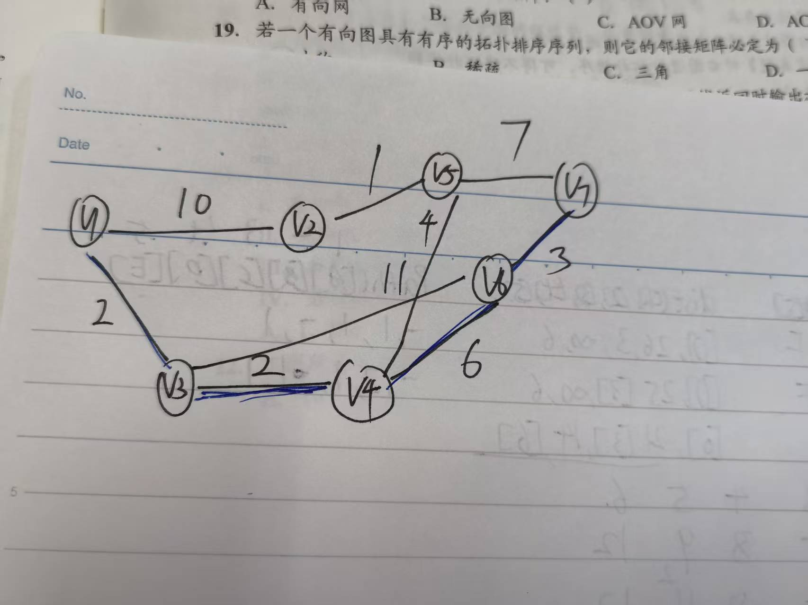
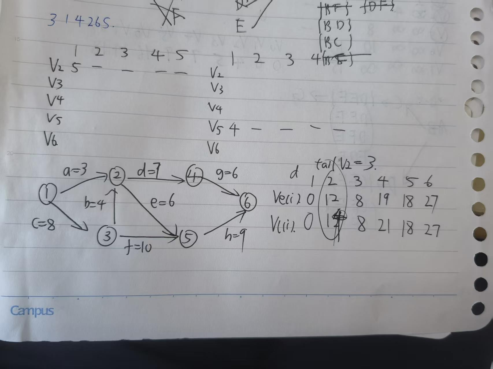

# HomWork_6_4

ACABB CCCCD ADBDC CACCA DCBCC BCACC DDCCB BDCBB DBACA AB

ACAAA CACBD ADDCD CABCA CCCCC ABACC CDCCB BDCAA BBACB BC

记住!!

**拓扑排序无法决定原图(A->B,B->C,A->C?)**

**拓扑序列唯一，要求必须有单向连通路径（一条直线）**

>   类似:$V_1\to V_2\to V_3$,但是还可以过度封装一个($V_1\to V_3$)
>
>   (存不存在一条能一口气从头走到尾、把所有顶点都踩一遍且不重复的路)

****

(C)2.用Prim算法和Kruskal算法构造图的最小生成树，所得到的最小生成树()。
A.相同
B.不相同
C.可能相同，可能不同
D.无法比较

>   无向连通图的最小生成树唯一时,不同算法生成的最小生成树必定是相同的

(A)4.设有n个顶点的无向连通图的最小生成树不唯一，则下列说法中正确的是()。
A.图的边数一定大于n-1
B.图的权值最小的边一定有多条
C.图的最小生成树的代价不一定相等 
D.图的各条边的权值不相等

>   A:不得不选,如果图的边数只有n-1,生成树的结果唯一;生成树不唯一则边大于n-1
>   B:权值最小的边是1,然后两条3成环,最后仍然不唯一
>   C:图各条边权值不相等,每次选的边都是唯一的,MST绝对唯一。

(A)5.用Prim算法求一个带权连通图的最小生成树，在算法执行的某个时刻，已选取的顶点集合U={1,2,3}，已选取的边集合TE={(1,2),(2,3)，要选取下一条权值最小的边，应当从()组中选取。
A. {(1,4),(3,4),(3,5),(2,5)}
B. {(3,4),(3,5),(4,5),(1,4)}
D. {(4,5),(1,3),(3,5))
C. {(1,2),(2,3),(3,5)}

>   错选B,(4,5)都在外面,Prim要求一内一外

(A)7.下列关于图的最短路径的相关叙述中，正确的是()。
A.最短路径一定是简单路径
B.Dijkstra算法不适合求有回路的带权图的最短路径
C.Dijkstra算法不适合求任意两个顶点的最短路径
D.Dijkstra算法可以正确处理含有负权边的图

>   错选C,其实Dijkstra算法完全可用求任意两个顶点的最短路径(for循环)
>
>   >   甚至n次Dijkstra的时间复杂度是 $O(V^2 \log V)$，比Floyd的$O(V^3)$快得多
>
>   A.只要不绕圈子就是简单路径

(B)9.已知带权连通无向图G=(V,E)，其中V={v1,v2,v3,v4,v5,v6,v7},E={(v1,v2)10,(v1,v3)2,(v3,v4)2,(v3,v6)11,(v2,v5)1,(v4,v5)4,(v4,v6)6,(v5,v7)7,(v6,v7)3}(注:顶点偶对括号外的数据表示边上的权值)，从源点v1到顶点v7的最短路径上经过的顶点序列是()。
A. v1, v2, v5, v7
B. v1, v3, v4, v6, v7
C. v1, v3, v4, v5, v7
D. v1, v2, v5, v4, v6, v7

>   错选C,画出来就知道了,抄错边了

(D)13.下列关于拓扑排序的说法中，错误的是()
I.若某有向图存在环路，则该有向图一定不存在拓扑排序
II.在拓扑排序算法中为暂存入度为零的顶点，可以使用栈，也可以使用队列
III.若有向图的拓扑有序序列唯一，则图中每个顶点的入度和出度最多为1
IV.若有向图的拓扑有序序列唯一，则图中入度为0和出度为0的顶点都仅有1个
A.III,IV
B.III,IV
C.II,IV
D.III

>   错选B
>
>   III:拓扑排序中,一个结点可以作为多个结点的条件(出度和入度都不等于1)
>   IV:若序列唯一，有一条贯穿所有点的单线(开头一个入度0，结尾一个出度0)

(C)14.下列关于拓扑排序的说法中，正确的是()。
I.顶点数大于1的强连通图不能进行拓扑排序
II.在一个有向图的拓扑序列中，若顶点a在顶点b之前，则图中必有一条弧<a,b>
II.若有向无环图的拓扑序列唯一，则可以唯一确定该图
A.I和II
B.III和II
C.仅I
D.I和III

>   错选D,仍然是唯一的拓扑排序无法确定图:v1->v2->v3(v1-?->v3有无条件)

(D)15.若一个有向图的顶点不能排成一个拓扑序列，则判定该有向图()。
A.含有多个出度为0的顶点
B.是个强连通图
C.含有多个入度为0的顶点
D.含有顶点数大于1的强连通分量

>   错选C,多个入度 0 只会导致拓扑序列**不唯一**,但不会失败
>
>   拓扑排序失败就意味着成环了(先有鸡先有蛋)

(B)18.下列哪种图的邻接矩阵是对称矩阵?()
A.有向网
B.无向图
D.AOE网
C.AOV网

>   错选C->三角矩阵不是对称矩阵（沿着主对角线对折要完全重合
>   但是AOE网不可能有环,否则前提<->后件
>
>   无向图的邻接矩阵是对称的(抄两遍)

(C)21.下列关于图的说法中，正确的是()
I.有向图中顶点V的度等于其邻接矩阵中第V行中1的个数
II.无向图的邻接矩阵一定是对称矩阵，有向图的邻接矩阵一定是非对称矩阵
III.在带权图G的最小生成树G中，某条边的权值可能会超过未选边的权值
IV.若有向无环图的拓扑序列唯一，则可以唯一确定该图
A.I、II和III B.III和IV C.II D.IV

>   错选D,仍然是拓扑序列定不了图
>   III中:MST中存在必经之路(单线)和其它分支的权值就无关了

(C)23.若某带权图为G=(V,E),其中V={v1,v2,v3,v4,v5,v6,v7},E={<v1,v2>5,<v1,v3>6,<v2,v5>3,<v3,v5>6,<v3,v4>5,<v4,v5>3,<v4,v7>1,<v4,v8>4,<v5,v6>4,<v5,v7>2,<v6,v10>4,<v7,v9>5,<v8,v9>2,<v9,v10>2}(注:边括号外的数据表示边上的权值)，则G的关键路径的长度为()。

A.19
B.20
C.21
D.22

>   错选B(抄错题了)
>   $ve(4) = v_3(6)+5 = 11$。
>
>   $ve(5) = \max(v_2(5)+3, v_3(6)+6) = 12$。
>
>   $ve(7) = \max(v_4(11)+1, v_5(12)+2) = 14$。
>
>   $ve(9) = \max(v_7(14)+5, v_8(15)+2) = \mathbf{19}$。
>
>   $ve(10) = \max(v_6(16)+4, v_9(19)+2) = \mathbf{21}$。

(A)26.在求AOE网的关键路径时，若该有向图用邻接矩阵表示且第i**列**值全为∞，则
A.若关键路径存在，第i个顶点一定是起点
B.若关键路径存在，第i个顶点一定是终点
C.关键路径不存在
D.该有向图对应的无向图存在多个连通分量

>   错选B,瞎了,\[i][j]表示i开始j结束,第i列全为无穷,节点j就没有入度,是起点

(B)27.【2010统考真题】对右图进行拓扑排序，可得不同拓扑序列
的个数是()。(a->e,a->b,a->c,b->c,c->d,e->d)

A.4
B.3
C.2
D.1

>   错选C,正确:a->{b,c,e}->d,a->{b,e,c}->d,a->{e,b,c}->d

(C)31.【2013统考真题】下列AOE网表示一项包含8个活动的工程。通过同时加快若干活动的进度，可缩短整个工程的工期。在下列选项中，加快其进度就可缩短工程工期的是()。

(1--a=3-->2,1--b=8-->3,3--d=4-->2,2--c=9-->4,3--f=10-->5,2--e=6-->5,4--g=6-->6,5--h=9-->6)
A.c和e
B.d和c
C.f和d
D.f和h

>(1) $1 \to 3 \to 2 \to 4 \to 6$；
>
>(2) $1 \to 3 \to 2 \to 5 \to 6$；
>
>(3) $1 \to 3 \to 5 \to 6$。
>
>**想缩短总工期，必须同时缩短所有关键路径。**
>
>活动 $f$ ($3 \to 5$) 在路径 (3) 上；
>活动 $d$ ($3 \to 2$) 在路径 (1) 和 (2) 上。

(C)38.【2019统考真题】下图所示的AOE网表示一项包含8个活动的工程。活动d的最早开始时间和最迟开始时间分别是()。

(1--a=3-->2,3--b=4-->2,1--c=8-->3,2--d=7-->4,2--e=6-->5,3--f=10-->5,4--g=6-->6,5--h=9-->6)

A.3和7
B.12和12
C.12和14
D.15和15

>   计算错了,在2-->4(14)和2-->5(12)选大

(A)39.[2019统考真题】用有向无环图描述表达式(x+y)((x+y)/x)，需要的顶点个数至少是()。
A.5
B.6
C.8
D.9

>   x/y/{n1=x+y}/{n2=(x+y)/x}/{n3=(x+y)((x+y)/x)}

(A)40.【2020统考真题】已知无向图G如右所示，使用Kruskal算法求图G的最小生成树，加到最小生成树中的边依次是()

>   a--20--b,a--9--e,a--12--c,b--11--e,b--6--d,b--5--f,c--10--e,e--14--d,c--18--d,d--7--f

A. (b,f),(b,d),(a,e),(c,e),(b,e)
B. (b,f),(b,d),(b,e),(a,e),(c,e)
C. (a,e),(b,e),(c,e),(b,d),(b,f)
D. (a,e),(c,e),(b,e),(b,f),(b,d)

>   虽然说按照权重进行选择,但是在(b,f)5(b,d)6以后的(d,f)7不能选

(B)41.[2020统考真题】修改递归方式实现的图的深度优先搜索(DFS)算法，将输出(访问)顶点信息的语句移到退出递归前(执行输出语句后立刻退出递归)。采用修改后的算法遍历有向无环图G，若输出结果中包含G中的全部顶点，则输出的顶点序列是G的()。
A.拓扑有序序列
B.逆拓扑有序序列
C.广度优先搜索序列
D.深度优先搜索序列

>   认为输出换了位置应该不变,错选D
>
>   注意:这里是DAG而不是树,树的DFS输出位置都是(拓扑排序/逆拓扑排序)
>
>   **DFS原始输出:进入节点前输出,正向输出**
>
>   ```c++
>   void DFS(u):
>       visited[u] = true
>       print(u)   // 这里是访问节点
>       for each v in Adj[u]:
>           if not visited[v]:
>               DFS(v)
>   ```
>
>   >   即存在关系$A\to B,B\to C,A\to C$,最后输出的可能是ACB(链表存储问题)
>   >
>   >   无法称作拓扑排序
>
>   **DFS逆输出:进入节点后输出,输出递归栈顺序->逆拓扑排序**
>
>   ```C++
>   void DFS(u):
>       visited[u] = true
>       for each v in Adj[u]:
>           if not visited[v]:
>               DFS(v)
>       print(u)   // 这里是访问节点
>   ```
>
>   >   即存在关系$A\to B,B\to C,A\to C$,最后输出的唯一是CBA(看有无叶子节点)
>   >
>   >   称作逆拓扑排序

(B)45.[2022统考真题】下图是一个有10个活动的AOE网，时间余量最大的活动是()。

(1--a=2-->2,1--b=5-->3,2--c=1-->3,2--d=3-->4,3--e=3-->4,3--f=4-->5,3--g=1-->6,4--h=1-->5,4--i=4-->6,5--j=1-->6)

A.c
B.g
C.h
D.j

>   错选A
>
>   |      | 1    | 2    | 3    | 4    | 5    | 6    |
>   | ---- | ---- | ---- | ---- | ---- | ---- | ---- |
>   | ve   | 0    | 2    | 5    | 8    | 9    | 12   |
>   | vl   | 0    | 4    | 5    | 8    | 11   | 12   |
>
>   这里的活动余量不是vl-ve而是vl(head)-ve(tail):
>   c:2->3:vl(3)-ve(2)=4-2=2
>   g:3->6:vl(6)-ve(3)=11-5=6

(B)46.【2023统考真题】已知无向连通图G中各边的权值均为1。在下列算法中，一定能够求出图G中从某顶点到其余各顶点最短路径的是()。
I.Prim算法 II.Kruskal算法 III.图的广度优先搜索算法
A.仅I
B.仅III
C.仅I、II
D.I、II、II

>   错选A,Prim是MST(n-1条边)不是最短路径,问题互斥
>   BFS本质上是边权为1的Dijkstra

(C)47.【2025统考真题】下列关于图的叙述中，正确的是()
A.有向图必存在入度为0的顶点
B.有向无环图的拓扑有序序列存在且唯一
C.各顶点的度均大于或等于2的无向图必有回路
D.可用BFS算法求出带权图中每对顶点间的最短路径

>   错选B
>
>   拓扑序列唯一，要求必须有单向连通路径(一条直线)，否则绝对不唯一
>
>   选项C,如果一个图没有回路他就是树,树绝对有n1,只有n2,肯定有环