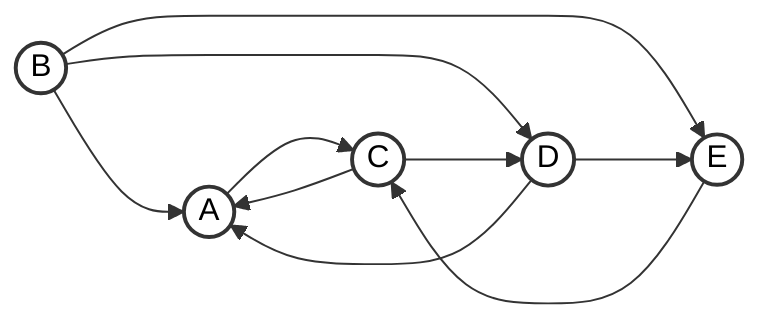

# HomeWork_6_1

BBCAC A==A==B==B==D CADCD ABB

DBCCC ADDDD CBBCA CBD

主要的坑在握手定理,无向图的连通分量,有向图的强连通分量,最少/最大生成条件

***

**因为刷手机导致的粗心**

(D)1.一个有n个顶点和n条边的无向图一定是()
A.连通的
B.不连通的
C.无环的
D.带环的

>   错选B,红字路径结论

(A)6.对于一个有n个顶点的图:若是连通无向图，其边的个数至少为();若是强连通有向图，则其边的个数至少为()
A.n-1,n B.n-1,n(n-1) C. n,n D. n,n(n-1)

>   错选B,至少看花眼了,B是最多

>   

(D)8.在有n个顶点的有向图中，顶点的度最大可达()。
A.n B.n-1 C.2n D.2n-2

>   错选B,2n(n-1)

***

(D)7.07.无向图G有23条边，度为4的顶点有5个，度为3的顶点有4个，其余都是度为2的顶点，则图G有()个顶点。
A.11
B.12
C.15
D.16

>   错选A,握手定理,**无向图全部顶点的度 = 边数的2倍**
>
>   $23\times 2 = 4\times 5+3\times 4 +(n-5-4)\times 2,n=16$

(D)9.具有6个顶点的无向图，当有()条边时能确保是一个连通图。
A.8 B.9 C.10 D.11

>   错选B,连通图:任意两点都是连通的,认为只需要7条边组成环就行
>
>   ==帝国孤岛模型:选5个点$\frac{5\times 4}{2}$+1个孤岛的边=11条边==

(C)16.【2010统考真题】若无向图G=(V,E)中含有7个顶点，要保证图G在任何情况下都是连通的，则需要的边数最少是()
A.6 B.15 C.16 D.21

>   错选A,个人觉得只需要12条即可(类似玻尔兹曼机的样子)
>
>   ==帝国孤岛模型:选6个点$\frac{6\times 5}{2}$+1个孤岛的边=16条边==

***

(C)4.以下关于图的叙述中，正确的是()。
A.强连通A有向图的任何顶点到其他所有顶点都有弧
B.图的任意顶点的入度等于出度
C.有向完全图一定是强连通有向图
D。有向图的边集的子集和顶点集的子集都构成原有向图的子图

>   错选A,似乎和无向图连通搞混了?
>
>   ==强连通有向图(有向图)只需要有路径,不需要两两相连==
>
>   **有向完全图每个结点之间都有边,肯定是强连通有向图**

(A)15.【2009统考真题】下列关于无向连通图特性的叙述中，正确的是()。
I.所有顶点的度之和为偶数
II.边数大于顶点个数减1
III.至少有一个顶点的度为1
A.只有I B.只有II C.I和II D.I和III

>   错选D,做懵了和生成树搞混了(最后一个结点肯定指向null)
>
>   ==I:握手定理,所以肯定是偶数==
>
>   II:包含n个顶点的生成树,边数等于n-1而不是大于
>
>   III:反例:环是有向连通图,但是它们的度都是2,没有1

(D)18.【2022统考真题】对于无向图G=(V,E)，下列选项中，正确的是()
A.当|V|>|E|时，G一定是连通的
B.当|V|≤|E|时，G一定是连通的
C.当|V|=|E|-1时，G一定是不连通的
D.当|V|>|E|+1时，G一定是不连通的

>   错选B,只知道结点和边对于有无环的关系,没有想到结点和边与连通的关系
>
>   翻译:想把n个点连起来最少需要多少边(n-1条)
>
>   ==所以D:|V|>|E|+1其实是|E|<|V|-1==

(B)12.在右图所示的有向图中，共有(2)个强连通分量

>   错选A(1个)强连通分量:有向图中的极大强连通子图,虽然没有结点指向B,但是可以从B指向任何结点,==所以错在B上面,B应该作为单独的连通分量==
>
>   强连通的底层协议：必须有来有回

(B)13.若具有n个顶点的图是一个环，则它有()棵生成树，
A.n^2 B.n C. n-1 D.1

>   错选D,认为减去环的一条边,整体就是一颗生成树
>
>   ==确实是对的,但是n个顶点的环有n种剪法==

G是一个非连通无向图，共有28条边，则该图至少有（ 9 ）个顶点。

>   $\frac{n(n-1)}{2}=28$,n=8刚刚好,但是是非连通,额外给一个,所以8+1=9
