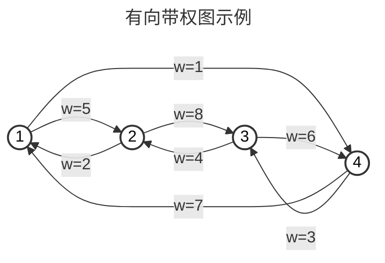
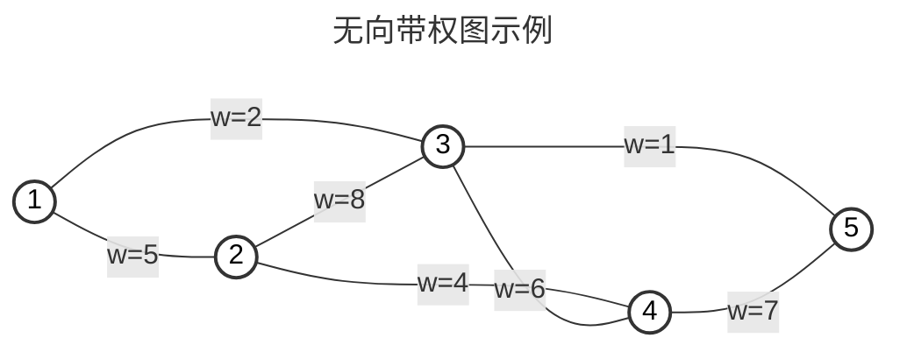

# mermaid

```mermaid
---
title: 有向带权图示例
---
%%{init: {'flowchart': {'curve': 'basis', 'nodeSpacing': 60, 'rankSpacing': 60}}}%%
flowchart LR
    %% 定义全局统一样式：白底黑边、固定宽高，让结点变成精致的小圆
    classDef default fill:#fff,stroke:#333,stroke-width:2px,color:#000;

    %% 结点命名尽量简短（单个字母或数字），配合样式显得紧凑
    1((1))
    2((2))
    3((3))
    4((4))

    %% 核心技巧：将 <--> 拆分为两条单独的单向箭头 -->
    %% 布局引擎会自动将其渲染为两条带有优雅弧度的独立连线，完美分离双向权重
    1 -->|w=5| 2
    2 -->|w=2| 1
    
    2 -->|w=8| 3
    3 -->|w=4| 2

    1 -->|w=1| 4
    4 -->|w=7| 1
    
    4 -->|w=3| 3
    3 -->|w=6| 4
```

```mermaid
---
title: 无向带权图示例
---
%%{init: {'flowchart': {'curve': 'basis', 'nodeSpacing': 60, 'rankSpacing': 60}}}%%
flowchart LR
    %% 统一样式：白底黑边圆形结点
    classDef default fill:#fff,stroke:#333,stroke-width:2px,color:#000;

    1((1))
    2((2))
    3((3))
    4((4))
    5((5))

    %% 无向图使用 --- 进行连接，可以在中间添加权重
    1 ---|w=5| 2
    1 ---|w=2| 3
    
    2 ---|w=8| 3
    2 ---|w=4| 4
    
    3 ---|w=6| 4
    3 ---|w=1| 5
    
    4 ---|w=7| 5
```

