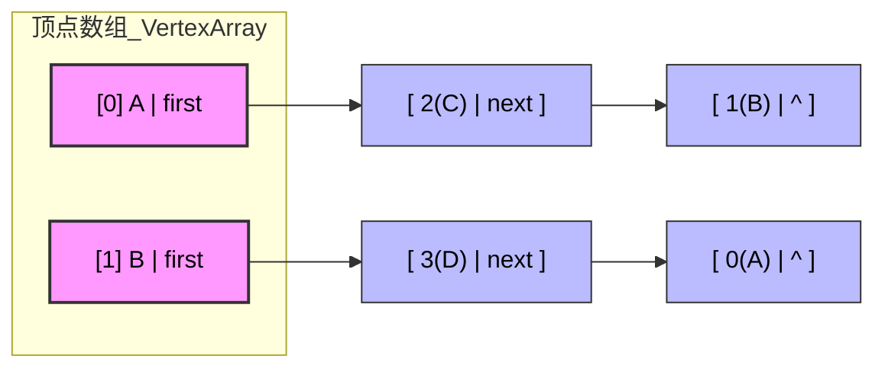

# 图的英语专题

## 1.核心词汇

vex/vertex：顶点（可以记成“V”开头，对应图的“点”）

arc/edge：弧/边（arc通常指有向边，edge是无向边）

adj：adjacent（相邻的，邻接的）

link：链接（指针）

first：第一个（通常指头指针）

in/out：入/出（针对有向图的方向）

head/tail：头/尾（有向边的“弧头”和“弧尾”）

Node：节点

Graph：图

## 2.按类型记忆

###### 1.邻接矩阵

```c++
typedef struct {
   char vex[MAX_VERTEX_NUM];                  // 顶点数组(存名字)
   int edge[MAX_VERTEX_NUM][MAX_VERTEX_NUM];  // 邻接矩阵 
   int vexnum, arcnum;                        // 当前顶点数和边数
} MGraph;
```

###### 2.邻接表相关



```C++
adjvex：		邻接点
AdjList：	邻接表
vertices：	顶点数组（存所有顶点的地方）
ArcNode：	边节点（邻接表里存边信息的节点）
VNode： 		顶点节点（邻接表里存顶点信息的节点）
firstedge：	第一条边（顶点节点里指向第一条边的指针）
==============================================================
整体印象:
ALGraph{
	int vexnum,arcnum,
	[
	vertices[0]:(VNode:data,ArcNode1[adjvex|next]-ArcNode2[adjvex|next])
	vertices[1]:(VNode:data,ArcNode3[adjvex|next]-ArcNode4[adjvex|next])
	...
	]
}
==============================================================
1.(栈初始化):	ALGraph G;	
  G.vertices[0].data = 'A';
1.(堆初始化):	ALGraph *G = (ALGraph*)malloc(sizeof(ALGraph));
  G->vertices[0].data = 'A';
2.(插入边):  	 注入第一条边(A, B)->即(0,1)
  new:0(A),1(B),前插法
  [0] A | first -> [ 1 | ^ ] // A指向B(无向图)
  [1] B | first -> [ 0 | ^ ] // B指向A(无向图)
```

###### 3. 十字链表相关（有向图专用，稍微绕一点）

```C++
OLGraph:Orthogonal List)十字链表存储的图
tailvex/headvex：起射顶点/尽头顶点（有向边“从tail 指向 head”）
顶点结点:形式为A,B,C,D
	  firstin:  指向顶点结点的边	
	  firstout：从顶点结点出发的边
边结点:形式为A→B,A→C,B→C	
      tlink:    同起射点的下一条边
      hlink:    同尽头的下一条边
      // [tailvex|headvex|tlink|hlink]
      // [	A	 |	 B	 | A→C | NULL]   
      // [	B	 |	 C	 | A→C | NULL]   
==============================================================
整体印象:
struct OLGraph{
 	int vexnum;int arcnum;
	xlist[
        xlist[0]:struct VNode{
            VertexType data;
            *firstin -->ArcNode[tailvex | headvex | *hlink | *tlink ]
            		-> tlink -> NULL
				 	-> hlink -> NULL	
            *firstout-->ArcNode[tailvex | headvex | *hlink | *tlink ]
            		-> tlink -> NULL
				 	-> hlink -> NULL	
        }VNode;
        ...
        ]
}OLGraph;
==============================================================
① malloc ArcNode
② 填结点的tailvex/headvex,tlink和hlink为空
③ 插firstout(同起点):新节点记录原先firstout,然后替换
	e->tlink = G.xlist[i].firstout;		G.xlist[i].firstout = e;    
④ 插firstin(同终点):新节点记录原先firstin,然后替换
	e->hlink = G.xlist[j].firstin;		G.xlist[j].firstin = e;
同终点有占位:改hlink(一个索引)和firstin(一个链表)--hin
同起点有占位:改tlink(一个索引)和firstout(一个链表)--tout
=====================================================================
遍历(1):同起点的边:起始结点->firstout->tlink直到NULL
遍历(2):同终点的边:起始结点->in->hlink直到NULL
```

###### 4. 邻接多重表相关（无向图专用，避免边重复存）

```C++
mark：		标记位((比如标记这条边有没有被访问过)
ivex/jvex：	边的两个顶点(无向边连着的两个点，不分头尾)
ilink/jlink：依附于ivex/jvex的下一条边(把同一个顶点的所有边串起来)
=====================================================================
// [ mark | ivex | jvex | *ilink | *jlink | info ]
typedef struct ENode {
    int mark;           // 标志域：0代表未访问，1代表已访问/已删除
    int ivex;           // 这条边连着的一个顶点 i 
    int jvex;           // 这条边连着的另一个顶点 j
    struct ENode *ilink;// 顺着这根线，全都是连着顶点 i 的其他边
    struct ENode *jlink;// 顺着这根线，全都是连着顶点 j 的其他边
    // InfoType info;   // 边的权值
} ENode;
typedef struct VNode {
    VertexType data;    // 顶点名字
    ENode *firstedge;   // 指向第一条依附该顶点的边
} VNode;
=====================================================================
对比:
ALGraph{
    vertices[
        VNodeA(data, first → ArcNode链[adjvex|next])	// 缺点:无向边存两次 A->B
        VNodeB(data, first → ArcNode链[adjvex|next])	// 缺点:无向边存两次 B->A
    ]
}
AdjMultiList{
    vertices[
        VNodeA(data,firstedge → ENode[mark | ivex | jvex | ilink | jlink])
        VNodeB(data,firstedge → ENode[mark | ivex | jvex | ilink | jlink])
    ]
}
=====================================================================
插入i-j
// 挂到 i (ilink记录,然后替换[i].firstedge)
e->ilink = G.xlist[i].firstedge;G.xlist[i].firstedge = e;
// 挂到 j (jlink记录,然后替换[j].firstedge)
e->jlink = G.xlist[j].firstedge;G.xlist[j].firstedge = e;
=====================================================================
	xlist[0] (a): firstedge
    			  -> e2(ilink = e1|jlink = NULL) 
    			     -> e1(ilink = NULL|jlink = NULL)
	xlist[1] (b): firstedge
    			  -> e1(ilink = NULL|jlink = NULL)
    xlist[2] (c): firstedge
    			 -> e3(ilink = e2|jlink = NULL) 
    			  	-> e2(ilink = NULL|jlink = NULL) 
    xlist[3] (d): firstedge
    			 -> e3(ilink = NULL)|jlink = NULL) 
"""""e4: [ mark | ivex(3) | jvex(1) | *ilink = e3 | *jlink = e1]"""""
	xlist[0] (a): firstedge
    			  -> e2(ilink = e1|jlink = NULL) 
    			     -> e1(ilink = NULL|jlink = NULL)
	xlist[1] (b): firstedge
				  -> e4(ilink = NULL|jlink = e1) 
    			  	-> e1(ilink = NULL|jlink = NULL)
    xlist[2] (c): firstedge
    			 -> e3(ilink = e2|jlink = NULL) 
    			  	-> e2(ilink = NULL|jlink = NULL) 
    xlist[3] (d): firstedge
    			 -> e4(ilink = e3|jlink = NULL) 
    			 	-> e3(ilink = NULL)|jlink = NULL)
(3)遍历:如果v是起点ivex则走ilink;如果v是终点jvex则走jlink
// 访问c(2):ilink-jlink
    xlist[2] (c): firstedge
    			 -> e3(ilink = e2|jlink = NULL) 
    			  	-> e2(ilink = NULL|jlink = NULL) 
    Step1:p = e3: (ivex=2, jvex=3)
	   (p->ivex == 2) p = p->ilink → e2
	Step2:p = e2: (ivex=0, jvex=2)
       (p->jvex == 2) p = p->jlink → NULL
```


