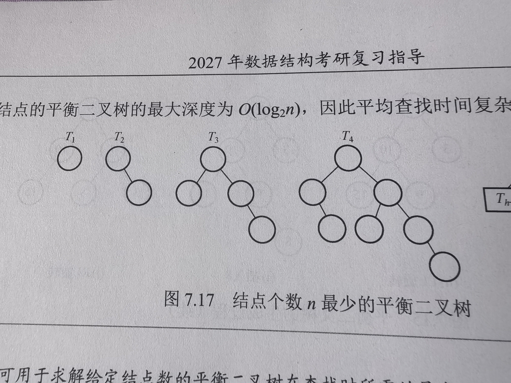
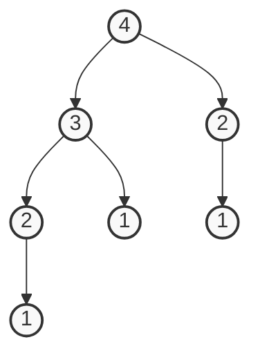
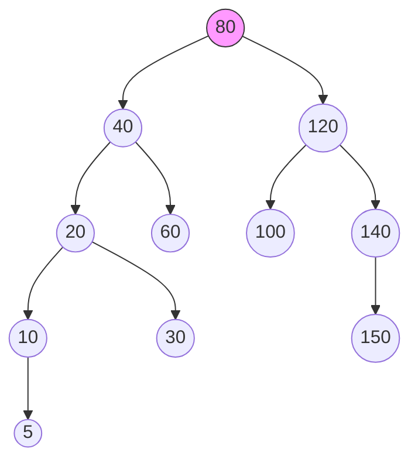
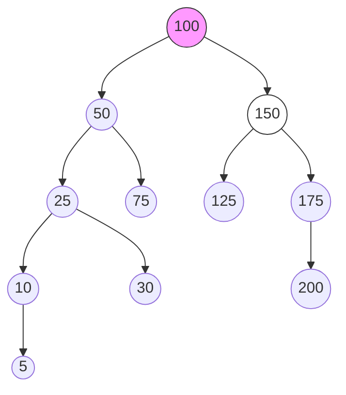
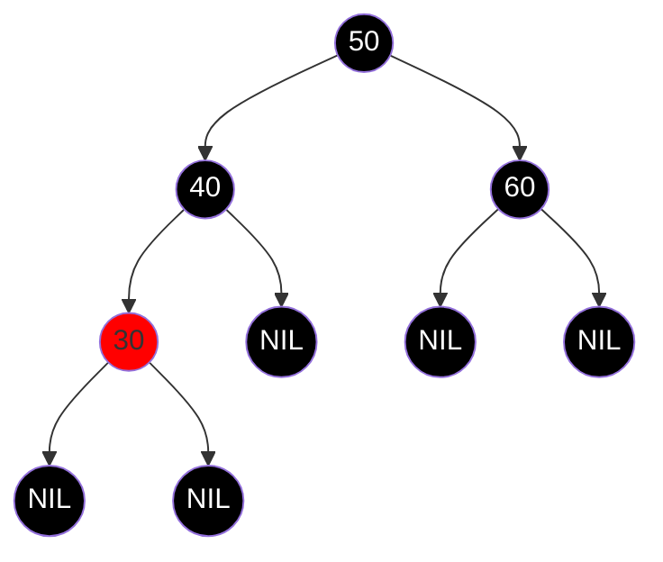
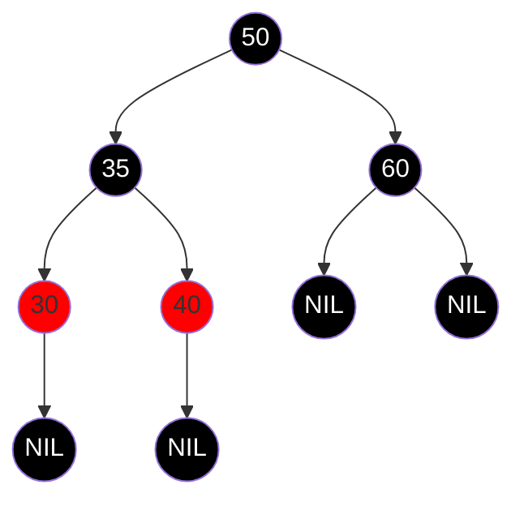
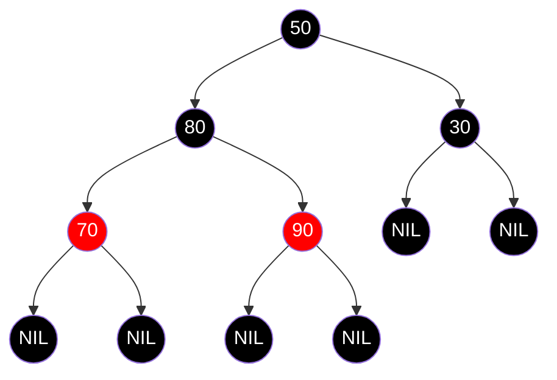
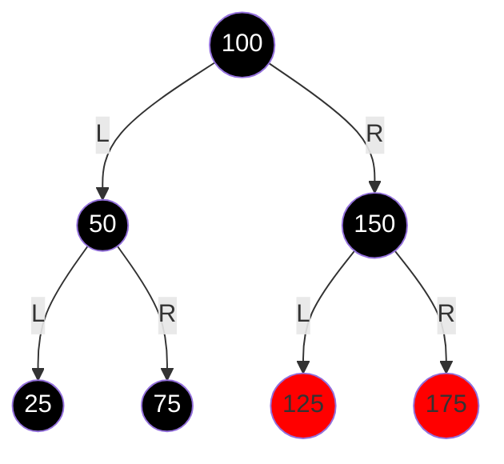

# 7.3 树形查找

## 1.二叉排序树(BST)

**<font color=red>注意:BST没有旋转,不保证所有在上面的节点都小</font>**

###### **1.二叉排序树的定义**

背景:折半查找达到了$O(log_2n)$,但是被顺序存储限制住了,对动态不友好

>   解释:即查找还不错,但是插入和删除的代价是$O(n)$

直观的插入很简单,根据当前树的大小,保证小的在一侧,大的在另一侧

**二叉排序树的状态(1):空树**

**二叉排序树的状态(2):二叉排序树**

>若左子树非空,则左子树上所有节点的关键字均小于根结点的关键字
>
>若右子树非空,则右子树上所有节点的关键字均大于根节点的关键字
>
>左右子树也分别是一颗二叉排序树

由以上信息可知:

>二叉排序树的构建只需要扫描大小,按照左小右大即可
>
>二叉排序树的序列只需要中序遍历即可得到从小到大的序列

###### **2.二叉排序树的查找**

二叉排序树的查找是从根节点开始,逐层向下比较并选择左右子树的过程:

若二叉排序树非空,则将给定关键字与根节点的关键字比较(递归)

>相等:则查找成功
>
>不等:小于根节点的关键字,则在根节点的左子树上查找
>
>不等:大于根节点的关键字,则在根节点的右子树上查找

**<font color=red>设$N_h$表示深度为n的AVL树所需最小结点数,则$N_h = N_{h-1} + N_{h-2} + 1$</font>**

>斐波那契数列$F_n$:$0, 1, 1, 2, 3, 5, 8, 13, 21, 34, 55 \dots$
>
>$h=1$ : $1$ 个节点(0+1)
>
>$h=2$ : $2$ 个节点(0+1+1)
>
>$h=3$ : $4$ 个节点(0+1+1+2)
>
>$h=4$ : $7$ 个节点(0+1+1+2+3)

(注:对于满二叉树高度公式是:$h = \lceil \log_2(n+1) \rceil$)

(注:对于AVL树而言:$$h \approx 1.44 \log_2(n+2) - 1.328$$)



```C++
BSTNode *BST_Search(BiTree T,ElemType key){
    while(T!=NULL&&key!=T->data){
        if(key < T->data)T=T->lchild;
        else T=T->rchild;
    }
    return T;
}
```



(只能按照斐波那契来算,想不完的)

###### **3.二叉排序树的插入**

二叉排序树是在查找过程中构建:即如果查找失败,则直接插入操作

```C++
int BST_Insert(biTree &T,KeyType k){
    if(T==NULL){
        T = (BiTree)malloc(szeof(BSTNode));
        T->data = k;
        T->child = T->rchild=NULL;
        return 1;
    }
    else if(k==T->data)
        return 0;
    else if(k<T->data)
        return BST_Insert(T->lchild,k);
    else
        return BST_Insert(T->rchild,k);
}

// 构造则取出数组元素后加入树即可
void Create_BST(BiTree &T,KeyType str[],int n){
    T = NULL;
    int i=0;
    while(i<n){
		BST_Insert(T,str[i]);
        i++;
    }
}
```

###### **4.二叉排序树的删除**

**注:删除不能直接删除所有子树,需要重新联接保证二叉排序树的性质**

情况(1):若删除节点z是叶节点,则可以直接删除

情况(2):若删除节点z有一颗子树(左或右)

>   结论:直接使用子树的根节点占据节点z

情况(3):若删除节点z有两颗子树(左和右)

>结论:直接使用直接前驱或直接后继占据节点z
>
>**<font color=red>注意:这里无法确定使用直接前驱或者直接后继(Hibbard现象)</font>**
>
>>   并且单纯只使用其中一个直接前驱/直接后继,会导致树的严重倾斜->退化
>>
>>   $O(log\ n)\to O(\sqrt{n})$(使用启发式算法)
>

###### **5.二叉排序树的查找效率**

二叉排序树的查找效率取决于树的高度
>如果是平衡二叉排序树,则平均查找长度为$O(log_2n)$
>
>>   $n=10:ASL = (1+2\times 2+3\times 4+4\times 3)/10 = 2.9$
>
>如果是极端二叉排序树,则平均查找长度退化为$O(n)$
>
>>   $n=10:ASL = (1+2+3+4+5+6+7+8+9+10)/10 = 5.5$

二分查找判定树和二叉排序树(二分查找唯一,二叉排序树不唯一)

如果表是静态查找表,则建议二分查找;如果是动态查找表(增加删除操作,则二叉排序)

>   二分查找的唯一:序列视角而非集合视角,并且折半公式确认
>
>   二叉排序的不唯一(1):插入序列的不同:输入形式是集合,而不是序列->形态不同
>
>   **<font color=red>卡特兰数:$C_n = \frac{1}{n+1}C^n_{2n}$</font>**(n=3,5种形态;n=4,14种形态)
>
>   二叉排序的不唯一(2):删除策略的不唯一:直接前驱和直接后继的上位不同

**==但是,不同的集合可能会构成相同的二叉排序树:{2,1,3},{2,3,1}==**

## 2.平衡二叉树(AVL树)

###### **1.AVL树的定义**

**平衡二叉树:任意节点的左右子树高度差的绝对值不超过1**

>平衡二叉树形式(1):空树
>
>平衡二叉树形式(2):左子树和右子树都是平衡二叉树,且高度差绝对值不超过1

###### **2.AVL树的插入**

**平衡因子:左子树和右子树的高度差**

```
状态机(1)插入:	  	  按照二叉排序树左小右大的方式进行插入
状态机(2)计算&寻找:	从插入节点"沿着父指针"向上爬
状态机(3)结果:		  找到|BF|>1的节点(即"最小不平衡子树的根节点"A)
					  (注:|BF| = 左-右 = 1)

状态机(4):旋转方式:    从A开始到新节点的前两步			(物理方式)
旋转(1):LL			第一步向左,第二步向左			捏住中间节点向上提
旋转(2):RR			第一步向右,第二步向右			捏住中间节点向上提
旋转(3):LR			第一步向左,第二步向右			最下面的C往上提,右侧A下降
旋转(4):RL			第一步向右,第二步向左			最下面的C往上提,左侧B下降
| 	 A     A		  B   |      A	        C  	   | A                C
|   B  和   B   ->  A   C |  B     (LR) -> B   A;  |      B(RL) ->  A   B
| C          C			  |	  C                    |   C

状态机(5):旋转作用		作用于根节点A-孩子节点-孩子节点的子树
状态机(6):分配孩子		最下面的铁盒将自然的作为左子树的右节点和右子树的左节点

```

Eg:{50,20,60,30,10,25,35},目标:插入25和35

>```mermaid
>graph TD
>50((50)) --> 20((20))
>50((50)) --> 60((60))
>20((20)) --> 10((10))
>
>20((20)) --> 30((30))
>30((30)) --> 25((25))
>30((30)) --> 35(( ))
>style 50 fill:#fff,stroke:#333,stroke-width:2px
>```
>
>状态机(1):按照二叉排序树进行排序,如图所示
>
>状态机(2):寻找失衡节点:插到25的时候(还没到35的时候)
>
>```
>Node	DF
>25		0
>30		0
>20		1
>50		2 !!!
>```
>
>状态机(3):判断旋转,从50到25,先L再R,LR旋转
>
>状态机(4):旋转操作,操作对象50-20-30,30作为根,20左孩子,50右孩子;旋转后再插入的35自然成50的左孩子
>
>```mermaid
>graph TD
>30((30)) --> 20((20))
>30((30)) --> 50((50))
>20((20)) --> 10((10))
>20((20)) --> 25((25))
>50((50)) --> 35((35))
>50((50)) --> 60((60))
>style 30 fill:#fff,stroke:#333,stroke-width:2px
>```

###### **3.AVL的删除**

```
状态机(1)拆卸:        按照二叉排序树方式删除节点
                    S1:删除的是叶子节点						操作:直接删除
                    S2:删除的节点存在单个孩子:会导致孩子失亲	操作:让孩子   占据  被删节点
					S3:删除的节点存在两个孩子:会从中间劈开	 操作:中序前驱 占据  被删节点  
状态机(2)计算DF:     从实际被剪掉的节点的父节点开始，向上计算|BF|
                    注:若|BF|>1,标记为最小不平衡子树根节点A
状态机(3)定型:       看哪边重决定(LL/RR/LR/RL)
					注:如果向下走发现重的一侧的分支高度相同,则优先使用LL/RR效率更高
状态机(4)!!!连锁:    检查旋转后新根的高度
```

Eg1:目标删除150



>状态机(1):删除150
>
>状态机(2):计算DF:80(4-2=2,失衡);LL过高
>
>状态机(3):执行LL旋转(把40拎起来即可)
>
>```mermaid
>graph TD
>    40((40)) --> 20((20))
>    40 --> 80((80))
>    
>    20 --> 10((10))
>    20 --> 30((30))
>    10 --> 5((5))
>    
>    80 --> 60((60))
>    80 --> 120((120))
>    
>    120 --> 100((100))
>    120 --> 140((140))
>
>    style 40 fill:#9f9,stroke:#333
>```

Eg2:删除125



>状态机(1):删除125
>
>状态机(2):计算DF:150(|0-2|=2,失衡);RR过高
>
>状态机(3):执行RR旋转(把175拎起来即可)
>
>状态机(4):计算DF:100(|4-2|=2,失衡);LL过高
>
>状态机(5):执行LL旋转(把50拎起来即可,让75作为100的左孩子)
>
>状态机(4):计算DF:50(3-3=0),完成
>
>```mermaid
>graph TD
>	50 --> 100((100))
>	50 --> 25((25))
>	100 --> 75((75))
>    100 --> 175((175))
>    175((175)) --> 150((150))
>    25 --> 10((10))
>    25 --> 30((30))
>    175 --> 200((200))
>    10 --> 5((5))
>```
>
>

<font color=red>**结论:综上,AVL树不唯一,体现在构造AVL树(二叉排序树的插入顺序)以及删除AVL树(可以用前驱可以用后继)**</font>

###### **4.AVL的查找**

平衡二叉树上的查找过程和普通二叉排序树相同,关键字的比较次数最多等于树的深度

**设$n_h$表示深度为h的平衡二叉树中所含的最少结点数**

>   ```math
>   \begin{align}
>   n_0 &= 0 \\ 
>   n_1 &= 1 \\
>   n_2 &= 2 \\
>   n_3 &= 4 \\
>   \therefore n_h &= n_{h-2}+n_{h-1}+1
>   \end{align}
>   ```


==**含有n个节点的平衡二叉树的最大深度为$O(log_2n)$,平均查找时间复杂度为$O(log_2n)$**==

## 3.红黑树(RBT)

背景:AVL树的操作过于频繁(始终保持平衡);优点是平衡&查找极快;缺点是插入删除的开销过大

>   产生了红黑树:不保证绝对平衡,而是大致平衡,旋转次数控制在常数次内
>
>   (AVL要求任意两条路径高度差不超过1;RBT则要求任意两条路径高度差不能超过2倍)

特点:适用于动态数据/频繁增删(Linux调度)

###### **1.红黑树的定义**

**红黑树的定义:红黑树是满足如下红黑性质的二叉排序树****

>**条件出现的目的:黑色节点是正式楼层,红色节点是临时夹层**
>
>>最短路径:纯黑路径
>>
>>最长路径:黑红相互交替的
>
>条件(1):颜色:     每个节点只有红色/黑色
>
>条件(2):根节点:   根节点是黑色的
>
>条件(3):叶子节点:  叶子节点(NIL,NULL)都是黑色
>
>条件(4):红节点:   上往下只能(黑-红-黑)	**(保证只有一个夹层,否则退化为O(n))**
>
>条件(5):黑路:     从任一节点到其它叶子节点的所有简单路径,包含相同数目的黑色节点**(骨架的长度一致)**

**红黑树的NIL节点:C++中NULL什么都不是,但是为了让NULL带有颜色,引入了NIL(哨兵节点)作为地板,==所以必然也是黑色==**

>   NIL节点的个数是n+1,仍然是2n个指针域,其中n-1个用于挂节点,因此剩余的n+1个节点就是NIL

**红黑树的黑高(压缩比):从某个节点出发,到达叶子节点的路径上的黑色节点的数量**

>   如果黑高是3,则存在最短路径长度为3(全部为黑)和最长路径长度为6(红黑相间)
>
>   即高度被锁定在$[\log(n+1), 2\log(n+1)]$之间

**红黑树的结论(1):最长路径长度:从根到叶节点的最长路径不大于最短路径的2倍**

**红黑树的结论(2):红黑树高度:有n个内部节点的红黑树的高度是$h\leq 2log_2(n+1)$**

**红黑树的结论(3):黑高为bh的内部结点最少为$2^{bh} - 1$(全黑森林),最多有$2^{2bh} - 1$(红黑交叉)**

###### **2.红黑树的插入**

**(1):红黑树插入节点的时候,先染成红色**

简单原因:

>   如果先染成黑色,则当前路径黑高+1其它路径变短了,不符合黑高同高的性质
>
>   如果先染成红色,则黑路性质满足,只需要修改局部(父子、叔叔)的颜色

**(2):插入后遇到异常:插入的红色节点z和父亲节点q都是红色的->看叔叔u**

>```
>Case 1: 叔叔是【红色】 (叔叔和父亲都是红)
>   操作：变色。父、叔变黑，爷变红。
>   连锁：把爷爷当成新插入的节点，向上递归检查状态机(2)。
>Case 2: 叔叔是【黑色】 (包含 NIL) 且呈现【三角形/折线】 (LR/RL)
>   操作：旋转。先旋转父亲，把它扭成【直线】 (LL/RR)。
>   结果：转化为 Case 3。
>Case 3: 叔叔是【黑色】 (包含 NIL) 且呈现【直线】 (LL/RR)
>   操作：旋转+变色。旋转爷爷，父变黑，爷变红。
>   结果：逻辑闭环，修补完成。
>```
>
>**Case1:无旋转**
>
>```mermaid
>graph TD
>    100((100)) --> 50((50))
>    100 --> 150((150))
>    
>    50 --> 25((25))
>    50 --> 75((75))
>    
>    25 --> 10((10))
>    25 --> 30((30))
>    
>    150 --> 125((125))
>    150 --> 175((175))
>	10 --> 5((5))
>    style 100 fill:black,color:white
>    style 50 fill:red
>    style 150 fill:red
>    style 25 fill:black,color:white
>    style 75 fill:black,color:white
>    style 10 fill:red
>    style 30 fill:red
>    style 5 fill:red
>    style 125 fill:black,color:white
>    style 175 fill:black,color:white
>```
>
>>状态机(a):插入并判断旋转:插入5,发现10和5都是红色,叔叔30也是红色,不考虑旋转
>>
>>状态机(b1):变色:10和30变黑,爷爷25变红;	检查:25和它的父节点50也是红色,叔叔150红色
>>
>>状态机(b2):变色:50和150变黑,爷爷100变红;      检查:100是根节点
>>
>>状态机(b3):变色:100变黑		      计算:全树黑高+1
>
>**Case2:LR型(RL型同理)**
>
>```mermaid
>graph TD
>	g((g)) --> p((p))
>	g((g)) --> u((u))
>	p((p)) --> NULL( )
>	p((p)) --> z((z))
>    style g fill:black,color:white
>    style p fill:red
>    style z fill:red
>    style u fill:black,color:white
>    style NULL fill:none,stroke:none
>```
>
>>状态机(a):插入并判断旋转:插入z节点,发现p和z都是红色,叔叔u是黑色,考虑旋转
>>
>>状态机(b):旋转类型判断:可以通过g-p-z通路看出它是LR型
>>
>>状态机(c):LR旋转:z升空(继承黑色),g变成z的右孩子(变红),u仍然是g的右孩子
>
>**Case3:LL型(RR型同理)**
>
>```mermaid
>graph TD
>    g1((g)) --> p1((p))
>    g1 --> u1((u))
>    p1 --> z1((z))
>    p1 --> NULL((T ))
>
>
>    style g1 fill:black,color:white
>    style p1 fill:red
>    style u1 fill:black,color:white
>    style z1 fill:red
>    style NULL fill:none,stroke:none
>```
>
>>状态机(a):插入并判断旋转:插入z节点,发现p和z都是红色,叔叔u是黑色,考虑旋转
>>
>>状态机(b):旋转类型判断:可以通过g-p-z通路看出它是LL型
>>
>>状态机(c):LL旋转:p拎起来(黑色),g变成p的右孩子(变红),u仍然是g的右孩子
>>
>>(额外的如果存在子树,则作为g的左孩子)

Eg:插入35






>状态机(a):插入节点:根据BST,35应该作为30的右孩子;发现30和35都是红色,叔叔是黑色考虑旋转
>
>状态机(b):判断旋转:根据通路40-30-35通路,可以看出它是LR型
>
>状态机(c):LR旋转:35替换到40的位置(黑色),40作为35的右孩子(红色)
>
>状态机(d):检查:30不需要变化,它的父亲是黑色;和30,40同层的NIL本身就是黑色不能变色
>
>该RBT的黑高为2:
>
>>   左侧路径：$50(B) \to 35(B) \to 30(R) \to NIL(B)$，黑色节点数：2
>>
>>   右侧路径：$50(B) \to 60(B) \to NIL(B)$，黑色节点数：2
>
>**小细节:如果原40存在右子树,则会变成35的右子树**

###### **3.红黑树的删除**

**核心方式:盯着被删节点的兄弟->不仅需要'不连红',还需要修补黑色节点的缺失**

**<font color=red>双黑问题:删除的节点是"黑色"(结构节点)计算黑高的时候要乘以2 ->递归的重要依据</font>**

>**红黑树删除修复结束(1):**double black 到达 root
>
>**红黑树删除修复结束(2):**通过旋转/染色消掉 double black

状态机(1):查找被删节点->如果是双孩子节点需要使用直接前驱/直接后继覆盖  ->  转换为度为0或度为1的节点

状态机(2):判断被删节点->如果是红色节点:直接删(它必然是叶子) & 如果是黑色:需要修复

>   (看兄弟节点w以及其孩子节点)
>
>   >外侧孩子:距离被删节点最远的侄子	(Eg:如果x是左孩子,则外侧是兄弟的右孩子)
>   >
>   >内侧孩子:距离被删节点最近的侄子	(Eg:如果x是左孩子.则内侧是兄弟的左孩子)
>
>   状态机(3a):兄弟节点w是红色	      -> (1)父亲节点必为黑色,父亲与兄弟换色，
>
>   ​				      -> (2)对父亲旋转(若x是左孩子,对p左旋[右边太重RR])
>
>   ​						      (若x是右孩子,对p右旋[左边太重LL])
>
>   ​			 	     -> (3)to(3b/3c/3d)
>
>   状态机(3b):兄弟节点w是黑色,两个孩子都是黑色	-> 兄弟节点染红(缺陷递归向上)
>
>   状态机(3c):兄弟节点w是黑色,内侧孩子是红  -> (1)兄弟节点变红
>
>   ==内侧孩子是红,但位置不好旋转,需要转换为3d==  -> (2)内侧红孩子变黑
>
>   ​				      -> (3)对兄弟节点旋转(若x是左孩子,对w右旋[左边太重LL])
>
>   ​							 (若x是右孩子,对w左旋[右边太重RR])
>
>   状态机(3d):兄弟节点w是黑色,外侧孩子是红色 -> (1)兄弟节点继承父亲节点颜色
>
>   ​				       -> (2)父亲节点染黑,兄弟的外侧红孩子染黑
>
>   ​					  (3)对父亲旋转(若x是左孩子,对p左旋[右边太重RR])
>
>   ​						      (若x是右孩子,对p右旋[左边太重LL])



>   状态机(1):寻找删除节点:30
>
>   状态机(2):判断被删节点:黑色,需要修复
>
>   状态机(3):Case判断:兄弟节点是黑色,两个孩子都是红色(内侧孩子是90,外侧孩子是70),优先Case4
>
>   状态机(4):Case4:
>
>   >-> (1)兄弟节点继承父亲节点颜色:50是黑色,80保持黑色
>   >
>   >-> (2)父亲节点染黑,兄弟的外侧红孩子染黑:50是黑色,70是黑色
>   >
>   >-> (3)对父亲旋转:被删节点30是右孩子,所以进行右旋LL(80上去,50作为右孩子
>   >
>   >​						90及其子树作为50的右孩子)
>
>   ```mermaid
>   graph TD
>       80((80)) --> 70((70))
>       80 --> 50((50))
>       
>       50 --> NIL_x((NIL))
>       50 ---> 90((90))
>       70 --> NIL1((NIL))
>       70 --> NIL2((NIL))
>       90 --> NIL3((NIL))
>       90 --> NIL4((NIL))
>   
>       style 80 fill:black,color:white
>       style 70 fill:black,color:white
>       style 50 fill:black,color:white
>       style 90 fill:red,color:white
>       style NIL_x fill:black,color:white
>   ```

***



>状态机(1):寻找删除节点:25
>
>状态机(2):判断被删节点:黑色,需要修复25的double black
>
>状态机(3):Case判断:兄弟节点75是黑色,两个孩子都是NIL黑色,兄弟节点75染红
>
>状态机(4):计算黑高:100-50-NIL(2):4,100-50-75-NIL:3;double black仍存在,向上传递
>
>```mermaid
>graph TD
>    100((100)) -- L --> 50((50))
>    100 -- R --> 150((150))
>    50 -- L --> NIL((NIL))
>    50 -- R --> 75((75))
>    150 -- L --> 125((125))
>    150 -- R --> 175((175))
>    style 100 fill:black,color:white
>    style 50 fill:black,color:white
>    style 150 fill:black,color:white
>    style NIL fill:black,color:white
>    style 75 fill:red
>    style 125 fill:red
>    style 175 fill:red
>```
>
>
>
>状态机(5):Case判断:探索50,兄弟节点150是黑色,两个孩子都是红色(125内侧,175外侧)
>
>>-> (1)兄弟节点继承父亲节点颜色:100是黑色,150保持黑色
>>
>>-> (2)父亲节点染黑,兄弟的外侧红孩子染黑:100是黑色,175是黑色
>>
>>-> (3)对父亲旋转:被删节点50是左孩子,所以进行左旋RR(150上去,100作为左孩子
>>
>>​						125作为100的右孩子,不变色)
>
>```mermaid
>graph TD
>    150((150:黑)) -- L --> 100((100:黑))
>    150 -- R --> 175((175:黑))
>    100 -- L --> 50((50:黑))
>    100 -- R --> 125((125:红))
>    50 -- R --> 75((75:红))
>    50 -- L --> NIL1((NIL:黑))
>
>    style 150 fill:black,color:white
>    style 100 fill:black,color:white
>    style 175 fill:black,color:white
>    style 50 fill:black,color:white
>    style 75 fill:red
>    style 125 fill:red
>    style NIL1 fill:black,color:white
>```
>
>


>状态机(6):计算黑高(double black仍存在,向上传递)
>
>```
>150 → 100 → 50(2) → NIL:4
>150 → 100 → 50(2) → 75 → NIL:4
>150 → 100 → 125 → NIL:
>150 → 175 → NIL:3
>```
>
>状态机(7):Case判断:探索100,兄弟节点175是黑色,两个孩子都是黑色NIL,兄弟节点175染红
>
>```mermaid
>graph TD
>    150((150)) -- L --> 100((100))
>    150 -- R --> 175((175))
>    
>    100 -- L --> 50((50))
>    100 -- R --> 125((125))
>    
>    50 -- L --> NIL((NIL))
>    50 -- R --> 75((75))
>
>    style 150 fill:black,color:white
>    style 175 fill:black,color:white
>    style 100 fill:black,color:white
>    style 50 fill:black,color:white
>    style 125 fill:red
>    style 75 fill:red
>    style NIL fill:black,color:white
>```
>
>状态机(8):计算黑高(double black仍存在,向上传递)
>
>```
>150 → 100(2) → 50 → NIL:4
>150 → 100(2) → 50 → 75 → NIL:4
>150 → 100(2) → 125 → NIL: 4
>150 → 175 → NIL:3
>```
>
>状态机(7):Case判断:探索150(double black到达root,删除算法终止)
>
>状态机(9):计算黑高
>
>```
>150(2) → 100 → 50 → NIL:4
>150(2) → 100 → 50 → 75 → NIL:4
>150(2) → 100 → 125 → NIL: 4
>150(2) → 175 → NIL:4
>```
>
>完成
