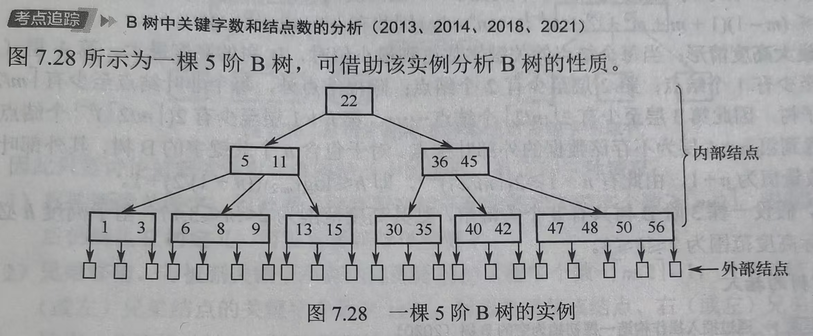

# Chap7.4 B和B+树

(注:考研重点考B树,基本特点和所有操作;B+树只要求原理)

## 1.B树及其基本操作

###### **(1)B树的基本定义**

m阶B树:自平衡的m路查找树,所有叶节点都在同一层次

m叉树的定义

(1):每个结点至多有m棵子树,即最多包含m-1个关键字

(2):若根节点不是叶子结点,则至少包含2棵子树,即至少包含一个关键字

(3):除根结点外所有非叶结点至少有$\lceil m/2 \rceil$棵子树(至少包含$\lceil m/2 \rceil - 1$个关键字)

(4):每个非叶结点的结构如下：

>   ```math
>   |n| P_0| K_1|P_1|K_2|P_2|\dots|K_n|P_n|
>   ```
>
>   其中，$K_i$ $(i = 1, 2, \dots, n)$ 为关键字，且满足 $K_1 < K_2 < \dots < K_n$；$P_i$ $(i = 0, 1, \dots, n)$ 为指向子树根结点的指针；指针 $P_{i-1}$ 所指子树中所有关键字均小于 $K_i$，指针 $P_i$ 所指子树中所有关键字均大于 $K_i$（更准确地说，介于 $K_i$ 和 $K_{i+1}$ 之间）；$n$ 为该结点中关键字的个数。

>   (也就是说$K_1,K_2,\cdots$关键字是从小到大排好的)
>
>   也就是说查询的时候二分查找,然后进一步探索之间的P指针

(5):所有叶结点都出现在同一层次上，且不实际存储数据（对应指针为空，可视为查找失败的外部结点，作用类似于折半查找判定树中的失败结点）。

**解释**

**(1):每个结点至多有m棵子树,即最多包含m-1个关键字**

>一根绳子切成m段,只需要m-1刀

**(2)若根节点不是叶子结点,则至少包含2棵子树,即至少包含一个关键字**

>m叉树从下往上构建的,所以"根节点"被塞满分裂,中间的关键字会被顶上去

**(3)除根结点外，所有非叶结点至少有$\lceil m/2 \rceil$棵子树(至少包含$\lceil m/2 \rceil - 1$个关键字)**

>当一个节点塞满m个关键字,会从正中间裂开一分为二,两个新节点
>
>(各自刚好分到大约一半的关键字$\rightarrow \lceil m/2 \rceil - 1$)

###### **(2)B树的性质**



>(1):任意结点的子树个数等于其关键字个数+1
>
>(2):若B树为空,则无结点;若非空,则根结点至少包含1个关键字，因此至少有2 棵子树
>
>(3):除根结点外,所有非叶结点:
>
>至少有3棵子树 (至少包含 $\lceil m/2 \rceil - 1 = 2$ 个关键字）；($\lceil m/2 \rceil = \lceil 5/2 \rceil = 3$)
>
>至多有5棵子树（至多包含 $m-1 = 4$ 个关键字）。
>
>(4)结点中的关键字从左到右严格递增,下层子树中的所有关键字均落在由上层结点关键字划分出的对应区间内。

**对于5阶B树**

>(1)一开始:整棵树只有一个结点最多能装m-1=4个关键字
>
>(2)分裂:当插入第5个关键字
>
>>a.从中间(第3个关键字)劈开
>>
>>b.左边两个数形成一个左子树,右边两个数形成一个右子树

###### **(3)B树的查找:定位+查找**

在B树中定位目标结点(磁盘)+在结点内查找关键字(内存)

在**磁盘上找到目标结点**后，先将结点读入内存，再采用顺序查找法或折半查找法。

>   **在磁盘上的查找次数（目标结点在B树中的层次）是决定查找效率的关键**
>
>   仍然是类似左小右大的思路

## 2.B树的高度（磁盘存取次数）

**B树的高度不包括最底层外部叶结点所处的那一层**

设$n \ge 1$,对于任意一棵包含n个关键字、高度为h、阶数为m的B树：

**<font color=red>核心概念:结点和关键字->(在二叉树中1:1)->(在B树中1:多)</font>**

>**结点:(公车)操作系统的磁盘块/内存中一块连续的空间**
>
>**关键字:(乘客)实际的有效信息**
>
>**指针:(车门)指向下一个公车**

###### **(1)最小高度情形(满m叉树)**

**当每个结点的关键字数达到最大值时，B树的高度最小**

**因每个结点最多有$m$棵子树（最多含 $m-1$ 个关键字）**

**故高度为$h$的B树最多可容纳的关键字数为**

>   ```math
>   n \le (m-1)(1 + m + m^2 + \dots + m^{h-1}) = m^h - 1
>   ```
>
>   (等比数列求和)
>
>   >第1层（根）有 $m-1$ 个关键字。
>   >
>   >第2层有 $m$ 个结点，共 $m(m-1)$ 个关键字。
>   >
>   >第3层有 $m^2$ 个结点，共 $m^2(m-1)$ 个关键字。

**有$h \ge \log_m(n+1)$**,不能写成$h \ge \lceil \log_m(n) \rceil$或者$h \ge \lceil \log_m(n+1) \rceil$

###### **(2)最大高度情形** 

**当每个结点的关键字数达到最小值时，B树的高度最大。**

第1层（根）至少有 1 个结点；第2层至少有 2 个结点；除根结点外，每个非叶结点至少有 $\lceil m/2 \rceil$ 棵子树，因此第3层至少有 $2\lceil m/2 \rceil$ 个结点……，第 $h+1$ 层至少有 $2(\lceil m/2 \rceil)^{h-1}$ 个结点。

(注意到第 $h+1$ 层为不存储数据的外部叶结点)

对于包含 $n$ 个关键字的B树，其**外部叶结点数量恒为 $n+1$**，由此有 $n+1 \ge 2(\lceil m/2 \rceil)^{h-1}$，即 **$h \le \log_{\lceil m/2 \rceil}((n+1)/2) + 1$**。

###### **(3)高度计算区别**

$h_{min}$：假设每个结点都塞得满满当当，空间利用率 100%。

$h_{max}$：假设每个结点都穷得要命，刚好踩在“半满”的红线上。

已知关键字数(乘客的数量)n

>$h_{min}$：每个结点都有$m$个分支,高度为h的树,关键字总数$n \le (m-1)(1 + m + m^2 + \dots + m^{h-1}) = m^h - 1$。
>
>$h_{max}$：


已知结点数(公交车的数量)N

>$h_{min}$：
>
>$h_{max}$：