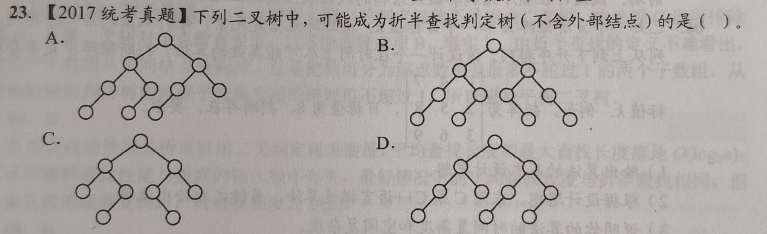

# Homework_7_2

ABBAD ABADB BA(AB)(AD)C BABCD CBCBD C

ABBAD CBBBB AA(AB)(AD)D BABCB ABABD C

```
1+2+..+n = \frac{n(1+n)}{2}

1*1/2+2*1/3+3*1/6 = 1/2+2/3+1/2 = 5/3

12：1+2+4+5
1*1+2*2+4*3+5*4 = 37/12
(10*4+3*3)/13 = 49/13

\frac{3+1}{2}+\frac{42}{2} = 23
1 2 4 8 16 32 64 128 256 512 1024 2048 4096 8192 16384 32768  65536
```

(C)6.在一个顺序存储的有序线性表上查找一个数据时，既可以采用折半查找，也可以采用顺序查找，但前者比后者的查找速度()。
A.必然快
B.取决于表是递增还是递减
C.在大部分情况下要快
D.必然不快

>   错选A,如果一个数组只有一个元素,折半查找还要额外计算mid

(D)15.下列关于查找的说法中，正确的是()。(注，涉及下节内容)
A.若数据元素保持有序，则查找时就可以采用折半查找法
B.折半查找与二叉查找树的时间性能在最坏情况下是相同的
C.折半查找法的平均查找长度一定小于顺序查找法
D.折半查找法查找一个元素大约需要O(log_2(n))次关键字比较

>   错选C,如果一个数组只有一个元素一样

(B)8.折半查找和二叉排序树的时间性能()。
A.相同
B.有时不相同 
C.完全不同
D.无法比较

>   错选A,觉得它们都是二叉树结构，但是折半查找的判定树是一棵完美的、静态的平衡二叉树，而普通的二叉排序树是动态构建的,它会退化成一根单支树（类似于链表）

(B)9.在有11个元素的有序表A[1,2,...,11]中进行折半查找($\lceil(1ow+high)/2\rceil$)，查找元素A[11]时，被比较的元素下标依次是()。
A.6,8,10,11
B.6,9,10,11
C.6,7,9,11
D.6,8,9,11

>   错选D,注意!!!折半查找的指针更新还要+1,low=mid+1而不是low=mid

(A)11.若有序表的关键字序列为{b,c,d,e,f,g,q,r,s,t}，则在二分查找关键字b的过程中，进行比较的关键字依次为().
A.f,c,b
B.f,d,b
C.g,c,b
D.g,d,b

>   错选B,同样,折半查找的指针更新还要-1,high=mid-1而不是high=mid

(B)20.【2010统考真题】已知一个长度为16的顺序表L，其元素按关键字有序排列，若采用折半查找法查找一个L中不存在的元素，则关键字的比较次数最多是()。
A.4
B.5
C.6
D.7

>   错选D.最大比较次数就是判定树的高度。对于 $n=16$，树高 $h = \lceil \log_2(n+1) \rceil = \lceil \log_2(17) \rceil = 5$

(A)21.【2015统考真题]下列选项中，不能构成折半查找中关键字比较序列的是A.500,200,450,180
B.500,450,200,180
C.180,500,200,450
D.180,200,500,450

>   错选C,A:先遇到 500，目标偏小，向左走，此时整个左子树的取值区间被锁定在 $(-\infty, 500)$；接着遇到 200，目标还是偏小，向左走，此时区间被死死锁定在 **$(-\infty, 200)$**。
>
>   既然在200处向左走了，后面的所有元素都必须小于200。但紧接着出现了一个 450！这在物理逻辑上绝对不可能发生

。



>   A
>
>   原因:折半查找在计算mid时:
>
>   >   要么永远向下取整 `floor((low+high)/2)`
>   >   要么永远向上取整 `ceil((low+high)/2)`
>   >   (绝不可能在左子树向下取整，跑到右子树又变成向上取整。)
>
>   若是向下取整(常规写法):
>   对于任何$n=2$的区间(比如仅剩元素1,2)`mid = (1+2)/2 = 1`。
>   节点1是根,节点2必然是它的右孩子。
>   **树中所有只有1个孩子的节点，这个孩子必然是右孩子（形状为 `\`）。**
>
>   若是向上取整:
>   对于任何$n=2$的区间(比如仅剩元素1,2)`mid = ceil(1.5) = 2`。
>   节点2是根,节点1必然是它的左孩子。
>   **树中所有只有1个孩子的节点，这个孩子必然是左孩子（形状为 `/`）。****