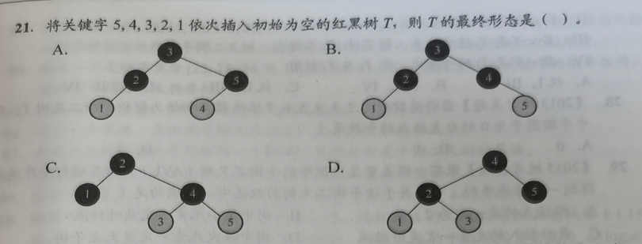
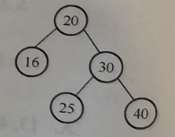

# Homework_7_3

```
CBABC CACDC BB?CC CBDAB  CBBCA ACCBC BBBD
CBABC CADDD	CBDAC DCBAC  DBBCA BCDDC ABDD

2^10

1 2 4 8 16 32 64 128 256 512 1024
1 3 7 15 31 63 127 255 511 1023 1

```

(C)(6)设二叉排序树中关键字由1到1000的整数构成，现要查找关键字为363的结点，下述关键字序列中，不可能是在二叉排序树上查找的序列是()。
A. 2  ,252,401,398,330,344,397,363 
B. 924,220,911,244,898,258,362,363
C. 925,202,911,240,912,245,363
D. 2  ,399,387,219,266,382,381,278,363

>   需要注意和n/2n/2n+1无关,单纯是区间压缩然后得到符合要求的
>
>   925: $363 < 925$，向左走。当前允许区间变为 $(-\infty, 925)$。
>
>   202: $363 > 202$，向右走。当前允许区间变为 $(202, 925)$。
>
>   911: $363 < 911$，向左走。当前允许区间变为 $(202, 911)$。
>
>   240: $363 > 240$，向右走。当前允许区间变为 $(240, 911)$。
>
>   912: 912 不在区间 $(240, 911)$ 内部（它大于了之前的上限 911）。

(D)(8)在含有n个结点的二叉排序树中查找某个关键字的结点时，最多进行()次比较。
A.n/2
B.$log_2n$
C.$log_2n+1$
D.n

>错选C
>
>错因:二叉排序树不能想当然平衡,而是平衡树+链表的双极端,退化后为n

(D)(10)构造一棵具有n个结点的二叉排序树时，最理想情况下的深度为()
A.n/2
B.n
C.$\lfloor log_2(n+1) \rfloor$
D.$\lceil log_2(n+1) \rceil$

>错选C
>
>错因:含有n个结点的完全二叉树的深度公式是$\lfloor \log_2 n \rfloor + 1\approx \lceil \log_2(n+1) \rceil$
>
>(比如n=4的时候,实际需要3层)

****

**以下三题:AVL不仅有满树,还有稀疏树:$$N_h = N_{h-1} + N_{h-2} + 1$$**

>$h=1$ : $1$ 个节点
>
>$h=2$ : $2$ 个节点
>
>$h=3$ : $4$ 个节点
>
>$h=4$ : $7$ 个节点

(C)(11)含有20个结点的平衡二叉树的最大深度为()。
A.4
B.5
C.6
D.7

>错选B
>
>1,2,4,8,16,32 -> 6层

(B)12.具有5层结点的平衡二叉树至少有()个结点。
A.10
B.12
C.15
D.17

>错选C
>
>稀疏树:0,1,1,2,3,5,8 ->$N_5 = N_4 + N_3 + 1 = 7 + 4 + 1 = 12$

<font color=red>(D)(13)高度为3的平衡二叉排序树的形态共有()种。</font>
A.13
B.14
C.16
D.15

>   没选
>
>   状态转移方程:**对于高度为h的根节点**,左右子树为了满足AVL的平衡因子限制
>   高度搭配只有3种合法情况：
>
>   >左子树高 $h-1$，右子树高 $h-1$
>   >
>   >左子树高 $h-1$，右子树高 $h-2$
>   >
>   >左子树高 $h-2$，右子树高 $h-1$
>   >
>   >```math
>   >S_h = (S_{h-1})^2 + 2 \times S_{h-1} \times S_{h-2}
>   >```
>   >
>   >$S_0 = 1$ (空树),$S_1 = 1$ (只有一个根),$S_2 = 3$ (三个节点排成LL/RR/LR)
>   >
>   >$S_3 = 3^2 + 2 \times 3 \times 1 = 9 + 6 = \mathbf{15}$
>   >
>   >$S_4 = 15^2 + 2 \times 15 \times 3 = 225 + 90 = \mathbf{315}$

****

(A)(14)在平衡二叉树的基本操作中，可能发生两次旋转的操作是()。
A.添加、删除结点 B.仅删除结点 C.仅添加结点 D.都不会

>   错选C

(D)(16)下列关于红黑树和AVL树的说法中，不正确的是()。
I.一棵含有n个结点的红黑树的高度至多为$2log_2(n+1)$
II.若一个结点是红色的，则它的父结点和孩子结点都是黑色的
III.红黑树的查询效率一般要优于含有相同结点数的AVL树
IV.若AVL树的某结点的左右孩子的平衡因子都是零，则该结点的平衡因子也是零
A.I、III B.III C.II、IV D.III、IV

>   错选C

(D)(21)

>   错选C,错因,只做了LL旋转
>
>   ```mermaid
>   graph TD
>       classDef black fill:#333,color:#fff,stroke:#000;
>       classDef red fill:#ffcccb,color:#000,stroke:#f00;
>       
>       5((5)):::black --> 4((4)):::red
>       5 --> inv1[空]:::black
>       style inv1 opacity:0;
>   ```
>
>   ```mermaid
>   graph TD
>       classDef black fill:#333,color:#fff,stroke:#000;
>       classDef red fill:#ffcccb,color:#000,stroke:#f00;
>       
>       4((4)):::black --> 3((3)):::red
>       4 --> 5((5)):::red
>   ```
>
>   红叔叔 $\rightarrow$ **只能变色，严禁旋转！**
>
>   ```mermaid
>   graph TD
>       classDef black fill:#333,color:#fff,stroke:#000;
>       classDef red fill:#ffcccb,color:#000,stroke:#f00;
>       
>       4((4)):::black --> 3((3)):::black
>       4 --> 5((5)):::black
>       
>       3 --> 2((2)):::red
>       3 --> inv2[空]:::black
>       style inv2 opacity:0;
>   ```
>
>   ```mermaid
>   graph TD
>       classDef black fill:#333,color:#fff,stroke:#000;
>       classDef red fill:#ffcccb,color:#000,stroke:#f00;
>       
>       4((4)):::black --> 2((2)):::black
>       4 --> 5((5)):::black
>       
>       2 --> 1((1)):::red
>       2 --> 3((3)):::red
>   ```

(B)(26)【2012统考真题】若平衡二叉树的高度为6，且所有非叶结点的平衡因子均为1，则该平衡二叉树的结点总数为()。
A.12
B.20
C.32
D.33

>   错选A
>
>   所有非叶结点的平衡因子均为1 = 每一个父节点的左子树都严格比右子树高1层
>
>   = 稀疏树->{$1, 2, 4, 7, 12,20, 33$}

(D)(28)【2013统考真题】若将关键字1,2,3,4,5,6,7依次插入初始为空的平衡二叉树T，则T中平衡因子为0的分支结点的个数是()。
A.0
B.1
C.2
D.3

>错选C,忘记触发RR旋转了,忘记算根节点了
>
>```
>	4
>  2  6
> 1 3 5 7
>```

(D)(29)【2015统考真题】现有一棵无重复关键字的平衡二叉树(AVL)，对其进行中序遍历可得到一个降序序列。下列关于该平衡二叉树的叙述中，正确的是()。
A.根结点的度一定为2
B.树中最小元素一定是叶结点
C.最后插入的元素一定是叶结点
D.树中最大元素一定是无左子树

>错选B
>
>降序序列(左<根<右变成左>根>右,而不是右根左)
>最小的元素一定是最右侧的节点,它可以有左孩子
>最大的元素一定是最左侧的节点,所以不能再有左孩子了

(A)(31)【2019统考真题】在任意一棵非空平衡二叉树(AVL树)T1中，删除某结点v之后形成平衡二叉树T2，再将v插入T2形成平衡二叉树T3。下列关于T1与T3的叙述中，正确的是()。
I.若v是T1的叶结点，则T1与T3可能不相同
II.若v不是T1的叶结点，则T1与T3一定不相同
I.若v不是T1的叶结点，则T1与T3一定相同
A.仅I
B.仅II
C.仅I、II
D.仅I、III

>错选B
>
>数据结构的插入和删除操作**不是对称可逆的**
>
>无论是叶子还是非叶子，都有可能相同，也有可能不同。
>
>>即使v不是叶结点,如果触发一次漂亮的LR或RL双旋,可以顶回来的
>>
>>即使v是叶子,删除了以后触发平衡旋转,再粘回来也不一样

(D)(33)【2021统考真题】给定平衡二叉树如右图所示，插入关键字23后根中的关键字是()
A.16
B.20
C.23
D.25


>   错选B,错因:对30-25-23进行了RL旋转导致了错误,但是应该对20-30-25旋转
>
>   ```mermaid
>   graph TD
>       classDef default fill:#f4f4f4,stroke:#333,stroke-width:2px;
>       classDef target fill:#d4edda,stroke:#28a745,stroke-width:3px;
>   
>       25((25 <br/> 新根)):::target --> 20((20))
>       25 --> 30((30))
>       
>       20 --> 16((16))
>       20 --> 23((23))
>       
>       30 --> inv1[空]
>       30 --> 40((40))
>       
>       style inv1 opacity:0;
>   ```
>
>   

## 草稿

```
 
 			5(B)
		4(B)   3(B)
	  2(R) NIL(B)
	 1(R)
	 
	    2(B)
	1(R)    4(R)
			3(B)5(B)
			
			
			24
		13      53
		     37    90
		       48
		    
48:0
37:1
53:1
24:2
RL旋转(24-53-37):
    37
  24   53
13    48  90


[24,91]94???
[34,88]


		    3
	      2   5
	    1    4  6
	              7
```


