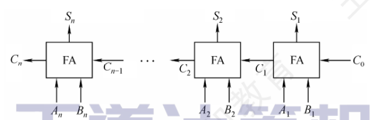
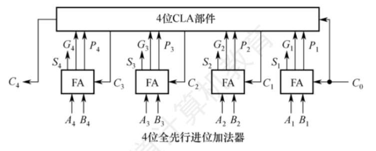
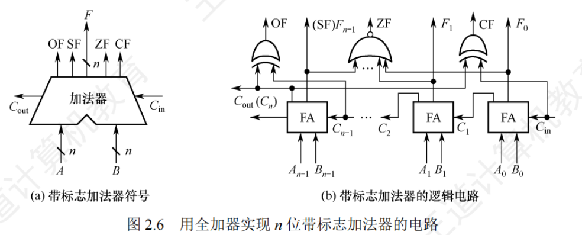

# 2.2 运算方法和运算电路

**<font color=red>(对应袁书的第三章:运算方法和运算部件)</font>**

主要目的(1):了解高级程序设计语言和低级程序设计语言中设计的各种运算

主要目的(2):掌握定点数的逻辑移位,算术移位,和拓展操作方法

主要目的(3):了解串行加法器和快速并行加法器的基本工作原理

主要目的(4):掌握补码加减方法,设计补码加减运算器

主要目的(5):了解原码加减运算的基本原理

主要目的(6):了解定点数乘法和除法的基本思想

主要目的(7):了解专用的阵列乘法器的基本思想

主要目的(8):理解为何在运算中会发生溢出,掌握各类定点数运算的溢出判断方法

主要目的(9):掌握浮点数加减运算过程和方法

主要目的(10):掌握IEEE754标准对附加位的添加以及舍入模式方面的规定

主要目的(11):了解浮点数乘法和除法运算的基本思想

主要目的(12):了解算术逻辑单元ALU的功能和结构

主要目的(13):了解浮点数加减运算器的基本结构

**<font color=red>重点:原码&补码一位乘法/两位乘算法/补码除法运算/阵列触发器</font>**

**<font color=red>乘除法重点:认识到乘除运算的算法复杂度和时间开销</font>**

**Q1:无符号加法器如何实现**

**Q2:补码加法器如何实现**

**Q3:补码减法运算如何实现**

Q4:需要考虑原码的加减运算吗?

Q5:定点整数运算需要考虑保护位和舍入吗?

**Q6:如何判断带符号整数运算结果是否溢出**

**Q7:浮点数如何进行舍入**

## 1.基本运算部件

**运算器=[算术逻辑单元ALU]+[移位器]+[状态寄存器PSW]+[通用寄存器]等**

>   可以执行的功能:加减乘除/与或非异或/移位/求补
>
>   电路:与[两个相同为1]/或[两个不同为1]/非[相反真值]/异或[两个不同为1]

#### 1.一位全加器FA [3in+2out]/(排骨吃剩)

**3 in:[加数$A_i$]+[加数$A_i$]+[低位进位的$Carry_{in}$]**

**2 out:[本位和$S_i$]+[高位进位的$Carry_{out}$]**

****

**核心(1):生成信号:		$G_i = A_i B_i$**				 [且门]

**核心(2):传递信号:		$P_i = A_i \oplus B_i$**			      [异或门]

**核心(f1):高进位$C_i$的计算:	** $\begin{align}
C_i &= P_i C_{i-1}+G_i=(A_i \oplus B_i)C_{i-1}+A_i B_i 
\end
{align}$      [且门&或门]

>其中[$G_i$是本身产生的进位];$[P_i C_{i-1}$是低位进位计算]	**<font color=red>[对三个输入,至少有两个1,就会产生高位的进位]</font>**

**核心(f2):本位和$S_i$的计算:	** $S_i = P_i \oplus C_{i-1} =A_i \oplus B_i \oplus C_{i-1}$

>对三个输入的连续异或	**<font color=red>[输入1的个数为奇数,$S_i=1$]</font>**

#### 2.串行进位加法器

定义:将n个全加器 级联 可以构成n位串行进位加法器(行波进位加法器)

**核心(1):计算本位$S_i$和进位$C_i$**

Eg:$$A=1111,B=0001,S=0000,C_4=1$$

>$第 0 位 (A_0=1, B_0=1)：G_0 = 1 \cdot 1 = 1，P_0 = 1 \oplus 1 = 0,进位C_0 = G_0 + P_0 C_{-1} = 1 + 0 \cdot 0 = {1},本位和 S_0 = P_0 \oplus C_{-1} = 0 \oplus 0 = 0$
>$第 1 位 (A_1=1, B_1=0)：G_1 = 1 \cdot 0 = 0，P_1 = 1 \oplus 0 = 1,进位 C_1 = G_1 + P_1 C_0 = 0 + 1 \cdot 1 = {1},本位和S_1 = P_1 \oplus C_0 = 1 \oplus 1 = 0$
>$第 2 位 (A_2=1, B_2=0)：G_2 = 1 \cdot 0 = 0，P_2 = 1 \oplus 0 = 1,进位 C_2 = G_2 + P_2 C_1 = 0 + 1 \cdot 1 = {1},本位和 S_2 = P_2 \oplus C_1 = 1 \oplus 1 = 0$
>$第 3 位 (A_3=1, B_3=0)：G_3 = 1 \cdot 0 = 0，P_3 = 1 \oplus 0 = 1,进位 C_3 = G_3 + P_3 C_2 = 0 + 1 \cdot 1 = {1},本位和 S_2 = P_2 \oplus C_1 = 1 \oplus 1 = 0$
>
>==$\ \therefore S = S_3S_2S_1S_0=0000,C_3 = 1(1111_2+0001_2 = 10000_2) $==

注:位数固定,结果实际为模$2^n$的加法(**<font color=red>溢出部分被丢弃</font>**)

**核心(2):门延迟计算**

总运算延迟:进位信号需要逐级串行传递。第$n$位的进位必须等待前$n-1$级电路

门延迟计算:假设每个基本逻辑门(与门/或门/非门/异或门)的延迟均为T,一位加法器的核心表达式

>(顺序1)[1T]$P_i = A_i \oplus B_i$
>
>(顺序2)[1T]$G_i = A_i B_i$
>
>(顺序3)[2T]$C_i= G_i + (P_i C_{i-1})$
>
>(顺序4)[1T]$S_i= G_i + (P_i C_{i-1})$

**核心(3):延迟时间线推导**

>t=0T,输入A,B及初始进位C−1同时到达
>
>t=1T,所有位的$G_0 \sim G_3$和$P_0 \sim P_3$计算完毕,[$S_0 = P_0 \oplus C_{-1}$]和[$C_i= G_i + (P_i C_{i-1})$]开始
>
>t=2T,$S_0$算完
>
>t=3T,$C_0$算完,[$S_1 = P_1 \oplus C_{0}$]和[$C_1= G_1 + (P_1 C_{0})$]开始	[$S_i:3T,5T,7T,...$]
>
>t=4T,$S_1$算完					     [$$C_i:4T,6T,8T...$$]
>
>t=5T,$C_1$算完...

>**最长进位链(进位输出 $C_{out}$)的总延迟**：
>
>$$T_{\text{Cout}} = 1T + n \times 2T$$			      在本例($n=4$)中：$1T + 4 \times 2T = \mathbf{9T}$。
>
>**最慢本位和($S_{n-1}$)的总延迟**：
>
>$$T_{\text{Sum}} = 1T + (n-1) \times 2T + 1T = 2nT$$		在本例($n=4$)中：$2 \times 4 \times T = \mathbf{8T}$。
>
>**整个电路稳定输出的总时间**：
>
>$$T_{\text{total}} = \max(T_{\text{Cout}}, T_{\text{Sum}}) = \mathbf{1T + 2nT}$$		**<font color=red>位宽n增加1位,延迟增加2T</font>**

#### 3.并行进位加法器*

并行进位(先行进位)加法器能显著提升加法运算速度,能几乎同时生成所有进位信号$C_i$

原理:n个一位全加器被连接至一个n位进位逻辑组件(CLA组件)

**CLA(并行进位加法器)核心(1):核心逻辑表达式[直接一路展开]**

>$C_1 = G_1 + P_1 C_0$
>
>$C_2 = G_2 + P_2 G_1 + P_2 P_1 C_0$
>
>$C_3 = G_3 + P_3 G_2 + P_3 P_2 G_1 + P_3 P_2 P_1 C_0$
>
>$C_4 = G_4 + P_4 G_3 + P_4 P_3 G_2 + P_4 P_3 P_2 G_1 + P_4 P_3 P_2 P_1 C_0$

>(从0T开始阶段)输入$A, B$及初始进位$C_0$到达。
>
>(从0T开始,1T结束)所有的**$P_i, G_i$**同时计算完毕(消耗1个门延迟1T)
>
>(从1T开始,2T结束)所有**乘积项**(例如$P_3 P_2 P_1 C_0$和$P_2 G_1$等)通过与门同时计算完毕
>
>(从2T开始,3T结束)所有的进位$C_1, C_2, C_3, C_4$通过[或门]将乘积项**相加**，同时计算完毕

**CLA(并行进位加法器)核心(2):延迟对比**

>行波加法器(串行):延迟随位数n线性增长($O(n)$)
>
>超前进位加法器(单级并行):所有进位产生只需要经过2层门电路，延迟为常数级($O(1)$)

#### 4.带标志加法器

在并行进位加法器的基础上拉出4根信号线Flag,给后面的条件跳转指令(je,jg,jl)做跳转依据

对于n位加法器来说:[计算结果]+{[(有符号数)溢出]+[结果的正负]+[结果是否为0]+[(无符号数)加法进位/减法借位]}

​			          OF        SF[Sign]     ZF[Zero]	CF[Carry]

**Eg:加法器n位运算:A+B=S,最高位为第n-1位,最高位产生的进位为$C_n$,次高位产生的进位为$C_{n-1}$**

>(注意在这里引入了CF,所以CF位是第n位,最高位是n-1位)
>
>**ZF:[判断结果S,是否为0]	**        操作:把输出S所有位做[或非],都是0,则输出1
>
>**SF:[判断(有符号数)结果补码,是正数负数]**  操作:输出结果S的最高位(符号位$S_{n-1}$)
>
>**OF:[判断(有符号数)是否超出n位表示范围]**  <font color=deeppink>操作A:(最高位进位$C_n$)和(次高位进位$C_{n-1}$)[异或]</font>:==不一致输出1必溢出==
>
>​			     	操作B:操作数与结果符号比较:==正+正=负 or 负+负=正必然溢出==
>
>**CF[判断(无符号数)是否产生进位]**	 <font color=deeppink>操作:(最高位进位$C_n$)和(初始进位$C_0$)[异或]</font>:==不进位CF=0,否则CF=1==
>
>>**<font color=red>如果用来判断有符号数:负数会产生溢出报错,正数相加会产生负数</font>**
>
>>Eg:200[1100 1000]+100[0110 0100] = [(1) 00101100]\(超过了8位256),C=1
>>
>>Eg:100[0110 0100]+50[0011 0010]  = [(0) 10010110]\(没超过8位256),C=0
>>
>>Eg:200[1100 1000]+(-100)$_{补}$[1001 1100] = [(1) 0110 0100]<font color=red>(大减小产生了借位,所以还要取反)</font>$CF = \overline{CF} = 0$
>>
>>Eg:100[0110 0100]+(-200)$_{补}$[0011 1000] = [(0) 1001 1100]<font color=red>(小减大没有借位,所以还要取反)</font>$CF = \overline{CF} = 1$
>

**(一句话:CF对无符号数作用,有负号写补码;两个数直接做相应操作;如果是加法C不变,如果是减法C取反)**

#### 5.算术逻辑单元(ALU)

[n位操作数A和n位操作数B]$\rightarrow$[一个k位操作控制信号ALUop] = [n位运算结果]+[4个标志位:ZF/SF/OF/CF]

**ALUop的位数决定可支持的操作种类数量[3位ALUop完成8种操作]\[2位ALUop完成3种(与/或/加法)操作]**

操作集合(1)算术运算:加(ADD)减(SUB)带进位加(ADC)带借位减(SBB)自增/自减。

操作集合(2)逻辑运算:与(AND)或(OR)非(NOT)异或(XOR)

>加法/减法:带标志加法器
>
>乘法/除法:多次加减和一位的方式,迭代实现

整体构成:$A_i,B_i$ $\rightarrow$  [全加器FA]    $\rightarrow$  SumOut  ]  ---> $C_i$高位进位

​		  [与门]	$\rightarrow$   OrOut  ]   $\Rightarrow$ MUX(多路选择器) $\rightarrow$ $R_i$结果

​		  [或门]	$\rightarrow$   AndOut ]

**核心(1):MUX控制信号与操作码译码**

>原理:如果一个MUX有k位控制线(ALUop),它就可以在2^k^个输入信号中选择1个输出
>
>| **S1S0 (ALUop)** | **MUX 选中的通道** | **ALU 实现的功能**          | **备注**        |
>| ---------------- | ------------------ | --------------------------- | --------------- |
>| `00`             | 输入端 0           | $A \ \text{AND} \ B$        | 逻辑与          |
>| `01`             | 输入端 1           | $A \ \text{OR} \ B$         | 逻辑或          |
>| `10`             | 输入端 2           | $A + B + C_{in}$            | 加法 / 带进位加 |
>| `11`             | 输入端 3           | $A + \overline{B} + C_{in}$ | 减法 / 带借位减 |
>
>**<font color=red>无论MUX最终选了哪一个,内部的全加器/与门/或门其实都在同时进行计算,只不过其它电平被压制了</font>**

**核心(2):ALU的逻辑运算**

>**<font color=red>首先[逻辑运算没有进位,$C_i$被阻断,CF和OF直接清零]</font>**
>
>**ZF(Zero Flag):正常生成:只要逻辑运算的n位输出全为0，则$ZF = 1$**
>
>**SF(Sign Flag):正常生成:直接取逻辑运算结果的最高位$R_{n-1}$**

**核心(3):ALU的减法计算**

>**在操作数B进入ALU之前,硬件会包裹一层异或门($B_i' = B_i \oplus Sub$)**
>
>当做加法时($Sub = 0$):$B_i' = B_i$,初始进位$C_0 = 0$,加法器执行 $A + B$
>
>当做减法时($Sub = 1$):$B_i' = \overline{B_i}$,初始进位$C_0 = 1$,加法器执行 $A + \overline{B} + 1$

## 2.定点数的移位计算

目的:对于任何二进制整数,左移一位,如果没有溢出则等价于乘以2;右移一位,如果没有溢出则等价于除以2

**根据操作数的类型不同,移位计算 = [逻辑移位(无符号数)] + [算术移位(有符号数)]**

#### 1.逻辑移位(操作数为无符号数)

核心A:左移时,高位移出,低位补0;[高位的1移出,则发生溢出]

核心B:右移时,低位移出,高位补0;[低位的1移出,则发生溢出]

(Eg:4位无符号数:0001{+1},左移0010{+2};4位无符号数:1000{+8},左移0000{0}==1被移除,溢出[16超出表示范围]==)

(Eg:4位无符号数:0001{+1},右移0000{0})

#### 2.算术移位(操作数为有符号数,补码)

首先要将操作数视为有符号整数,**采用补码表示**

核心A:左移时,高位移出,低位补0;[新的最高位和原符号位必须相同,否则则发生溢出]

核心B:右移时,低位移出,高位补符号位;低位的1移出,则影响精度

(Eg:4位有符号数:1001{-7},左移0010{+2}==符号变化,溢出[-14超出表示范围]==)

(Eg:4位有符号数:1001{-7},1100{-4},符号保留,精度影响)

| **码制** | **符号** | **算术左移（移出的位丢弃）** | **算术右移（移出的位丢弃）** | **物理补位口诀**             |
| -------- | -------- | ---------------------------- | ---------------------------- | ---------------------------- |
| **原码** | 正and负  | 低位补 `0`                   | 高位补 `0`                   | 原码一律补 `0`               |
| **反码** | 正数     | 低位补 `0`                   | 高位补 `0`                   | 正数三码合一，全补 `0`       |
| **补码** | 正数     | 低位补 `0`                   | 高位补 `0`                   | 正数三码合一，全补 `0`       |
| **反码** | 负数     | 低位补 `1`                   | 高位补 `1`                   | 负数反码，全补 `1`           |
| **补码** | 负数     | 低位补 `0` （重点！）        | 高位补 `1` （重点！）        | 负数补码：左移补 0，右移补 1 |

>   补码:4位有符号数:1100{-4},右移1110{-2};高位补1
>
>   补码:4位有符号数:1110{-2},左移1100{-4};低位补0

#### 3.循环移位

不带进位位的循环移位:移出的位既填入另一端,又送入CF标志位

带进位位的循环移位:把CF标志位看作环形链表的一部分(n+1位一起循环)

>   作用:常用于多字长(如64位、128 位)数据的连续移位操作。

## 3.定点数的加减运算

#### 1.补码加减运算

补码运算特点(1):按二进制加法规则,逢二进一

补码运算特点(2):补码加法:[数A的补码]+[数B的补码]

补码运算特点(3):补码减法:[被减数]+[减数的负数补码]

补码运算特点(4):补码运算:符号位与数值位一同计算,结果的符号位由运算自然得出

补码运算特点(5):补码运算:运算结果自动截断为n+1位,高位进位被丢弃

Eg:(8位)A=15,B=24,(减法直接对补码取反加一)

>$[A+B]_{补} = [A]_{补}+[B]_{补} = 0000 \ 1111+0001 \ 1000 = 0010\ 0111$
>
>$[A-B]_{补} = [A]_{补}+[-B]_{补} = 0000 \ 1111 + 1110 \ 1000 = 1111 \ 0111$

#### 2.溢出判别方法

**<font color=red>补码加减法唯一溢出的情况:(A)正+正=负;(B)负+负=正</font>**

**溢出辨别方法(1):采用一位符号位:  	两个操作数的补码符号相同,计算结果符号和它们不同,则溢出**

**溢出辨别方法(2):采用一位符号位+进位情况: [符号位产生的进位$C_n$]和[数值位产生的进位$C_{n-1}$]不同,则溢出**

**溢出辨别方法(3):采用双符号位(模4补码):**

双符号位在存储器中存储时通常只存1位符号位，仅在ALU内部运算时临时扩展为2位

**$S_1$**和$S_2$,$V = S_1\oplus S_2$[$S_1$是真正的符号$S_2$是结果留下的符号]

>双符号位(1):$S_1S_2=00$,$V=0$结果为正数,没有溢出	
>
>双符号位(2):$S_1S_2=01$,$V=1$结果正溢出		[结果应该是正数,但是实际上是负数]
>
>双符号位(3):$S_1S_2=10$,$V=1$结果负溢出		[结果应该是负数,但是实际上是正数]
>
>双符号位(4):$S_1S_2=11$,$V=0$结果为负数,无溢出	 

#### 3.加减运算电路

**<font color=red>在计算机中,无论是无符号数还是有符号数的加减乘除,均采用一套硬件逻辑</font>**

**(1)加减运算电路的组成:输入端[操作数X+操作数Y+控制信号Sub]**

>   ```
>   X-------------------------------------[			]{out1:ZF}
>   				  		sub----Cin----[	  ALU   ]{out2:OF}
>   Y---------Y----|   		|						}{out3:SF}
>   	  |        |------>MUX(ChooseY)---[			]{out4:CF}
>          |--NegY--|                      {out5:C_out}
>   ```

**(2)加法减法的工作原理**

加法运算的工作原理:Sub=0,MUX(Choose$Y$),$C_{in}=0$,ALU:$X+Y+C_{in}(X+Y)$

>对于无符号数:当$X+Y\geq 2^n$,产生进位$C_{out}=1$溢出,此时$CF=C_{out}=1$
>
>对于有符号数:当两个操作数同号,而结果异号,则溢出

减法运算的工作原理:Sub=1,MUX(Choose$\overline{Y}$),$C_{in}=1$,ALU:$X+\overline{Y}+C_{in}(X+\overline{Y}+1)$

>注:按位取反加一的数学写法:$\overline{Y} = (2^n - 1) - Y$
>
>对于无符号数:当$X\geq Y$,ALU计算$X + \overline{Y} + 1 \ge 2^n$,**足够减**,$CF = C_{out} \oplus Sub = 1 \oplus 1 = 0$
>
>**<font color=red>(没有OF)</font>**    当$X<Y$,ALU计算$X + \overline{Y} + 1 < 2^n$,**不够减**,$CF = C_{out} \oplus Sub = 0 \oplus 1 = 1$
>
>对于有符号数:结果为$[X-Y]_{补}$,运算结果超出n位补码表示范围,则溢出,OF表示

**(3)加减法和信号产生过程计算**

**<font color=red>注:下列习题中的S7,C7都是最左边的最高位,右侧从D0开始</font>**

Eg:无符号:5(X)[0000 0101]-8(Y)[0000 1000]

>$Sub=1$ $\therefore C_{in}=1$,$\therefore Sub=1,Choose\overline{Y}$$\rightarrow\overline{Y}$=1111 0111
>
>```
>	X:	0000 0101						C_out:X的无符号二进制比neg_Y小,C_out=0    ->Co=0
>neg_Y:	1111 0111					->	CF:Cout \oplus Sub = 0\oplus 1 =1 ->CF=1[发生了借位]
> C_in:   0000 0001						ZF:1111 1101不等于0				->ZF=0
> 	S:	1111 1101	[保留低8位结果]	   SF:1111 1101中S7=1				 ->SF=1
>C_Idx:  0000 0111	[进位会传递]			OF:C_8 \oplus C_7 = [第7位进位]\oplus[第6位进位] = 0 \oplus 0 = 0
>```
>
>无符号数:不看OF和SF(没有符号位),要看非零ZF和借位CF

Eg:有符号:(+100)X[0110 0100]+(+50)Y[0011 0010]

>$Sub=0$ $\therefore C_{in}=0$,$\therefore Sub=0,Choose \ Y$$\rightarrow \ Y$= 0011 0010
>
>```
>	X:	0110 0100						C_out:算出来的最高位进位是0,C_out=0    ->Co=0
>	Y:	0011 0010					->	CF:Cout \oplus Sub = 0\oplus 0 =0 ->CF=0
> C_in:   0000 0000						ZF:1001 0110不等于0				->ZF=0
> 	S:	1001 0110	[保留低8位结果]	   SF:1001 0110中S7=1				 ->SF=1
>C_Idx:  0010 0000	[进位会传递]			OF:C_8 \oplus C_7 = [第7位进位]\oplus[第6位进位] = 0 \oplus 1 = 1
> 																			 [正数+正数=负数的溢出]
>```
>
>有符号数:不看CF(没有意义),要看非零ZF/符号SF/溢出OF

**(3)无符号数大小的比较[看CF(ZF)]**

原理:做CMP(A,B)的时候,其实是做了一次不保存结果的减法计算A-B**(Sub必然等于1)**,然后看CF和ZF

>(ZF:[ZF=1]:$A=B$	[ZF=0]:$A\not =B$)
>
>CF:[CF=1]$CF:Cout \oplus Sub = 0\oplus 1 =1 $	[Cout=0,直接说明A比B小]
>
>   [CF=0]$CF:Cout \oplus Sub = 1\oplus 1 =0 $	[Cout=1,直接说明A比B大于等于]

**(4)有符号数大小的比较[看OF和SF(ZF)]**

原理:做CMP(A,B)的时候,其实是做了一次不保存结果的减法计算A-B**(Sub必然等于1)**,然后看CF和ZF

>(ZF:[ZF=1]:$A=B$	  [ZF=0]:$A\not =B$)
>
>OF:[OF=0]:没有溢出	$\rightarrow$\[$SF=1$,直接说明负号,A比B小;$SF=0$,直接说明正号,A比B大]
>
>   \[OF=1]:有溢出	  $\rightarrow$\[$\overline{SF}=1$,直接说明正数减负数溢出,A比B大]
>
>​			  $\rightarrow$[$\overline{SF}=0$,直接说明负数减正数溢出,A比B小]
>
>[$SF \oplus OF = 1,A<B$]  \[$SF \oplus OF = 0,A>B$];
>
>[$SF \oplus OF = 1,ZF=1,A\leq B$]  \[$SF \oplus OF = 0,ZF=1,A \geq B$]

#### 4.原码的加减运算*

**原码的加减运算中,[符号位]\[数值位]分开处理**

>加法:同号求和:[两个符号相同]结果符号不变,数值位加法
>
>​     异号求差:[一个正数一个负数]绝对值大的减去绝对值小的,符号位与绝对值大的相同
>
>减法:减数取反,然后做加法

**<font color=red>可以看到,做加法还需要比较大小,所以单一加法器无法实现</font>**

## 4.定点数的乘除运算

#### 1.乘法运算

**1.原码乘法的运算原理**

原码乘法的特点:符号位和数值位分别处理

[步骤1:乘积的符号位,两个乘数的符号位(异或)得到]

[步骤2:乘积的数值位,无符号数的相乘]

>人类视角:乘数不断左移
>
>机器视角:乘积不断右移

**2.无符号整数的乘法运算电路[逻辑右移:最高位补0]**

组成:[被乘数寄存器X+乘数寄存器Y+乘积寄存器P+计数器$C_n$]

>被乘数寄存器X(n位):保存被乘数X[运算全过程保持不变]
>
>乘数寄存器Y(n位):  [部分积n个低位]:	    初始化为Y
>
>乘积寄存器P(n+1位):[部分积n个高位,1位可能进位]: 初始化为0
>
>计数器$C_n$:	 [机器字长n]:	        完成一次计算就减一
>
>ALU**<font color=red>(n位并行加法器)</font>**:计算P的低n位+X
>
>```
>  时钟
>	|							 		 |----------------------------------|		
>    |									 |									|
>[逻辑计数器Cn]	  [乘数寄存器Y{32}|乘积寄存器P{32}]	[被乘数寄存器X{32}]	    |
>	|-------------|				         |-------------------|			 	|
>	  (右移,写使能)				         |      32位ALU  	|----------[C进位触发器]
>
>```

>   \[核心步骤1]:判断Y最高位:{Y=1,ALU执行一次计算:X+寄存器低位P};{进位存入C触发器里}	{Y=0则不变}
>
>   \[核心步骤2]:整体逻辑右移**<font color=red>(高位补0)</font>**
>
>   \[核心步骤3]:计数器递减,若$C_n=0$,计算结束

>Eg:(无符号乘法)X=1101,Y=1011
>
>步骤(0):预处理:$Y=[1011]$,$$[C_{\text{out}}, P, Y] = [0 \quad 0000 \quad 1011]$$
>
>步骤(1):$Y_0=1$,加法,$P=0000+1101=1101$;$[0 \ 1101 \  1011]$右移$[0 \ 0110 \ 1101 ]$
>
>步骤(2):$Y_0=1$,加法,$P=0110+1101=1\ 0011$;$[1 \ 0011 \  1011]$右移$[0 \ 1001 \ 1110 ]$
>
>步骤(3):$Y_0=0$,不变,$[0 \ 1001 \ 1110 ]$右移$[0 \ 0100 \ 1111 ]$
>
>步骤(4):$Y_0=1$,加法,$P=0100+1101=1 \ 0001$;$[1 \ 0001 \  1111]$右移$[0 \ 1000 \ 1111]$
>
>步骤(5):$[P, Y] = [1000 \quad 1111]_2 = 128 + 8 + 4 + 2 + 1 = +143$

>   CPI和时间:进行n位无符号数乘法,需要进行n次加法判断和n次右移，计数器从n减到0。
>
>   溢出判断:寄存器的高32位不为0,则说明溢出,无符号,至CF和OF为1
>
>   溢出处理:检查CF和OF,可以插入一条溢出自陷指令,处理错误[报错/高精度]

**3.有符号整数的乘法运算电路[算术右移:最高位补符号位]0**

原理:Booth算法让符号位与数值位统一参与运算,直接生成补码形式的乘积,对正负数一视同仁

组成:[被乘数寄存器X{加装非门+MUX} + 乘数寄存器Y{扩展到n+1} +乘积寄存器P{n+1位} + 计数器$C_n$]

>\[被乘数寄存器X{加装非门+MUX}]:	可以提供$[X]_{补}$和$[-X]_{补}$
>
>\[乘数寄存器Y{扩展到n+1}]:	    最低位右边多了Y_{-1}辅助位:全置为0
>
>\[乘积寄存器P{n+1位}]:		采用补码算,初始化为0
>
>\[计数器$C_n$]	
>
>**<font color=red>[进位触发器C:不需要]:所以高位都被舍弃了</font>**
>
>```
>  时钟
>	|							 	   |------------------------------------|		
>    |								   |									|
>[逻辑计数器Cn]	  [0|乘数寄存器Y{32}|乘积寄存器P{32}]  [被乘数寄存器[X]/[-X]{32}]|
>	|-------------|				       |-------------------|			 	|
>	  (右移,写使能)				       |      32位ALU  	  |----------[C进位触发器]
>
>```

>\[核心步骤1]:判断[Y的最低位]和[辅助位]:
>
>​	   如果[Y的最低位]和[辅助位]组合10[大变小]:执行P=P-X
>
>​	   如果[Y的最低位]和[辅助位]组合01[小变大]:执行P=P+X
>
>​	   如果[Y的最低位]和[辅助位]组合00[不加减]:执行空操作
>
>​	   如果[Y的最低位]和[辅助位]组合11[不加减]:执行空操作
>
>\[核心步骤2]:整体逻辑[乘积寄存器P|乘数寄存器Y|辅助位Y-1]右移
>
>​	   **最高符号位是多少,最高位就补多少**
>
>\[核心步骤3]:计数器递减,若$C_n=0$,计算结束,**最后额外进行一次右移**

>(4位)计算$X\times Y,(-3)\times(-5)$:$X=[1101],[-X]=[0011]$
>
>步骤(0):预处理:$Y=[1011]$,$[P,Y,Y_{-1}] = [0000\ 1011\ 0]$
>
>步骤(1):$Y_0Y_{-1}=10$,大变小减法,$P=0000+0011=0011$;$[0011 \ 1011 \  0]$右移$[0001 \ 1101 \ 1]$
>
>步骤(2):$Y_0Y_{-1}=11$,不变,$[0001 \ 1101 \  1]$右移$[0000 \ 1110 \ 1]$
>
>步骤(3):$Y_0Y_{-1}=01$,小变大加法,$P=0000+1101=1101$;$[1101 \ 1110 \  1]$右移$[1110 \ 1111 \ 0]$
>
>步骤(4):$Y_0Y_{-1}=10$,大变小减法,$P=1110+0011=(1)0001$;$[0001 \ 1111 \  0]$右移$[0000 \ 1111 \ 1]$**<font color=red>[计算高位被舍去]</font>**
>
>结果:+15

**4.乘法运算的三种实现方式**

实现方式(1):迭代式乘法器:[ALU+移位器+寄存器+控制逻辑],多次迭代完成乘法,算完n位需要2n个时钟周期

实现方式(2):阵列乘法器:全并行的快速乘法器,部分积同时生成,以二位阵列组织,单个时钟周期就能完成

实现方式(3):移位-加减法:运用移位+加法模仿人类计算方法,硬件成本低但是最慢

**5.Booth算法与无符号一位乘的考场三大区别**

区别(1):移位方式:Booth高位补符号位,无符号数高位补0

区别(2):循环判断:Booth每一次都要后移,无符号数要看C

区别(3):符号处理:Booth直接算出来,无符号数需要单独异或处理

#### 2.除法运算

**1.异常判断**

==(首先满足整除原则,不会产生小数)==

规则(1):异常[被除数和除数均为0]:DivisionError

规则(2):异常[被除数不为0,除数0]:DivisionError

规则(3):为零[被除数为0,除数不为0]\[被除数<除数]:结果积为0

规则(4):正常[被除数和除数均不为0,且被除数$\geq$除数]:正常除法

**2.无符号数的除法运算原理**

步骤(1):取[被除数的**高**n位]作为[初始被除数]

步骤(2):[初始被除数]和[除数]相减:够减,商1,差值作为进一步被除数

步骤(3):[初始被除数]和[除数]相减:不够减,商0,差值作为余数

步骤(4):将[被除数的下一位]带下来,拼接到[余数]末尾,形成新的被除数,和余数相减...

Eg:X=13(1101),Y=3(0011),X/Y?

>步骤(0):被除数X=1101,除数Y=0011,商Q=0000,余数R=0000
>
>步骤(1):被除数第(1)位:1,掉下接入[余数末尾]:R=0001
>
>​	判断:0001-0011<0,商0,R=0001
>
>步骤(2):被除数第(2)位:1,掉下接入[余数末尾]:R=0011
>
>​	判断:0011-0011=0,商1,R=0000
>
>步骤(3:被除数第(3)位掉下接入[余数末尾]:R=0000
>
>​	判断:0000-0011<0,商0,R=0000
>
>步骤(4):被除数第(4)位掉下接入[余数末尾]:R=0001
>
>​	判断:0001-0011<0,商0,R=0001
>
>步骤(5):商高到低[0100]=4,余数最终[0001]=1

**3.无符号数的除法运算电路**

组成:[除数寄存器Y]+[余数/商寄存器Q]+[余数寄存器P]+[逻辑计数器Cn]+

```
  时钟
	|							 	   
    |								  									
[逻辑计数器Cn]	  [余数/商寄存器Q(32)|余数寄存器P(32)]  [除数寄存器Y{32}]|
	|-------------|				       |-------------------|			 	
	|  (左移)				       		 |      32位ALU  	 |
	|----------------------------------|-------------------|
```

>\[核心步骤1]:寄存器[P,Q]整体**左移**提取出最高位,最低位不管;**更新余数**
>
>\[核心步骤2]:ALU减法:$P = P-Y$:[余数]减去[除数]
>
>​	   如果[余数]比[除数]大&等于:   商1;余数更新
>
>​	   如果[余数]比[除数]小:	商0;余数不变
>
>\[核心步骤3]:计数器递减
>
>\[核心步骤4]:最终的n位商存储在[寄存器Q];最终的n位余数存储在[寄存器R]中

>异常处理:如果除数为0,除法器立即停止计算.首先标志异常,其次通过中断向量表跳转到处理程序

**4.补码除法运算的工作原理**

核心:需要带入符号进行计算,所以符号位直接拓展n位

```
  时钟
	|							 	   
    |								  									
[逻辑计数器Cn]	  [余数/商寄存器Q(32)|余数寄存器P(32)]  [除数寄存器Y{32}]|
	|-------------|				       |-------------------|			 	
	|  (左移)				       		 |      32位ALU  	 |
	|----------------------------------|-------------------|
```

>   \[核心步骤1]:预处理:符号拓展
>
>   寄存器[P,Q]整体**左移**提取出最高位,最低位不管;**更新余数**
>
>   \[核心步骤2]:ALU减法:$P = P-Y$:[余数]减去[除数]
>
>   ​	   如果[余数]比[除数]大&等于:   商1;余数更新
>
>   ​	   如果[余数]比[除数]小:	商0;余数不变
>
>   \[核心步骤3]:计数器递减
>
>   \[核心步骤4]:最终的n位商存储在[寄存器Q];最终的n位余数存储在[寄存器R]中

Eg:X=-5(1011),Y=3(0011),X/Y?

>步骤(0):预处理,有符号的除数都要有负数:[X]=1011,[Y]=0011,[-Y]=1101
>
>​	按照符号位拓展:[P,Q]=[1111 1011],除数为正数
>
>步骤(1):判断:[余数P]和[除数Y]异号:执行加法
>
>​	更新[余数P]:1111+0011=(1)0010=0010
>
>​	上商:新余数和除数同号:q=1
>
>​	左移:[0010 1011] -> [0101 0111]{最低位补商}
>
>步骤(2):判断:[余数P]和[除数Y]同号:执行减法
>
>​	更新[余数P]:0101+1101=(1)0010=0010
>
>​	上商:新余数和除数同号:q=1
>
>​	左移:[0010 0111] -> [0100 1111]{最低位补商}
>
>步骤(3):判断:[余数P]和[除数Y]同号:执行减法
>
>​	更新[余数P]:0100+1101=(1)0001
>
>​	上商:新余数和除数同号:q=1
>
>​	左移:[0001 1111] -> [0011 1111]{最低位补商}
>
>步骤(4):判断:[余数P]和[除数Y]同号:执行减法
>
>​	更新[余数P]:0011+1101=(1)0000
>
>​	上商:新余数和除数同号:q=1
>
>​	左移:[0000 1111] -> [0001 1111]{最低位补商}
>
>步骤(5):得到结果:[1111]->[1110]->[0001]=1
>
>​	余数矫正[对于P和X异号]:[P]=[P]+[-Y] = [0001] + [1101] = [1110] = -2

>异常处理:除数为0或者商溢出,除法器立即停止运算


## 附录:加法器

#### 1.行波加法器



#### 2.并行加法器(CLA)



#### 3.带标志加法器

