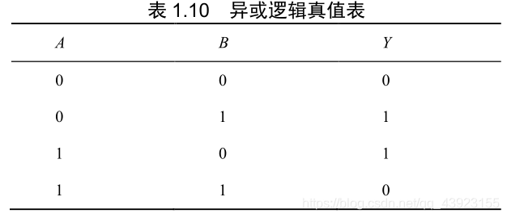

# Chap1 逻辑代数基础

## 1.逻辑代数基本概念

###### **1.基本逻辑计算**

定义(1)正负逻辑:规定高电平为逻辑"1",低电平为逻辑"0"

定义(2)逻辑变量:使用英语字母来表示变量,并称之为逻辑变量

定义(3)逻辑函数:使用AB作为输入逻辑变量,Y为输出逻辑变量,并配合反号组成的表达式

|             |                     逻辑表达式                     |                         运算逻辑符号                         |                          逻辑真值表                          |
| :---------: | :------------------------------------------------: | :----------------------------------------------------------: | :----------------------------------------------------------: |
|   与(AND)   |                  $$Y = A\cdot B$$                  |  |  |
|   或(OR)    |                     $$Y=A+B$$                      |  |  |
|   非(NOT)   |                $$Y = \overline{A}$$                |  |  |
| 与非(NAND)  |            $$Y = \overline{A\cdot B}$$             |  |  |
|  或非(NOR)  |               $$Y = \overline{A+B}$$               |  |  |
|  异或(XOR)  | $$Y = A\bigoplus B = A\overline{B}+\overline{A}B$$ |  |  |
| 同或(XNOR)  | $$Y = A \odot B = \overline{A} \ \overline{B}+AB$$ |  |  |
| 与或非(AOI) |              $$Y = \overline{AB+CD}$$              |  |  |

**异或(XOR,Exclusive OR)** 解释:"相异为真"

>   作用(1)比较器:如果两位不相等,则XOR=1
>
>   作用(2)可控反相器:目标是输出1,如果一个输入C=0,那么输出就是D本身;如果输入C=1,那么输出就是D反
>
>   作用(3)加法器:**半加器**中,两个二进制相加的本位和就是XOR的结果:$$1 \ XOR \ 1 = 0,1 + 1 = 10$$

**同或(XNOR,Exclusive NOR)** 解释:"相同为真"

>   作用(1)比较器:如果两位相等,则XNOR=1(直接的作为CPU的比较器(指令/数据))

**与或非(AOI,And OR Invert)** 解释:"分组与,一起或,整体非"

>   (配置是至少四路输入的逻辑)
>
>   **一种设计思路:主要是并行逻辑比三个串联逻辑速度更快,使用的晶体管更少(用于基本中的基本)**
>
>   作用(1):控制单元(CU)的指令译码器(简化多重逻辑嵌套)
>
>   作用(2):算术逻辑(ALU)单元的**决策**(简化多重逻辑解析)
>
>   作用(3):多路复用器(MUX)的实现:(自然的AOI,依然是简化NAND/NOR组合)

###### **2.逻辑运算的基本定律**

(1)变量和变量之间的关系

|  公式名  |                            表达式                            |
| :------: | :----------------------------------------------------------: |
|  交换律  |         $$A\cdot B = B \cdot A$$  $$A +B = B+A$$         |
|  结合律  | $$(A\cdot B)\cdot C = A\cdot (B\cdot C)$$ $$(A+B)+C = A+(B+C)$$ |
|  分配律  | $$A\cdot (B+C) = A\cdot B + A\cdot C$$ $$A+BC = (A+B)\cdot(A+C)$$ |
|  同一律  |              $$A\cdot A = A$$ $$A + A = A$$               |
|  还原律  |               $$\overline{\overline{A}} = A$$                |
| 德摩根律 | $$\overline{A\cdot B} = \overline{A} +\overline{B}$$ $$\overline{A+B} = \overline{A}\cdot \overline{B}$$ |

(2)常量和常量之间的关系

| AND  | $$0\cdot 0 = 0\quad 0\cdot 1 =0\quad 1\cdot 1 = 1$$ |
| :--: | :-------------------------------------------------: |
|  OR  |         $$0+0 = 0\quad 0+1=1\quad 1+1 = 1$$         |
| NOT  |      $$\overline{0} = 1\quad \overline{1} =0$$      |

(3)变量和常量之间的关系

  AND: 	$$\begin{cases}A\cdot 1 = A\\ \\A\cdot 0 = 0 \\\\ A\cdot \overline{A} = 0\end{cases}$$

   OR: 	$$\begin{cases}A+ 1 = 1\\ \\A+ 0 = A \\\\ A+ \overline{A} = 1(重要)\end{cases}$$

###### **3.三个基本原则**

   规则名称  	           结论和证明                  	         

  (1)代入规则	$$\begin{cases}\overline{A+B+C} = \overline{A}\cdot \overline{B}\cdot\overline{C}&(结合律+德摩根律)\\ \\ \overline{ABC} = \overline{A}+\overline{B}+\overline{C}&(结合律+德摩根反用)\end{cases}$$	

>   **函数直接代入相关结论即可**

  (2)反演规则	$$\begin{cases}\because F = A + \overline{B+\overline{C} +\overline{D+E}}\\\\\therefore\overline{F} = \overline{A}\cdot \overline{\overline{B}\cdot C\cdot\overline{D}\cdot\overline{E}}\end{cases}$$		

>   **函数中原变量反变量互换,与或运算互换(乘加互换);两个及以上的变量长非号不变**

  (3)对偶规则	$$\overline{A \cdot B} = \overline{A} + \overline{B}$$

>   **函数中各变量保持不变,与或运算互换(乘加互换);两个及以上的变量长非号不变**

###### **4.最小项表达式**

## 2.逻辑函数公式法化简

## 3.逻辑函数和卡诺图

## 4.具有无关项的逻辑函数化简

## 5.逻辑函数的表示方法以及相互转换

